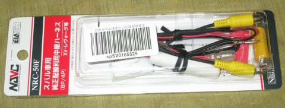
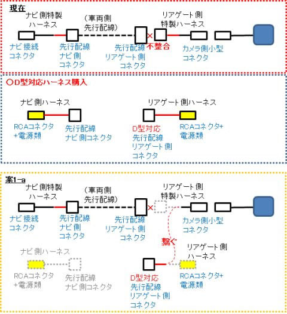

# プロジェクトX2第2章…LEVORG E型にリアカメラをつけてみた・LEVORG C型用コネクタで何とかE型の先行配線を使う対策

📅 投稿日時: 2018-07-28 01:40:21

🏷️ カテゴリ: [車](cba0e8330b3f2ded7c1addfacc75d4547.md)

…はい．

すみません．

たいへんお待たせしました…

ダイビング旅行記を1日はさみましたが．

本日は，みなさんお待ちかね．

一昨日の，[衝撃の事実の記事](ea238efa81c7faa22626c054d5628ed1e.md)の続きです…

前回．

LEVORGのC型までとD型以降で．

リアカメラ用先行配線のリアゲート側

コネクタ形状が変わっている

という衝撃の事実を知り．

[手間ひまをかけて作った，独自ハーネス](e0ec12572486bf2ce78094e14c23332d5.md)が

全くの無駄になったということで，かなりのショックを

受けたSkier_S．

それだけでなく．

先行配線を使わずに，自前でリアカメラからナビまで

配線しようにも．

7mケーブルをぶった切っているので，

そのままでは配線が使えない…という

状態に陥っているわけで．

とりあえず，私が購入した[NAVC社製のNRC-50](https://www.amazon.co.jp/%E3%83%8A%E3%83%93%E3%83%83%E3%82%AF-NAVC-%E7%B4%94%E6%AD%A3%E9%85%8D%E7%B7%9A%E5%88%A9%E7%94%A8%E3%83%AA%E3%82%A2%E3%82%AB%E3%83%A1%E3%83%A9%E6%8E%A5%E7%B6%9A%E3%83%8F%E3%83%BC%E3%83%8D%E3%82%B9-%E3%82%B9%E3%83%90%E3%83%AB%E8%BB%8A%E7%94%A8-NRC-50F/dp/B073WVR7QC/ref=sr_1_fkmr2_3?s=automotive&ie=UTF8&qid=1532542552&sr=1-3-fkmr2)F.

こいつは，C型までのLEVORGにしか対応してなかったようです…（涙）

このような事態に陥ってしまった今．

果たして，どのように対処するのが正解か？？？

…って考える前に．

リアゲート側コネクタは，D型以降変わってしまったのが分かったけど．

ナビ側コネクタも変わってないか，確認しとかないと！

自作スペシャルハーネスのナビ側コネクタが

使えるか使えないかで，これから取るべき

対応もかわります．

もし，先行配線のナビ側コネクタも変わって

しまってるなら．

…先行配線を使うことは，完全に諦めた方が

良さそう…

ってことで．

このナビスペースに来ているコネクタ類．

この，矢印で示した8pinのコネクタが，

リアカメラ用先行配線なので…

Skier_S特製の，この自作スペシャルハーネスのナビ側．

こいつがつながるか，いざ試してみましょう！

（ドキドキ）

と，差し込んだところ．

…

…ををを！！

ナビ側は無事刺さりましたっ！！

…この自作特製ハーネス．

ナビ側はちゃんと使えるようだな…（ちょっと安心）

なにぶん，作業の一番最初につなごうとしたコネクタが

いきなりつながらない

という，かなり悲しい状態だったので．

二つ目につないだ，このコネクタが．

今回の作業で無事刺さってくれた初めての

コネクタになります…

とりあえず，一個でも刺さってくれて．

ちょっと嬉しい…

とりあえず．

ナビ側スペシャルハーネスは使えることは

分かった．

これらの状況を鑑みて．

考えられる対処法としては…

1．純正リアカメラ用先行配線を使う場合（ナビ側スペシャルハーネスは活用）

1-a．D型以降に対応した純正配線中継ケーブルを

　購入，リアゲート側自作ハーネスのみ作り直し，

　先行配線を利用

1-b．リアゲートの先行配線のコネクタを

　ちょん切り，自作ハーネスもちょん切って，

　両者を直接つなぎ，先行配線を利用

2．純正リアカメラ用先行配線の利用をあきらめる場合

2-a．カメラを買いなおして，新しい7mケーブルを入手．

　リアゲートからナビまで配線

2-b．力作の自作ハーネスをぶった切り，7mケーブルの

　両端にはんだ付け．7mケーブルを復活させ，

　リアゲートからナビまで配線

…といった感じか…

うーーーむ．どれも強烈にイマイチな対応案だなぁ…（涙）

1-a．は．D型以降に対応する純正配線中継ケーブル．

　私の調べた限りでは，公式にD型以降対応を謳っているのは．

　[静岡県島田市のアーティファクトさんが手作りしているこいつ](http://www.artifact-jp.net/product/detail.php?GN=9&N=35)

　しか無くて…

　Amazonなどで手軽に買えるモノはなさそうなので．

　入手できるまで時間がかかりそう…

1-b．は，車両側にもともと付いているコネクタを

　切り取って，

　車にもとからついてるコネクタをKENWOODカメラ

　専用のコネクタに付け替えてしまう

　ことになるわけで．

　後でカメラを交換しなくてはならなくなった場合に，

　KENWOOD製カメラしか使えない恐ろしい車に

　なってしまいます…

　そもそも，車のそばにコンセントが無いので，はんだごても使えず．

　車両ハーネスに直接はんだ付けするのは不可能だし．

　まぁありえない選択肢ですね．

2-a．は，カメラ購入にまた8000円以上かかってしまい．

　今のカメラが完全に無駄になっちゃいます（泣）．

　そして，カメラを入手するまで作業できず，

　通販で買ったカメラが届くまで，ナビ取り付けを

　待たなくてはなりません…

2-b．は，ケーブルを接続しなおす作業時間がかかる…

　というか，ちょん切って別のハーネスにしあげたものを，

　またちょん切って元に戻すという

　精神衛生上非常によろしくない作業

　が強いられるうえ．

　リアゲートからナビまで配線を引っ張る作業で，

　ケーブルに力がかかるので，それによってはんだ付け

　した部分が断線してしまうリスクがあり．

　あまり取りたい方法ではありません…（涙）

…うーむ．

どれもいい方法じゃないなぁ…

やっぱり，精神衛生上良くないけど．

お金と時間を考えると，2-b．かなぁ…（ちょっと涙）

うーーーーーん．

うーーーーん…

やっぱり，どれもイヤだなぁ…

何か他の方法が無いか…

コネクタがハマらないなら，

何とか線を直接つなぐ方法があれば

いいんだけど…

はんだ付けしなくてよくて．

後で元に戻せる方法…

そんな都合のいい方法があるか？？

うーむ．

…

とりあえず，リアゲート側の先行配線コネクタを．

リアゲートから外してじっくり見ながら考えれば，

何か出てくるかも…

…なにか，出てくるかも…

と．

車両側コネクタをばらして，

ピンをとりだしてみたけど…

（コネクタについている，ピンを抑える爪を

　抑えながらコネクタからピンを引っ張り出すと，

　ピンはコネクタから外れます）

…

うむ！？？？

ちょっと待て．

この，先行配線の車両側コネクタの，

この4本のピン．

…これって．

このピンって…

自作ハーネスのコネクタに

直接挿せるんじゃないかな？？？

…と．

各ピンが接触してショートしないよう．

ピンの根元を絶縁テープで巻いて．

自作ハーネスに，ピンを1本1本

挿していったところ…

…

をををををっ！！

…なんとっ！！？？

車両コネクタから外した先行配線の

ピン単体なら，自作ハーネスのコネクタに

見事挿さるじゃないかっ！！

…これなら，

後でもとに戻す必要があった場合には．

この，外したコネクタケースを取っておいて．

後で，ピンをコネクタケースに戻せば

元通りにできるじゃないか！

（何色のケーブルがどこに刺さっていたか分かるよう

　書いてあるけど…文字が汚い（泣））

素晴らしい…

素晴らしい解決策だよっ！！！

とりあえず，これで．

追加費用無しに，

追加部品到着を待つ必要がなく，このままナビ取り付けが継続でき，

さらに先行配線を使って，

車を元通りにできる形で，

…そのうえ，ナビ側・バックゲート側の両方の自作特製ハーネスをそのまま使って

リアカメラがつけられそうだな！

ふははは．

やっぱり私は天才だっ！！！

これら全ての条件を満たす解決策を，ちゃんと

見つけたのだから．

ふははははは！

まぁ，今の段階では．

先行配線の何色の線が映像信号で，

何色の線がACCで．

何色の線がGNDかは分からないので．

自作ハーネスのコネクタの，どの穴にどのピンを

挿せばいいか分からないけど．

…後でナビを繋いだ時に，テスターで当たれば

解読できるな…

ナビを繋いだ後に解読してから，

自作ハーネスに正しいピンを繋ぎこめば，

これで問題なくリアカメラを取付できるよね…

と．

この時は．

この解決策に気づいた

自らのすばらしさに酔いしれつつ．

気持ちよく続きの作業に取り掛かったのだった…←この時は，これからも

まだまだ問題は続くということを知らなかったのだった…

## 💬 コメント一覧

### 💬 コメント by (ほっぽ)
**タイトル**: 素晴らしい！
**投稿日**: 2018-07-28 10:34:30

Ｓさん

なるほど！

端子からピンを抜いて直接挿す、その発想は私には無かったです。

素晴らしい想像力です。(^^♪

私の乏しい想像力では、これで問題なく使えるように思うのですが、

そうではなかった思わせぶりな書き方、まだ何かあったのでしょうか。

これでダメだったとしたら、私ならカー用品店で市販の

４極コネクターオス／メスセットを買って、ピンを抜いて

そちらのコネクターで接続してしまうと思います。

多分、ピンの規格は共通なので、市販の４極コネクターに刺さると思います。

その方が固定はしっかりできるから安心かなと。

これ、先行配線側のＣ型までのコネクターだけ売ってくれれば、

ピンの差し替えで対応可能なんですよね。

### 💬 コメント by (Skier_S)
**タイトル**: ほっぽさま
**投稿日**: 2018-07-29 14:14:22

今回，コネクタピンのオスメスが

上手く合ってましたし，ピンの太さもちょうど

良かったので，偶然上手くいった感じです…

とりあえず，これでリアカメラのコネクタ問題は

解決なのですが，ここ以外のコネクタの仕様が違うとか，

ついていると思った部品がついてないとか…

一筋縄ではいかない取り付けでした．

コネクタピンですが，コネクタによってやっぱり

ちょっとずつ仕様が違います．

ピンの太さ，長さ，コネクタケースに取り付ける

爪の位置，形…

なので，ピンだけ取り換えてうまく行くケースは

少なそうに感じました．

