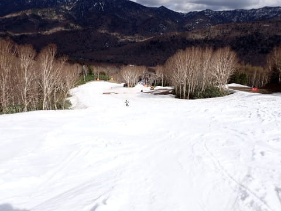
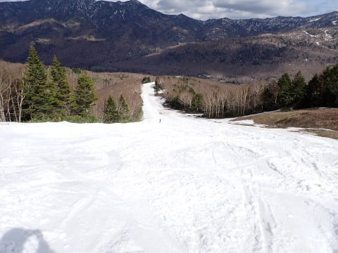

# 2024/5/2(木)，GW4連休前日の志賀高原焼額山スキー場のゲレンデ状況速報モード！…ところどころ雪が薄いところもあるけど，GW4連休前半2日間くらいはゴンドラ動くんじゃないかな？

📅 投稿日時: 2024-05-02 23:24:36

ということで．

本日も志賀高原で滑ってました～！！

…でも．

本日たった今，K奈川県の自宅に戻ってきました…

いや．4連休前半に家族で妻の実家へ行く

約束をしていて…

あと1時間半後，深夜0時発で徹夜で500km

運転して，関西某所へ出発です！！←相変わらずご無体なプランを立ててるな…

ってなことで．

出発が直前に迫っているので，

今日は速報モードにて，本日の焼額山の

レポートです！！

まず，本日は朝からすっきり晴天っ！

晴天なのに，明け方は氷点下まで

冷え込み…

朝はしっかり締まった結構いい感じの

雪！

板が走るよ！！

そして，昨日土が出始めていたところは…

朝には完全に埋められて，真っ白な

きれいなバーンになってます！

一番下の緩斜面で，雪が薄くなっていた

ところも，朝は完全にきれいになって

いましたね～…

ゴンドラ乗り場も，朝はきれいに

なってます！！

今日は昼間もずっとブルドーザーが

動いていて，一生懸命ゲレンデ外から

コース修復用の雪をかき集めてました…

この雪で，朝までにバーンをきれいに

しているようで．

バーン維持にかなりの労力をかけている

のがわかります…

焼額，すごいぞ！！

で．

今日は気温がそんなに高くなく，

最高気温も+10℃を越えず，ちょっと

肌寒いくらいで，さらに終日晴れ

ではなく，時折うっすら曇る程度の

天気でしたが…

やはり昼間の日差しのせいで，

雪はゆっくりと解けていき…

昼頃には緩斜面は滑りが悪くなり，

斜度のある所は荒れた感じの雪に

なってきました（泣）

でも，サウスコースはまだまだ幅いっぱい

雪があって．

この部分は人工雪のしっかりした下地が

あるのか，そこまでひどく荒れず，

このGWで滑れる場所としては，

かなりいいコンディションのコース

ではないかな～…

ってなことで．

本日午後3時，ほぼ営業終了のころの

パノラマーサウスコースを見てみると．

ゴンドラ降り場は，営業終了時でも

まだ雪はきれいです！

ゴンドラ降り場からしばらくは，

幅は狭いものの，営業終了までしっかり

雪が白いまま残るよう，ストックされた

雪でしっかり厚みが確保されてます！

最初の落ち込み部分も，左右に土が

出てきているところはあるものの，

まだ大丈夫そうだし…

そのあとの緩斜面の狭い通路も，

通路幅いっぱい雪があり．

この通路の最後の部分．

パノラマコースと白樺コースの

分岐部分も，まだ雪はありそうに

見えますが…

ここはわずかに一部，土が出てきて

いるところが…（涙）

でも，これなら明日までにはきれいに

埋められるレベル．

そして，パノラマの急斜面部分は．

だいたい幅いっぱいにまだ雪がついて

ますが…

ただ，下の部分．

ちょっと茶色いところが見えますね…

ここは近づくと，結構ヤバそうな感じ

ですが…

下から見るとこんな感じであんまり

目立たないですね…

ここも明日の朝にはコース整備職人の

努力できれいになっていると期待！

そして，第4ロマンス降り場付近．

ここに出ている土は埋められてませんが．

まぁ，ここは左に回避すれば問題ない

レベル．

ただ…

一見白く見えても，雪が薄くなって

きているところがあるのが気になる

ところ．

でもまぁ，まだ幅いっぱいあるので

コース幅を狭めるか何かでこのあたりも

またちゃんと埋めてくれるかな…？？

それ以外は，サウスコースの急斜面部分は，

3月になっても人工雪をたっぷり打った部分

なので，まだまだ雪がたっぷりあります！

今年のGWに，ここまで雪が残ると

思わなかったよ…

ただ，ここから下の，最後の緩斜面

部分．

ここはところどころ雪が薄くなり，

茶色い部分が出てきました…（泣）

でも，茶色くなった個所は2か所だけ．

ここと…

ここだけですね．

あとは大体幅いっぱい雪が残って

いるので，たぶんコース幅を

狭めれば，この2か所も埋められるかな…

…ってなことで．

本日の営業終了時でも，ここまで

雪があるので．

最悪レベルの高温が続いても，

あと2日間くらいはコースが維持

できるんじゃないかな～…

そこまで気温が上がらず，雨や風が

無ければ4連休ぎりぎり持ちそうな感じ

なんだけど…

GW前半3日間は晴天で日差しが強く，

夜は気温が冷えるけど，昼間は

すごい気温が上がりそう（泣）

でもまぁ，最悪でも第4ロマンスは

4連休最終日まで動きそうだけど…

焼額のゲレンデ整備職人の皆さんの

努力で、ゴンドラが4連休最終日まで

動くことに期待！！

このGWに焼額へ行く人は，

早朝券じゃなくても，焼額限定1日券や

2日券，4時間券で滑れる，朝6時からの

早朝営業がねらい目ですよ～！！

（書き終わった後に，全然速報モードじゃなかったことに気づいたSkier_S）
