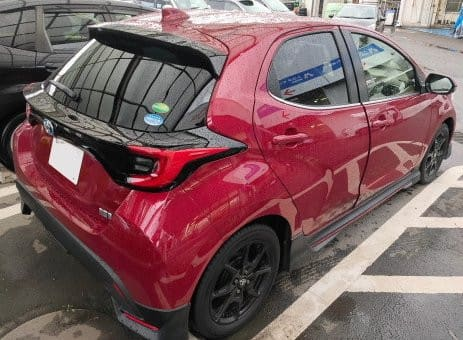
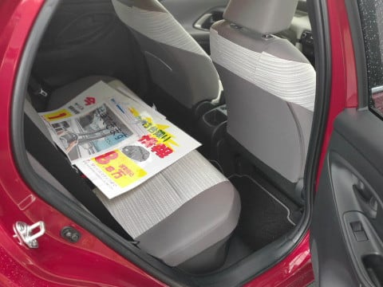
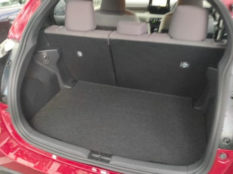
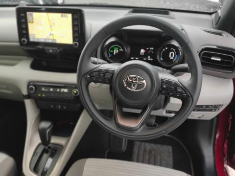
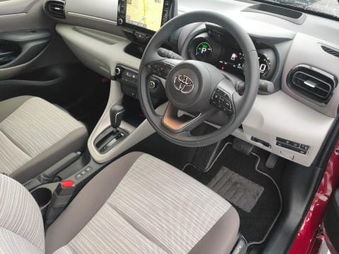
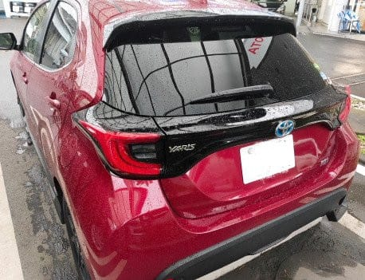

# TOYOTA新型YARISのハイブリッドに試乗してみた

📅 投稿日時: 2020-08-06 01:00:39

ってなことで．

前回，HONDAに行って，[FITを試乗](e666a7044d83090825a4af8aaea6c85db.md)してきましたが．

うむ．

FITにも乗ったんだから，ヤリスにも乗って

比べてみないと…

と，TOYOTAで[ハリアーに試乗した](e984736128fa51bc919aedc0aa8a4b975.md)ついでに．

ヤリスにも試乗してきました～！！

試乗したのは，ハイブリッドの最高グレード，

HYBRID Z．

今は，YARISもハイブリッドで4WDが

選べるようになりましたが，今回はFF車です…

外観は，このグレードは

かなりアグレッシブな感じですね…

とりあえず，見てみると…

リヤシートは，FITの方が圧倒的に

広い感じ．

まぁ，センタータンク方式のFITが，

コンパクトカーにしては異常に広いと

言った方がいいのかもしれないですが…

トランクも…ちょいとコンパクトかな．

運転席に座りますが．

さすが最高グレード，このクラスなのに本革

ステアリングとは…！

まぁ，ATセレクターあたりにちょっとチープさは

感じますが，コンパクトカーとしては比較的高級感が

感じられる内装です．

…まぁ，最上級グレードで230万くらいすることを

考えると，このくらいではあってほしいですが…

シートとかはいい感じ．

で，走り出してみると…

おっと．ハイブリッドだけど，動き出し

一瞬モーターで動いた後，すぐエンジンが

かかって，エンジンが頑張り出します．

…動き出しのトルク感，レスポンスの良さは…

圧倒的にFITが上です．

25kg-mという化け物トルクのモーターを積んだ

FITに比べると，5kg-mのトルクしか持たない

ヤリスのモーターでは，ある程度以上の加速は

エンジンの助けを借りざるを得ず，

そのエンジンも，3800回転のトルクバンドに

乗ったときで，出力トルクは12.2kg-m．

合わせて17.2kg-mと，圧倒的にFITに

届かないだけではなく．

ある程度の加速をしようと思うと，CVTが

トルクバンドに乗せようとするので，

エンジン音がかなり頑張った感じになります．

一生懸命加速している感にあふれる

エンジン音がするので，

本当はかなり加速してるのかもしれないけど，

「凄い頑張ってます！頑張ってます！」

と汗をかきながら加速している感じにあふれ，

体感の加速度としては，

「あれ？こんなもの？」という感じで，

アンダーパワーに思ってしまいます…

ちょっと残念ながら，

あぁ，やっぱりコンパクト車だなぁ…

という感じ．

そして，CVTがトルクバンドに乗るにつれ

加速Gが上がっていくので．

うーむ．

アクセルをふんだ瞬間から気持ちよく加速

していくFITの方に軍配を上げたくなります…

ボディは結構ガッチリしている感じで，

足回りもしっかり衝撃を受け止めてくれて，

このクラスとしてはよくできてるなぁ…

と思いますが．

やはりFITがよく出来すぎているのか…

FITに比べると，ダンパーの抑えが

今一つ足りないのか，ブッシュ容量が

大きいのか，ちょっと早い振動の収まりが

FITの方がいい感じ…

ステアリングフィールも悪くはないけど，

低速時のアシストがかなり強めにしてあり，

軽くクルクル回せるぶん，ちょっと低速時の

ステアリングインフォメーションが弱い感じ…

あ，スピードを出すとちゃんと落ち着いてきます．

高速時の直進安定性は文句ありません．

このクラスの車に乗る人だと，

低速時のステアリングが重いと

嫌な人が多いから，そういう味付けに

してるのかな～．

とりあえず，TOYOTAのヤリスハイブリッド．

「このクラスとしては頑張っている」

という感じではありますが．

ヤリスとFITの対決．

同じクラスのハイブリッドなら，

私なら何のためらいもなくFITを選ぶな…

と思った，Skier_Sだったのでした…

…でも，トヨタの人曰く

「FITはいい車だけど，デザインがどうも…

　と言って，ヤリスを選ばれるお客様が

　結構いらっしゃいます」

ということで．

確かに，デザイン…特に，カッコよさという

観点では，私個人の観点ですが，

ヤリスの勝利な気がします…

HONDA，惜しい．いろいろ，惜しい…

## 💬 コメント一覧

### 💬 コメント by (yumi)
**タイトル**: Unknown
**投稿日**: 2020-08-07 00:17:19

Ｓさぁ～ん🏎🚗🚘

yarisのレポート📝✒️むっちゃ👍参考になりましたぁ～⤴️😁👍

我が家の候補に上がっていたので・・・😅

進入路の狭さと、車庫の小ささで、サイズに制限が有るので・・・😢

Fitが 急浮上ｼﾃｷﾏｼﾀ😁

本命は、yaris cross なんだけどなぁ～🙄

### 💬 コメント by (Skier_S)
**タイトル**: ＞yumiさま
**投稿日**: 2020-08-07 00:35:52

Yaris crossは乗ってないですが，Yarisとのハイブリッド

同士の比較なら，圧倒的にFITのほうが良くできてます

yaris crossの対抗なら，FITならFIT Crosstarでしょうか…

最低地上高は，両者大体同じです．

https://www.honda.co.jp/Fit/special/crosstar/

とりあえず，ぜひFITを一度試乗してみてください．

