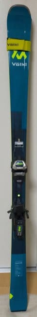
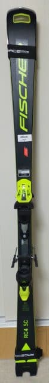
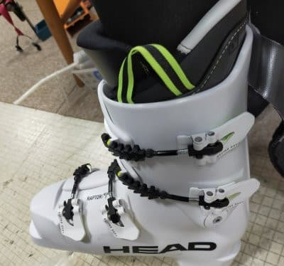
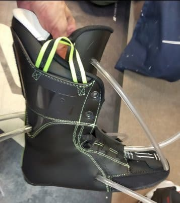

# 物欲選手権の背景…今回Getしたのは板2セット，ブーツ＆フォーミングインナー＆インソールの豪華セット

📅 投稿日時: 2023-12-13 05:24:14

ってなことで．

今シーズンも[物欲選手権に大敗した](e05737a8e31c770fa09305653a9f0b66c.md)わけ

ですが…

大敗してGetしたのは，以下の3アイテム．

'23 Volkl Deacon84 171cm

'23 Fischer RC4 RC Pro 165cm

’23 HEAD Raptor WCR3 + フォーミングインナー + インソール

の3アイテム．

それぞれを購入した理由は，

だいたい物欲選手権の記事に書かれていますが…

ここであえて詳しく書いておくと．

1．'23 Volkl Deacon84 177cm

以前から，春の荒れた雪や，ちょっとだけ

新雪が積もって午後に向かって荒れていく

ようなゲレンデ状況で，セミファット板を

履いている仲間が多くて…

何回か履かせてもらったところ，実に調子が

いいので，実は数シーズン前から欲しかった

セミファット板．

ただ，Fischarの名機，Pro MTがもう生産も

終わっていて，在庫もなく．

他にピンとくるセミファットがなくて

買わずにいたところ…

今シーズン，試乗してめちゃくちゃいい感じで．

ついついやられちゃいました…

いや．

また別途詳細レポート書きますが，ホントに

いいんですよこの板．

私がもっている板でも，ベストに近い感じで．

この板を普段履きにしてもいいかも？

と思うレベルで．

4月から履き始めてますが，実に買って

よかった板です…

2．Fiscer RC4 SC Pro

あれだけ増殖していたATOMICの小回り用板，

SXがすべてヘタってしまった今．

石ころふみ用板として残っていた四郎君も，

ドナドナされていったので…

2021年から3シーズン履いていた

'21 FISCHER RC4 SC Pro．

履く頻度が低かったので，3シーズン履いた

けどまだそれほどヘタりを感じてないけど，

こいつを石ころふみ用として利用することに

しました…

いや，ホントにグリップが完全に失われる

ほどペタペタにヘタった板を石ころふみ

用にすると，あまりにも板がグリップせず

楽しめなさすぎるので…

ちょっともったいない感じもあったけど，

完全にヘタリきる前，まだ元気が残っている

うちに，月山やかぐらファイナル・イエティ用

として使うことにしました．

だもんで，トップシーズン用の小回り板が

別にあってもいいけど…

石ころふみ用にしたとはいえ，まだ

’21SC Proはヘタってなくて元気だし．

さらにトップシーズンにそこまで

ショート板を履くことが無くなった最近．

…2024シーズンも，イエティや月山だけ

じゃなく，このまま'21 SC Proをトップ

シーズンにも使い続けようかな…

2025シーズンくらいに新しい小回り板を

買えればいいかな？

と思っていたけど．

2024シーズンからスキー板のお値段が

爆上がりするということと，

値上がり前のお安い2023シーズンモデル板，

それも試乗板落ちが1セット残っているという

ことで，

小回りメイン機として，ついつい買って

しまったのでした…

3．'21 HEAD Raptor WCR3 + フォーミングインナー

えー．

これは．

もう，物欲全開で買ってしまったものです．

21年モデルですが，2022シーズンから

すでに全く同じ型のHEAD Raptor WCR3を

履いているのですが．

あまりにも調子がいいし．さらにエキップ

さんチューンですごく快適に滑れる，

私にとっては魔法のブーツだったんですが…

このブーツを履いてまる2シーズン．

100日ほど履いて…

そろそろインナーブーツがヘタって来たし．

シェルもゆがみが入ってきてたりしてるし．

さらに，REXXAMのR-EVO2が，[3シーズン
経たずしてシェルの粘りが無くなって
しまった](e8f13e053373781df72b9d77ff5af2cdd.md)…という経験をして．

次は3シーズン目に突入するHEADブーツの

後継機をGetせねば…！

と思っていたところ．

「HEADブーツのフォーミングインナーを

　個人輸入でGetしたのがあるけど，どう？」

　「今のHEADのインナーだけ交換するのも

　あるけど，シェルはもう2シーズンも

　使ってるから，新しいシェルをもう

　1セット買って，フォーミングインナーを

　古いシェルと新しいシェルの両方で

　使うのがいいかも…」

という悪魔のささやきに屈してしまい，

ついついフォーミングインナーだけじゃなく

ブーツ本体まで新品を買ってしまってました…

ということで．

4月に実施されいてた物欲選手権ですが．

その時予約したブーツのフォーミングも

すでにGWに終えているので．

また後日，フォーミングの詳細を

レポートします~！

## 💬 コメント一覧

### 💬 コメント by (レインボー76)
**タイトル**: Unknown
**投稿日**: 2023-12-13 15:38:04

水曜日の志賀高原情報

朝の上林0℃、蓮池-5℃。道路はまっ平らで安全そうに見えるけど、実は0℃前後のこんな日は赤信号。皆さんスリップを味わってました。

焼額山は期待に反して(諦めを裏切らず)、新雪3cmのみ。

でも気温が低いので雪が緩まず、いつものように11時30分までの長きに？わたり、ストイックに滑り続けました。

移動できないので、食事の関係で今日まで早あがりしてましたが、そろそろレインボー(２時あがり)を目指そうかなあ。

明日も気温はマイナスキープのようなので、今夜の降雪機に期待します。

それからアリス様、あの日の講習から私は毎日が楽しくてたまりません。今日は上下の動きを課題に滑りました。スキーって上手く滑れるほど楽しくなるんですね。後期高齢者になっても、まだまだ未来は開けている気がしてます。

### 💬 コメント by (アリス)
**タイトル**: こんばんは
**投稿日**: 2023-12-13 20:46:31

Skier_S様

物欲選手権ですが、伝染しそうです・・・

VolklとRaptor欲しくなりました。

23日、24日のゴンドラコース滑走を楽しみに仕事に励みます。

久しぶりの土、日滑走となりそうです。

レインボー様

お言葉、痛み入ります。

レインボーさんのコメントいつも勉強になります。

志賀高原でお聞きするお言葉も私のスキーへの楽しみになっております。

### 💬 コメント by (Skier_S)
**タイトル**: 17日から降る！積もる！！
**投稿日**: 2023-12-14 02:46:11

＞レインボー76さま

積雪はやっぱりせいぜい3㎝ですか…

今晩から明日の朝にかけて人工降雪が打てますが，唐松復活はまだ遠そうですね（涙）

17日からの降雪に期待！来週月曜か火曜にはいいコンディションになりそうな予感…

＞アリスさま

ぜひ物欲選手権に敗れてください（笑）

23日くらいまで，クリスマス寒波が来そうなので期待大です！

