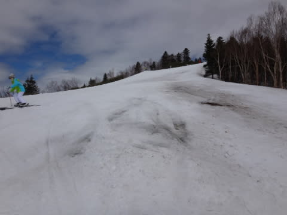

# 復活！5月4日の志賀高原は…曇り，一瞬雨（涙）．雪は…かなりマズい感じ

📅 投稿日時: 2015-05-04 21:38:21

🏷️ カテゴリ: [2015スキー滑走日記](c09ea645cfc085f86dfcd80f49599dd89.md)

ということで．

中1日の休みで，また志賀へ舞い戻ってきたわけですが．

…わずか1日いなかっただけで．

またすごい雪が溶けてるんですが…っ！（涙）．

焼額の第2高速沿い，唐松コース．

上半分のコース幅が狭くなってきただけではなく…

下側は廊下になっちゃってるんですがっ！！？？

ゴンドラのコースも，ところどころ穴があきはじめました…

一の瀬正面バーンは，もう壊滅的です（激涙）

この写真にあるように，上のほうはガバッと土が出て…

土が出たあたりは，周りも雪が薄く，

コブ溝はすべてブッシュが出ちゃってるんですがっ！

もう，切れます．

このコース，切れちゃいそうです．

…明日営業できるのかな…？？？

2日前までは，こんな感じでぜんぜん問題なかったのに．

今日はこんな感じで…

完全真っ白だったバーン．

わずか中1日で，こんな壊滅的な状況に…（耐えられない涙）

下半分の緩斜面も，かなり土が出ちゃってます…（涙）

うーん．

さらに．本日．

5連休の真ん中ってのがあるのか．

焼額の早朝，混みましたね～．

とても早朝と思えない人口密度…（悲）．

そして．

朝から曇っていて，気温もプラス10度近く．

雪も朝イチからザブザブだし…（涙）．

うがーーー！

混んでいて，雪が良くないこんなの，

早朝じゃないっ！！！

通常営業時間になっても人が結構多くて…

（ゴンドラ待ちは0～2分程度と，それほどひどくなかったけど）

そして．

さらに．

雪はかなりダメな感じ…（ため息）．

ああ．

あぁ．

おとといまで，快適早朝バーンだったのに…

この変わり具合はどうしたことだっ！

そして．

さらに追い討ち．

…なんですか，これはっ！！

…私の目が確かなら，これは，雨というものでは…っ！？？←誰が見てもそうだから

せめてもの救いは．

雨が降ったのは，昼前の一瞬．20分くらいかな？

それも，ぽつぽつ…程度ですんでくれたこと．

あと，この雨のおかげで．

をを！

雪が，かなり滑る雪になってくれたよ！！

さらに人も減ったし．

…ぽつぽつ程度の雨が降ってくれたのは，

意外と良かったかも…

って感じで．

雨が降って滑る雪にならなければ，もうどうしようもない感じの

今日一日でしたが．

うーん．

…これから2日間，

ちょっと楽しめなさそうな感じ…（耐え難い悲しみ）

さらに追い討ち．

志賀高原．

夜9時現在，雨が降ってます（涙）．

それも，かなりの土砂降りです…

だ，だ，誰だ～っ！！

日ごろの行いが，激烈に強烈に過激に悪いやつはっ！←それはお前だろ

明日の朝は晴れるはずだけど．

…雪，溶けないで残っててくれるのかな～（心配）．

わずか数日前のコンディションが懐かしい…（遠くを見る目）
