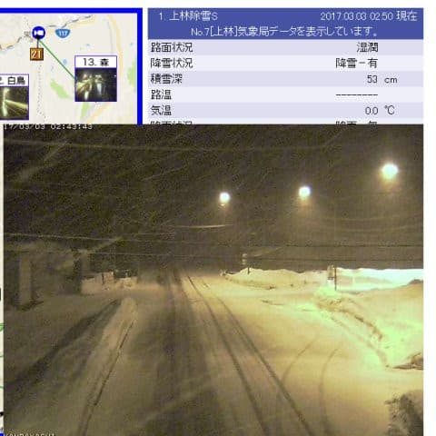
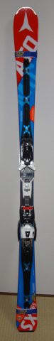

# 新（？）物欲選手権…その2

📅 投稿日時: 2017-03-03 03:53:45

🏷️ カテゴリ: [スキー雑談](c1f9d2cb7478308da16419928ea3945e9.md)

えー．

とりあえず，水曜の予想で．

　志賀は，午前中は降らない感じですね．

　2日の夕方，冷え込んでから雪がちらつき始める感じかな…

と，書いたように．

高温危険な本日．

気温の高い午前中は降らず．

なんとか志賀は，雨にならずに済んだようです…（一安心）．

で．

　2日夜から3日午後にかけて，雪が降り．

　10cm，運が良ければ20cmくらいは積もりそうかな…？

って予想通り，

現在，志賀高原は結構な勢いで雪が降ってるようです！

（[北信建設事務所道路気象情報ページ](http://www.q0.ws302.smilestart.ne.jp/index.htm)より）

この雪は，明日金曜の昼すぎまでドサドサ降り続け．

…予想以上に積もりそうな勢いです…

これは．今週末はしっかりアイスバーンが隠れてくれて．

かなりゲレンデコンディションは改善しそう…！！

土日は晴れそうなので，やっぱりこの週末は，

いい感じかなっ！！

…ってことで．

本題へ．

お待ちかね（？），新・物欲選手権のその2（完結編）です．

（[その1はこちら](eda7898d5cb5580b1871f3cbef83241ac.md)）

では，どうぞ～！

---

アナウンサー　「えー．本日は，

　　第1回　スキーヤーの物欲を刺激する通販サイトを

　巡って，物欲にまみれたスキーヤーが

　ポチらずに我慢できるか選手権

　を，お送りしていますが．

　『太い板の情報を調べるだけで，買わないぞ～』

　と言っている，Skier_S選手．

　果たして，物欲に屈せず，勝利を手にすることが

　できるのでしょうか！？」

解説　「…その可能性は，宝くじ100枚買って

　全部一等が当たるくらいの，ありえない確率なんですが…」

アナウンサー　「しかし，太い板のメーカーは

　数多くありますが．

　Skier_S選手の良く知らないブランドが多く，

　あまり試乗レポートも無いようで．

　どうも情報収集に苦労しているみたいですね～」

解説　「Skier_S選手は，一般上級者モデルには

　異常に詳しいのに，太い板については素人

　同然ですから…」

アナウンサー　「4FrontやらARMADAといったブランドから，

　Momentやら3G，Black Diamondなど…知らないブランドばかりで，

　そもそもどんな板を選べばいいのかも分からず，

　苦労しているようです！」

解説　「いや，かなり悩んでいるようですね…

　さて，一体何を買うつもりなんでしょう…」

アナウンサー　「まだ買うと決まったわけではありません…！

　買うのか買わないのかをドキドキハラハラで

　見守るのが，この選手権です！！」

解説　「…いまさらドキドキ感もへったくれも

　無いんですが…」

アナウンサー「　…おや？

　いつの間にか，Skier_S選手．

　試乗レポートやメーカーサイトではなく，

　通販サイトを見ていますよ！？」

解説　「どんな板があるか分からないので，

　とりあえず実売価格が安く手に入る板から

　目星をつけよう，という戦略ですね．」

アナウンサー　「どうやら，K2とLINEの板が安いということで，

　そのあたりにめどを付けたようです…」

解説　「太い板は，Skier_S行きつけの

　いつもの店で売ってませんから，

　わざわざ神田に行く必要が無いわけで．

　通販でめどをつけたら，ポチってしまう

　のではないでしょうか」

アナウンサー　「ここで，センター幅110mm以上の，

　何種類かの板に，候補を絞ってきたようですよ？」

解説　「…候補の板に検索をかけて，実際の試乗レポートや

　ユーザーの報告が無いか探してますね～．」　

アナウンサー　「でも．なかなかこういった太い板の

　滑走フィーリングのレポートが無いようで…

　Skier_S選手，苦労しているようですね…」

解説　「まぁ，そもそも試乗会で，パウダーパフパフを

　太い板で試乗できる…ってものではありませんから．

　なかなかパウダー板の滑走レポートは

　見つかりませんよね…」

アナウンサー　「かなり一生懸命，いろんなページを

　探っていますが…

　これといった，決定的な情報が無くて困っているようです」

解説　「まぁ，Skier_S選手は，

　自分で試乗して気に入った板を買うスキーヤーなので．

　試乗したことのない板を選ぶのも，何を

　決め手にすればよいか分からず，躊躇しているようです…」

アナウンサー　「ここでちょっと疲れたのか？

　通販サイトで太い板を調べるのはひと休みして，

　Skier_S選手が良く知っている板をチラチラ

　見ていますね」

解説　「まぁ，知っている板の値段でも

　見てた方が面白いですからね」

アナウンサー　「デモ板見てますね」

解説　「ATOMICのSXを見てますね」

アナウンサー　「あれ？」

解説　「ん？」

アナウンサー　「えええっ！！なんですか！？

　ポチったようです！

　いきなりポチりましたっ！！

　それも，SXをっ！」

解説　「ええええっ！！そっち！？？」

アナウンサー　「そっちなの！？？」

解説　「…まさか，すでに持っているATOMICのSXをポチるとは…っ！！

　あまりにも予想外すぎる…っ！！！」

アナウンサー　「なんということか…

　なんということか～っ！！

　Skier_S選手！！！

　本来買わなくてはならない太い板ではなく，

　すでに何セットも持っている，ATOMICのSXを

　さらに買い足しました～っ！！！！！」

解説　「ATOMICの板が来年全く変わるということからか，

　今年モデルの値段が一気に下がったようで…

　本来太い板を買うべきところ，

　自制心なく反射的にポチってしまったようです」

アナウンサー　「なんと，なんという，

　あまりの自制心の無さっ！

　予想を激しく超える自制心の無さです！

　Skier_S選手っ！！！

　我々，そして読者の想定をも著しく超える物欲を，

　ものの見事に我々に見せてくれました！」

解説　「…彼は，

　そもそも我慢という概念を，生まれた時から

　持ち合わせてなかったとしか思えません…」

アナウンサー　「ということで，まさか，まさかの

　'17 ATOMIC Bluester DEMO SXをポチるという

　誰も想定しえなかった結果での大敗となりました，

　　第1回，スキーヤーの物欲を刺激する通販サイトを

　巡って，物欲にまみれたスキーヤーが

　ポチらずに我慢できるか選手権．

　これにてお別れです．

　では，また第2回でお会いしましょう！！」

解説　「…やっぱり，この選手権も第2回があるんですね…」

というわけで．

かなり本気で太い板を買うつもりだったのに．

なぜか．

なぜか．

今シーズンモデルのSXを買っちゃったのでした…

＃鋭い人は，先週の志賀高原レポートのSXの写真，

＃1枚をのぞいて，全て'17SXになってることに

＃気づくはず…←'16SXと'17SXの違いは間違い探しレベルだから，気づく人いないって

なぜSXをポチってしまったかの解説は，

また次回に続く…予定．

## 💬 コメント一覧

### 💬 コメント by (れお)
**タイトル**: え!! あれ!?
**投稿日**: 2017-03-03 19:16:57

もう太板買ってるはずと思ってたのに、そっちでしたか〜。 これも負けですよね!! 笑

Atomicの新モデルを試乗する前にSXで決めたんですね。とりあえず購入理由の解説楽しみにしてます〜

### 💬 コメント by (michi)
**タイトル**: Unknown
**投稿日**: 2017-03-03 21:34:39

このオチ、笑えました。

今週もヤケビに行くことにしました。

息子は風邪ひいて行けないので友人を誘いました。

また明日お会いできればお声がけしますね(^^)

### 💬 コメント by (Skier_S)
**タイトル**: 太い板，欲しいんですけど…
**投稿日**: 2017-03-04 01:03:31

＞れおさま

普段履きは，来シーズンのATOMICを買おうかと考えていたのに…

なぜか今シーズンモデルを追加購入しちゃいました．

…太い板はもう少し我慢かな…？？

＞michiさま

いや．

なぜかSXに行っちゃいました…

また週末，焼額でお会いしましょう～！

### 💬 コメント by (いか)
**タイトル**: Unknown
**投稿日**: 2017-03-10 12:44:48

なるほど、いまになって来期のS9でない理由がわかった気がします、私も買わないと思います。でも、どうやらあれが使えるモデルもあるとか、、、？

### 💬 コメント by (Skier_S)
**タイトル**: いかさま
**投稿日**: 2017-03-11 10:25:26

S9iはTLビンディングしかつかなさそうなんですよね…

まぁ，まずはいろいろ試乗してみたいところです（笑）

