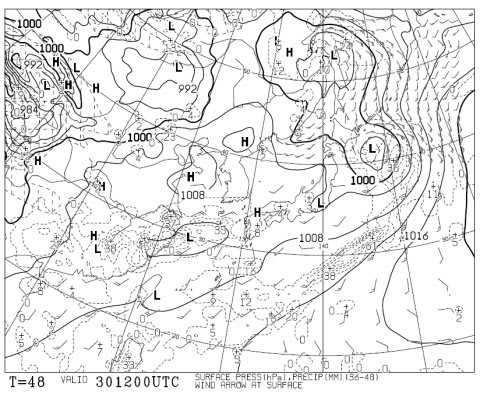
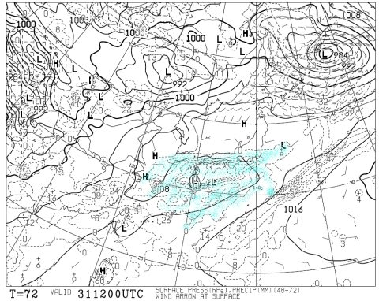

# ラストかぐら！今週末のかぐらの天気は…土曜は晴れそうだけど．日曜は微妙…

📅 投稿日時: 2015-05-29 01:33:42

えー．

これまで意地でも雪付けをして，何とか

ゲレンデからロープウェーまで，スキーで移動できた

かぐらスキー場ですが．

ここ数日の異常高温＆晴天続きのせいで．

ついに．

昨日，水曜日．

みつまたエリアのコースが切れて．

ロープウェーからゴンドラまで，[バス移動になった](http://blog.princehotels.co.jp/ski/kagura/033157.php)ようですね…

…2011年以来，5シーズンぶりのバス移動ですね…

さらに本日．

[ゴンドラコースも切れちゃった](http://blog.princehotels.co.jp/ski/kagura/033159.php)みたいで．

ゴンドラコースもスキーで降りることができず，

上り下りとも，ゴンドラ移動になったみたいです…

かぐらのブログを見ると．

かぐら[メインバーンも，もうかなりやばそうな](http://blog.princehotels.co.jp/ski/kagura/033159.php)感じですね…

すぐに穴が開きそうな廊下状態です…（涙）．

…今週末は，ガラガラだろうなぁ…

とりあえず．

こんな状態でも滑ろうと思う人は．

よっぽど重篤な「スキーやらないと死んじゃう病」患者ばっかり

だと思うんですが．

そういう，ごく一部の限られたおかしな人向けに．

今週末の，天気予想をば…

土曜の地上天気図ですが…

…これは．晴れますね．

一瞬，雲がかかってぱらっと通り雨みたいなのが

あるかもしれませんが．

基本的に，晴れです．

日曜の地上天気図は…

…

…うーむ．

微妙．

水色で塗った降水域，ぎりぎり今のところはかぐらに掛かって

いないように見えますが…

低気圧がわずかにずれただけで，かぐらはずっぽり降水域に

入ります…

降る可能性が高いけど，運が良ければ降らずに済むかも…

ってことで．

まとめると．

土曜：基本的に晴れ！Tシャツで十分なくらい，すごい暑いよ！！

　　ただ，運が悪いとにわか雨に一瞬降られるかも…

　　まぁ，基本的に晴れのはず．

　　暑いので，雪どけはかなり進みます．

　　午後は土だらけになって，滑れたもんじゃないかも…

日曜：曇り．運が悪ければ朝から雨が降ってるかも…

　　基本的に太陽は拝めなさそうかな．運が良ければ

　　曇りのままで済むかもしれないけど，今のところ

　　時折雨が降る感じかな…

　　雨のせいで，この日も雪はとけて．

　　ところどころ水たまりみたいな雪になってるでしょう…

　　雪があるところを縫って滑る感じになるか？？

って感じで．

うーーーむ．

もう，「滑れる」ってだけで．

晴れても雨が降っても，

楽しめる感じじゃないかな～．

でも．

それでも．

私は，行く！
