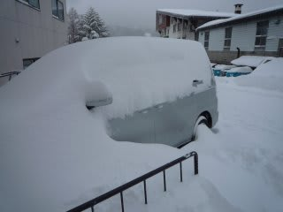
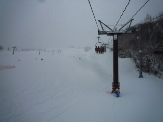
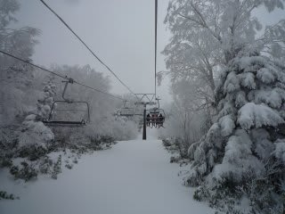
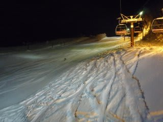
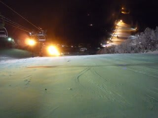

# クリスマスイブの志賀高原

📅 投稿日時: 2010-12-24 22:25:19

いやーーーー．

降りましたね．

昨晩からの積雪はこんな感じです…

今朝も降雪のため，一の瀬オープンは15分遅れの

8時45分から．

しかし．オープン後は一の瀬メインコース，

ひざ下パフ！！

そんなに深くないけど，1時間ばかりパフパフを

楽しめました！

今日は一日，雪が降ったりやんだりで，一時強く降ったので，

昼間も10cm以上雪が積もったかな～

志賀，ほぼ全面可能になりました．

明日から，焼額第1ゴンドラも動き出し，焼額はゴンドラ2本体制．

西舘山もフードクワッドがようやく動き出します．

今日は平日ってこともあって，リフトもガラガラ

…あ，一の瀬ファミリー下部はゼッケン軍団の方々により

多少混雑してましたが，それ以外のリフトは待ちなし．

最高でした．

んで…

なんと．

今日から，一の瀬ファミリー，ダイヤモンド，高天原の

ナイター開始です．

…ほとんど人が滑ってません．

がらがらです．

雪は最高です．

粉雪を圧雪したしましまです．

ハイシーズンです．

いやー．

やっとハイシーズンに突入ですね．

背負われている娘も大喜びでした

