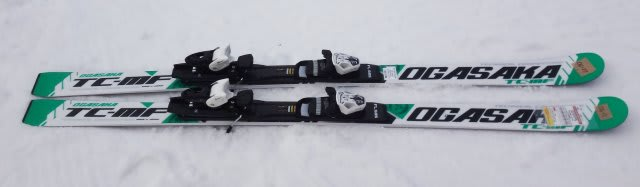
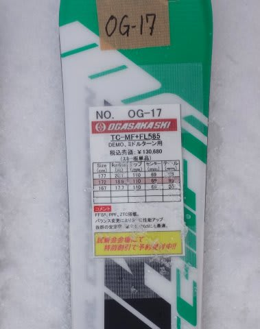
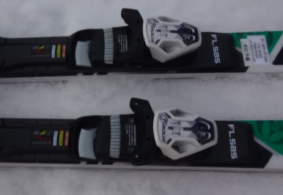
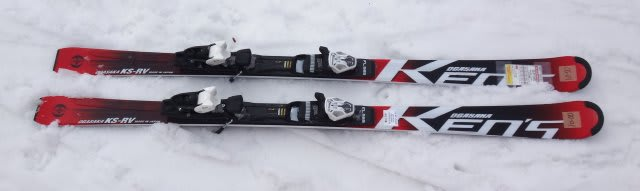
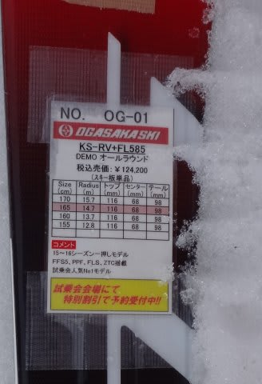
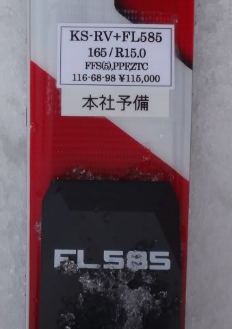

# 2016シーズンモデル，スキー試乗レポート第3回…OGASAKA編その1

📅 投稿日時: 2015-03-20 00:20:02

やはり，志賀高原でも一日雨が降り続いてしまった今日この頃．

皆様いかがお過ごしでしょうか…（涙）．

ということで．

まだ続く，2016シーズンモデルのスキー板の試乗インプレッション．

試乗コンディションなどは[こちら](e8d8515ef15e0de5854269614a0329844.md)を参照していただくとして．

…こんどは，オガサカの2機種です．

では，どうぞ～！

○OGASAKA TC-MF FL585 172cm

基礎中回り用．

来シーズンからオガサカのプレートは，GR585（もっとも強い），FL585（中くらい），

FM-600（優し目）という3種類になるようで…

RC600GRの後継がGR585，RC600FLの後継がFL585，ってことだと思うんですが．

とりあえず，試乗したモデルは中間のFLプレートのモデルです．

試乗した感じは…

結構グリップが強く，フレックスもかなり強め．

そのため，素直にエッジに乗っていくと，結構大きな半径で回り，

かなり縦に落とせる大回りで滑れます．

172cmだと，普通のゲレンデだと十分大回り用として行けますね．

フレックスもしっかりしているので，高速安定性も十分．

結構強い板です．

しっかり仕掛けてたわませていくと，ようやっと中回りっぽく

できるかな…という感じ．

…FLプレートでもそう感じるので，GRプレートつけたら

かなり強烈な板になるんじゃなかろうか…

荷重ポイントはしっかりセンター．

センター，心持ち母指球寄りですが，

谷回りでトップ側に仕掛けていかなくても，

板が回ってきてくれます．

この板は，センターにたわみがくる感じ．

母指球側に仕掛けに行かなくても，センターを抑えていれば

しっかりグリップして回っていきます．

そして．

やはりオガサカ．

ずらしのコントロール性はすごくいい．

高速でも，しっかり圧を受け取りながらずらしていけるので．

板を動かしていけば，ハイスピードの中でも中回りから小回りまで，

自在に作れます．

しっかり圧をもらったズレの中でターンが作っていけるので，

攻めたズラしができます．

うむ．

レベルの高い人にとっては，大回りベースのオールラウンドとして

結構使える板なんじゃないでしょうか？？

○OGASAKA KS-RV FL585 165cm

基礎オールラウンド．

KEO'sシリーズの最上級モデルになります．

この板は，プレートはFL585かFM-600のみで，GR585付きは無いようなので…

FLプレートと組み合わせたこの板が，KEO'sシリーズでは

もっとも強い組み合わせになるのかな…

で．

165cmでもR15と比較的大きめのラディウスで，

小回り用って感じではないですね…

履いた感じは，結構軽快．

気楽に乗れる感じの板です．

ずらしで中速で滑っていると，極めて快適に

ずらしながら，気楽に滑れる．

荒れた斜面，難しい斜面，重い雪でも，

楽にずらして回していけます．

最初は，この板は低速向けの，ずらし主体の板か？

と思ったほどですが…

なのに．

スピードを出していくと，

しっかりグリップの小回りができます．

低速とは全く違った性格が出てきます．

かなりのスピードを出した時もたわみきってしまうことなく，

ハイスピードでガッツリグリップで切っていくことも可能．

ハイスピードで切っていくと，R15というよりもう少し小さいRの

板に感じます．

どちらかというと，ミドル～ショート．

ロングも滑りたいなら，170cmがいいかな．

軽快でずらしも行けるし，切ろうと思えばハイスピードで

切っていけるので．

おそらくこぶ斜面なんかも滑りやすいと思うし．

アイスバーンから湿雪まで，雪質を選ばないし．

普段はそんなにガンガン攻めずに，気楽に履きたいけど．

でも，ここ一番というときにハイスピードキレキレターンが

できる板じゃないと！

という，どんな状況にも耐える，ワイルドカードみたいな

板だな～，と思いました…
