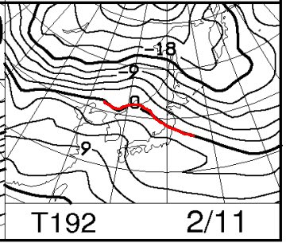
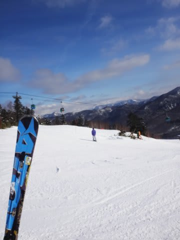
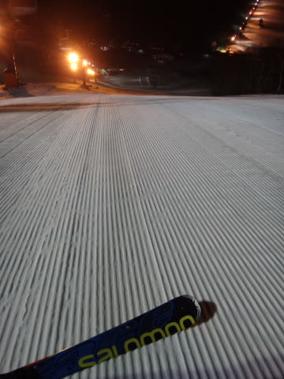

# 2016シーズンモデル，ATOMIC Bluester D.D.3.0 SXようやくデビュー！…インプレッション

📅 投稿日時: 2016-02-05 00:48:39

えー．

昨日．

「この日曜はあまり雪が積もらなさそう…」

と，予想したところですが．

…なんだか．

日曜朝の地上天気図がこんな感じで．

等圧線が，水色で書いたような左下がりのパターン

になりました…っ！

これは．

赤矢印で書いたような北風のパターンになるので．

志賀高原は雪が降るパターン．

…上手くいけば，日曜の朝はパウダーかも！？？

まぁ．

等圧線全体が左下がりではなく．

日本付近だけ東にポッコリ出っ張って，志賀近辺が北風…

ってパターンなので．

そんなドサドサ積もらずに，おそらく朝，

積もっていても30cmくらいかなぁ…

って感じではありますが．

…とりあえず，昨日の段階の，

土曜一日降り続けるという雪予想が，

日曜朝まで降り続きそうかな～，って感じになり．

それほど深い積雪ではないとはいえ，

朝はプチパウダーになってくれそうな形になったので，

ちょっと期待…！

朝までに積もって，昼に向かって晴れていくという

いいパターンになるかも～っ！

…

…といった，良いニュースのあとで．

そーだ，来週の11日，休みだよっ！！！！

ラッキーっ！（歓喜）

んで，この日の天気はどないだ…？？

…と，11日の850hpa図を見た瞬間．

「なんじゃこりゃぁ」←松田優作風に

赤くマークした0℃線がっ！

0℃線が，東北まで上がってるよ…っ！！

そして，志賀には+3℃線が…（涙）．

…

…

みなさん．

今週は大丈夫です．

今週は大丈夫ですが…

また，来週．

必死に冷え冷え踊りを踊りましょうっ！！！！！！←正式名称変更済み

…と，異常に長い前フリをしたところで←こっちが本題なのでは…？

ようやっと本題へ．

[一昨日のブーツ](e76b089b0952386cfef847dd0878b1fc3.md)に続く，

今シーズンのニューアイテムシリーズ，第2段！

…こちらは想定外ではなく．

計画通り（？）の購入だった，

ATOMIC Bluester SX．

…今シーズン．

これまでの雪不足のため．

雪不足対策マシンである，旧SXに

ずっとお出まし願っていたわけですが…

1月も末になろうという先週．

ようやっと雪不足が解消されて，

ブッシュもほとんど消えたので．

…ついに，ニューマシンのデビューとなりました～！

いや，鋭い人は．

この，1月30・31日のレポートに，

いつもの古いSXの写真がなかったなぁ…ってことに，

気づいていたと思うのですが…

ようやっとデビューです！

＃長い潜伏期間だった…

とりあえず．

新しいSXを履いて．

わずか数10m滑った時点で．

「曲がるっ！曲がるよ，この板！」←いや，曲がらない板なんてないから．どの板も曲がることはできるから

もう，そんなことを叫んでしまうほどの，すさまじい曲がり方！！

これは…

とても旧SXと，同じSXと思えない…っ！

トップとテールのグリップがしっかりしていて，

テールの張りが最高っ！！！

ヒールピースのあたりに乗ってやると，

板がきれいにたわんで強烈に曲がり，

圧をテールに抜いてやると，スポンとオートマチックに

切り替わります．

そして，恐ろしい振動吸収性と安定性があり，

荒れた斜面でも，足元に振動がビリビリ来ることなく，

驚くほどのスピードで，滑らかに滑っていけます．

…そうだよ！

SXって，こういう板だったんだ！

はい．

認めます．

今シーズンで3シーズン目に突入していた，古いSX．

この板．

強烈にヘタってました…．

私が2シーズンちょい，メインで履いた板ですから．

ヘタらないわけがありません…．

もう，グリップと返りが全然違います．

新しいSXとは別物です．

そして…

ナイターでも，この板で滑ってみましたが…

うひょーーーーっ！

す，すごい．

すごいよ．

どこまでも傾いて行けるッ！！！

板がしっかりグリップして，ちゃんと戻ってくるので．

安心して谷回りで板を外に出していけるっ！！

すごい！ありえない傾きが出せるっ！！！

＃この日のダイヤモンドナイターに来た人は，

＃リフト沿いをわけ分からん傾きで滑っていた

＃私を見ていたのでは…

…

…

…あれ？

ちょっと待て．

たしか，先週は．

X-RACEでこのナイターを滑ったんだが．

…その時は．

ここまで傾けられなかったよな…．

ここまで安心して，板を外に出せなかったよな…

ここまでのグリップと，板の返りを感じなかったよな…

…

…

…

あれ？

X-RACEの方が，グリップ・張りともに，SXより強い板

のはずなんだけど．

X-RACEの方が，SXより強烈な横Gを出せる板だったはずなのだが…

…

…

まさか．

…まさか…

まだ1シーズンちょいしか履いていないX-RACEが．

早くもヘタッ…

…

いやいやいやいやいや．

…ありえない．

そんな恐ろしいこと，ありえないっ！

…

…

…そうだ．

これは．

きっと．

私が買ったSX.

今年も，[前回と同じ](ef429e6264e79c420fc0cb4dc41634d6c.md)で．

また，フレックスが異常に強い，強化版SXを買ってしまったに違いないっ！！！！

ははははは．

どうやら私は，ATOMICの板を買うと，必ずフレックス強化版に

当たるんだなぁ…

はははははは…（乾いた笑い）．

…

…と．

自分に言い聞かせてみたものの．

もしかすると，WC130のブーツを履いて，柔らかく感じたのも，

X-RACEがマイルド化してしまったためなのじゃなかろうか…？？

という恐怖が頭から離れない，Skier_Sなのでした…

## 💬 コメント一覧

### 💬 コメント by (いか@ご無体職場)
**タイトル**: Unknown
**投稿日**: 2016-02-05 00:58:57

デビューおめでとうございますー(ぱちぱちぱち)

やはり、SXはキレッキレが本来の姿なんですね！最近少しずつ私の14SXもキレが…。今期SXが気になっているのですが、後継者としてはよさそうですね。

ヘタったならそろそろ神田の季節ですね！ 今年は板の割引が早いようにおもいます(´▽｀)

### 💬 コメント by (Skier_S)
**タイトル**: いかさま
**投稿日**: 2016-02-05 01:03:18

’14SX，ヘタリます．

ヘタるの早いです．

’16SXに乗って，すごいシアワセを感じました．

ヘタリ対策に，もう1セット買おうか？

…と思ったほどです…

’14SX乗りとしては，’16SX（ただしVARビンディング付きに限る）は，

後継機として間違いないです．

’14SXからビンディングを移植して，安く上げる手も

あります．

ぜひ，乗り換えましょう！！！

物欲選手権を開催してください！

（道連れを求めている）

### 💬 コメント by (いか)
**タイトル**: Unknown
**投稿日**: 2016-02-06 15:18:16

やはりヘタりが早いんですね…知り合い(重量級)が1シーズン半乗ったSXはテールがかろうじて感じられるだけになっていました…笑

ちなみに私は、すでに先日、木が自分に向かって生えている斜面でも行けるファットを買ってしまいました(笑) 安定感抜群です。 もう1セットはなかなか辛いですねー(^^;;

### 💬 コメント by (Skier_S)
**タイトル**: いかさま
**投稿日**: 2016-02-06 22:23:08

いやー．

ヘタります．

ヘタるのが早いかどうかは，

乗り方にもよるかと思いますが…

私は1シーズン半でダメになった感じです（涙）

…しかし．超おデブ板行っちゃいましたか．

過激なフルロッカーですか？？

### 💬 コメント by (いか)
**タイトル**: Unknown
**投稿日**: 2016-02-06 23:10:01

私は中量級でそろそろ1シーズン半の40日くらいですね…コブも結構入ります…

超おデブまでいかなくて、センターで122ですね！(超おデブ、フルロッカーです)

ただ、テールがSXより固いので、スピード耐性がすごいです。いままでの板のフルスピードくらいからやっと曲がろうかという気になります…笑

### 💬 コメント by (Skier_S)
**タイトル**: Unknown
**投稿日**: 2016-02-06 23:27:29

40日ですか…

私は50日くらいで，明らかにへたり始めた

感じを受けました．

朝イチは大回り用板を履くので，

びっちり50日滑り続け，って感じでは

ないですが．

…あと，個人的にはコブ滑るとへたりが加速しそうな気が…

しかし，板はセンタ122mmのフルロッカーですか．

強烈ですね（笑）

これで，逆サイドカーブまで行くと最終兵器感が

強いですね（＾＾；）．

