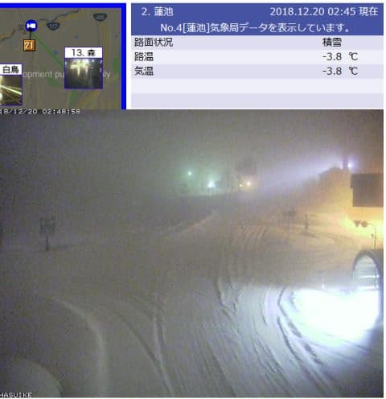

# 3連休の志賀高原の天気を予想してみるが…ダメだ．期待しちゃダメだ．というか…壊滅的？？

📅 投稿日時: 2018-12-20 04:03:02

うーむ．

本日水曜は結局，焼額は非圧雪だったようですね…

でも．

現在，志賀高原は雪になっているようです…！

（[北信建設事務所HP](http://www.q0.ws302.smilestart.ne.jp/index.htm)より）

明日までにドサドサ積もってほしいけど…

西h風なので．志賀はつもらないパターン．

せいぜい10cmか…

まぁ．

それでも降らないよりはずっとマシですが（笑）．

ということで．

今週末は3連休なわけで．

昨日は，3連休までに雪が積もりそうか…

というところを記事にしましたが．

本日は，3連休の間の天気はどんなもんか…

というところを記事にします．

が．

皆さん．

覚悟はいいですか？？

歯を食いしばってください．

では，行きます！

まず…

21，22，23日，850hpa気温，平均値+5℃くらいに

上がりそうな予報です…！

ってことで．

22日，3連休初日の850hpa気温図は…

赤い0℃線が東北まで北上し，

志賀高原は，水色の+6℃線が近づいてます（涙）

そして．

地上天気図を見ると．

水色に塗ったエリアが志賀にもかかってます…

…

…

ということは．

…この気温で，降水量があるとなると．

…

…考えたくないけど，100％液体です．

個体はありえません…

22日，終日雨か…（涙）

で．

3連休中日，23日ですが．

この日も，850hpa気温の0℃線は東北まで

北上しちゃってます（泣）

そして．

この日も網掛けの降水域が志賀にかかってるということは…

この日も，雨ってこと！？？？

そして，再守備の24日は．

この日は，やっと赤い0℃線が志賀より

南に行ってくれます…

それより，志賀には水色の-9℃線が掛かるので．

かなりの冷え込みです！

そして，地上天気図は…

東に低気圧がある，冬型の気圧配置に

なりそうですね．

だもんで，志賀は曇り～雪，って感じ

でしょうか．

ってなことで．

まとめると．

22日：どの時点から降り始めるか分からないけど…

　この日は気温が上がり，雨がぱらつく一日（涙）

23日：この日も朝から時折雨がぱらつきそうな

　一日…そんなにひどい降りにはならなさそうだけど，

　終日曇ったり雨がぱらついたり．

24日：結構冷える一日．

　22，23日は人工降雪機が動かせなさそうなので．

　雪は22，23日の雨で融けたのが固まった

　ガチガチアイスバーン．

　朝から雪がぱらつくかもしれないけど…

　積もるほどではなさそう．

ということで．

この3連休．

あまりコンディション良くなさそうです（涙）

うーむ．

ダメだ．

12月3連休，普段ならクリスマス寒波の時期なのに．

今年はダメだ…

とりあえず．

皆さんの踊りが足りないようです！

神は，まだ祈りが足りないと言っているようですので．

これからこの週末にかけて．

冷え冷え踊りを狂ったように踊り．

そして，寒気の歌を歌い続けましょう…

## 💬 コメント一覧

### 💬 コメント by (若杉勲71)
**タイトル**: だめだー
**投稿日**: 2018-12-20 07:02:29

おはようございます。悲しい予報をありがとう。

積雪を期待して窓を開けたら、なんも積もってない。がっくり今日もヤケビへ向かいます。

### 💬 コメント by (若杉勲71)
**タイトル**: 20日のヤケビ
**投稿日**: 2018-12-20 11:38:23

本日のヤケビは2ゴンと２高だけですが、雪質は上の上。15センチの新雪でコロコロもなく天国です。明後日からいろいろ動きますが、オリンピックはダメそうな感じです。

この後降れば別でしょうが。雪の予報を期待しています。

### 💬 コメント by (つーちゃん)
**タイトル**: Unknown
**投稿日**: 2018-12-20 18:09:30

ピンポイントに週末を殺してくる天気ですね、、、

激烈に普段の行いがよろしくない人でもいるのでしょうか

ともかく今週末は"しんちゃん"にかかっているということで

もし雨なら特大の雪玉を用意しなければなりません(# ゜Д゜)

### 💬 コメント by (Unknown)
**タイトル**: Unknown
**投稿日**: 2018-12-20 22:45:12

踊るぜー☃

　あれ狂うほどに寝ずに踊るぜ☃

### 💬 コメント by (しんちゃん)
**タイトル**: 踊り踊りまくり
**投稿日**: 2018-12-20 23:31:07

もー、今年流行っているＵ．Ｓ．Ａなみに

激しく踊りまくっています。

そうです冷え冷え降れ降れ踊りです(笑)

Ｓ様の黒魔術と皆さんの祈りで、特大の雪玉攻撃は避けたい(笑)

### 💬 コメント by (Skier_S)
**タイトル**: 1ゴンうごくよ！
**投稿日**: 2018-12-21 05:41:01

＞若杉さま

雪，良かったんですね…

おそらく木．金が最高のコンディションだと思います．

土曜からコンディション悪化します（涙）

24日からまた冷え込みそうなんですが…

＞つーちゃんさま

そうです．

これまで，週末は割と天気が良く，雨にならなかったのに．

この3連休の天気が崩れるとなると…

これまでの週末に来てなかった人が悪いのでしょう．

これまで来てなくて今週来る人は，誰だ！？？

＞Unknownさま

そうです！

踊ってください！

狂うほどにっ！！！

＞しんちゃんさま

もう，今週末のためにひたすらひたすら踊りましょう！

今週末が雪になるように…

