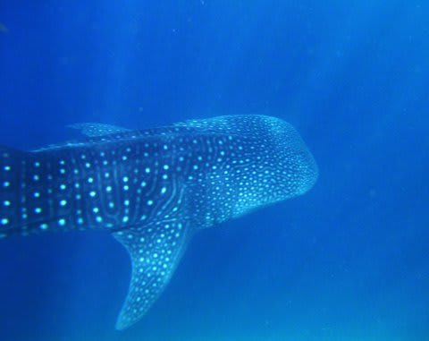
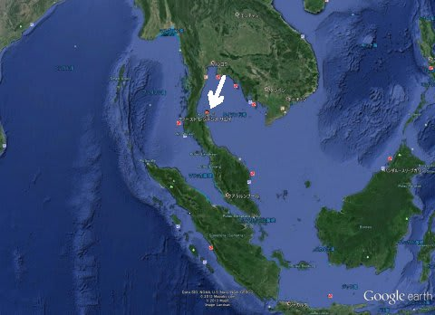

# 正式和名は「ジンベエザメ」で，「ジンベイザメ」じゃないよ

📅 投稿日時: 2013-09-01 03:39:50

ってことで．

このサメ．

本来，「甚平」と同じような柄があるから名前がついたということから考えると．

「ジンベイザメ」が正しい気がしますが．

なぜか，標準和名は「ジンベエザメ」なんです．

なんででしょうね～？？

って話題はさておき．

今回．

…妻が，「ジンベエみたい～ジンベェみたい～」と日々つぶやき続けるので．

9月の3連休を絡めた，夏休みPart2は．

(運がよければ)ジンベエが見れるという，タイはタオ島まで行ってきます…

(この矢印の先の辺りに浮かんでいる，小さい島です)

この8月にタオに行った知り合いの方は，ダイビングでジンベエ様を

堪能できたということで，ちょっと期待．

＃私はモルジブでジンベエ見たことあるけど，妻はまだない

(冒頭とこの写真は，モルジブのジンベエシュノーケリングのときの写真)

今回，目的地決定からダイブショップ，

エア＆ホテルの手配まで，ジンベエ見たさの妻が全部やってくれました．

スタッフが子供の面倒を見てくれて，ボートにも子供を

乗せて連れて行けるショップを選んでくれたようで…

はたして今回，ジンベエ様はお出ましいただけるのかな？

## 💬 コメント一覧

### 💬 コメント by (ゆうこ)
**タイトル**: 美ら海水族館で
**投稿日**: 2013-09-01 17:39:48

今日、ちょうど美ら海水族館でジンベエザメ見てきました！

おっきくて可愛いですね。

写真ダイビングでの楽しみにしてます。

### 💬 コメント by (Skier_S)
**タイトル**: 沖縄ですか!
**投稿日**: 2013-09-01 21:04:22

沖縄、いいですねー

ダイビングはしてきましたか？

いつから沖縄ですか？

台風の影響は受けませんでしたか？

ちなみに、私は先週能登島水族館でジンベエ

様を見てきてたりします…(^_^)

### 💬 コメント by (ゆうこ)
**タイトル**: Unknown
**投稿日**: 2013-09-01 21:10:43

金曜日から今日までです。

台風の影響なく、晴天で楽しかったです。

私はダイビング出来ないので、娘さんよりは下手ですがシュノーケルしてきました。

私はライフジャケットないとシュノーケル出来ません！

### 💬 コメント by (伽羅)
**タイトル**: Unknown
**投稿日**: 2013-09-01 21:58:38

タオですか！ジンベエいると良いですね！

セイルロックは群れがいっぱいワイドな海なので写真楽しみにしてます♪

ちょっと前からフィリピンのオスロブの餌付けジンベエが話題ですが、今度はインドネシアの西パプアでも同じようなのあるらしいですよ。餌付けよりは普通に見たいですが…

### 💬 コメント by (マルハバ)
**タイトル**: ジンベエ
**投稿日**: 2013-09-01 22:21:33

＞9月の3連休を絡めた・・・

20日～23日の大潮回りだったら最高ですね！

もう10年以上前ですが・・・

大潮のモルディブ・アリ環礁南端で

ワンダイブ中ずっと

ジンベエが遊んでくれた事があります♪

私たち夫婦のダイビング史上最高の1本でした

奥様にもぜひあの感動を！

### 💬 コメント by (Skier_S)
**タイトル**: コメントいっぱいありがとうです…
**投稿日**: 2013-09-02 00:28:53

＞ゆうこさま

ちょうど台風を避けられた感じですね～．

金曜日，まだ海のうねりがのこってそうな

感じでしたが，シュノーケリングできましたか！

でも，足が着かない海で泳ぎなれてない人は，

ライフジャケットつけないと怖いですよね…

でも，楽しめたようで，なによりです．

＞伽羅さま

いやー．

タオですが，セイルロックにまず行けるかどうか…

私もシュノーケリングでしかジンベエを

見たことがないので，ダイビングで見たいのですが…

子連れででこまでいけるのかも心配．

＞マルハバさま

いやー．

残念ながら，前半の3連休で，大潮回りではないんですよ…

ちと残念ですが，仕事の都合上いかんともしがたく(涙)．

ワンダイブずっとジンベエって，超ゼイタクですね！

私は2回のモルジブダイブクルーズで計10本以上

ジンベエダイブをしておきながら，一度もダイビングで

ジンベエ様を拝めていません…

今回，見れるといいなぁ～

### 💬 コメント by (マーメイドU+2B50)
**タイトル**: タオでジンベエ会いました！
**投稿日**: 2013-09-06 08:06:58

ご無沙汰でございます。の書き込みです。

数年前GWのチュンポンピナクルとかいうポイントで会いました(^-^)/

一本目、正面から現れダイバーも他にはいなくマイジンベイでした。モルディブよりも大きく、浅場だったので明るく、しかもゆっくり。当時はワイドレンズなかったので、近づき過ぎてエラアップ、ヒレアップ、目玉アップ、、の写真ばかり。会えるといいね！タオは、ビーチも派手でヨーロピアンも多く、おかまさんも街かどにいて楽しかったな。

食べ物も安くて美味しかったです。

### 💬 コメント by (Skier_S)
**タイトル**: マーメイドさま
**投稿日**: 2013-09-07 00:09:35

をを～っ！

お久しぶりです．

タオのジンベエ遭遇率，そんなに高くないように

聞いてたんですが…

結構出るんですね！

今回，子連れなのでどこまで潜れるか…．

チュンポンピナクル，1本しか潜れないと

夫婦のどちらかしかいけない可能性が…

ところで，U+2B50ってなんでしょう？

### 💬 コメント by (マーメイド)
**タイトル**: 文字化け
**投稿日**: 2013-09-07 14:16:06

Ｓさま

星マークつけたら、化けたみたいです。(^^;;

ダイビングはGW以来になってしまってます。今年は多良間島でしたが、、ブイにたまたまかかって自害なさった、タイガーシャークとの記念写真で500本でした。(^^;;

### 💬 コメント by (Skier_S)
**タイトル**: 文字化けですか…
**投稿日**: 2013-09-08 09:28:24

500本，おめでとうございます！

タイガーシャークですか…．

泳いでるところにお会いしたくはないですが，

そんなすごいもの見れて500本とは

ラッキーですね！

多良間は行ったことないんですが，面白いですか？

### 💬 コメント by (マーメイド)
**タイトル**: 多良間は
**投稿日**: 2013-09-12 21:47:10

きれいです！

ダイナミックさは、西表島だと思っているのですが、サービス1つしかなく、素朴すぎてクセになります。

砂地の砂紋がすごい！！って、ウリになるかな？

スタッフ一同さまに皆、惚れ込んでます。

ただ、少数精鋭なので、お子様対応は期待できないかもです。

多良間 JAWS でヒットすると思います。

写真できれいさは伝わるかな、、、

### 💬 コメント by (Skier_S)
**タイトル**: タオは…
**投稿日**: 2013-09-13 19:17:09

風が強く、この２日間浅い砂地しか潜れてません…(;_;)

今日は船を出せるギリギリで、娘は船にのるのを

拒否したので、私が娘とホテルで留守番(T-T)

どちらにしろ、ジンベエは見れそうにない感じ(泣)

多良間良さそうですね…

子連れが無理だとちょっと厳しいかな～

