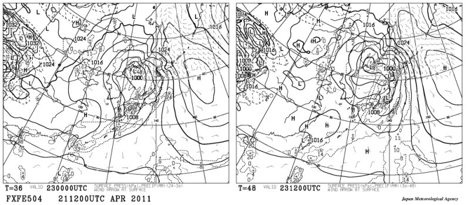
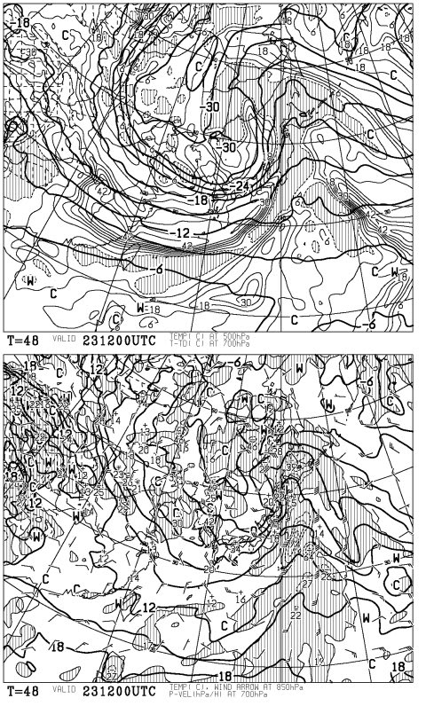

# この週末も…雨（涙）

📅 投稿日時: 2011-04-22 02:05:37

🏷️ カテゴリ: [スキー天気予想](c6554f5c3c106093b511a8daae23757e8.md)

[ここ](e57b12f95c9cd283ab6a61345c683d59e.md)で予想したとおり．

志賀高原，20日は雪が結構降ったみたいですね．

10cm弱積もったようで．

しかし．

この週末は．

…雨になりそうではないですか（泣）．

どうしたことだ．

ここ3週間連続で，週末雨に降られている気がする…

とりあえず，土曜は雨ですね．

間違いなく．

ほぼ終日降り続けそう．

こんな感じで．

左側，23日の朝9時の図も．

右側，23日の夜9時の図も．

日本にガッツリ降水域が…

しかし．

この，23日土曜の夜9時の図．

上が500hpa図ですが．

また，－30度の寒気が…

下が850hpaですが，ここで0度線が日本海側にかかっています．

…もしかすると，土曜夜から日曜朝にかけては，雪になるかも？？？

まぁ，霙っぽい雪だと思いますが．

日曜も…

スカッと晴れることはなさそうですね～．

雨がちらつくこともありそう．

でも，気温はこの時期にしては低めですね．

うーん．

雨さえ降らなきゃ，結構いいコンディションになりそうな

気温の低さなんですけどね～

この週末は．
