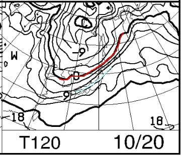
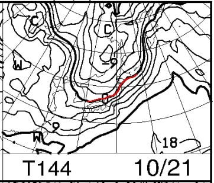
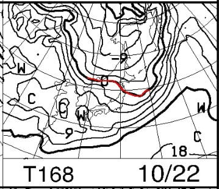
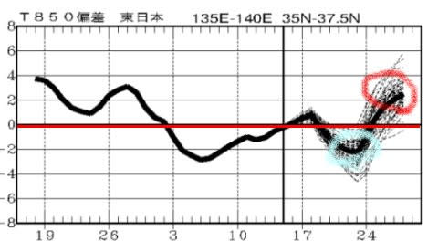
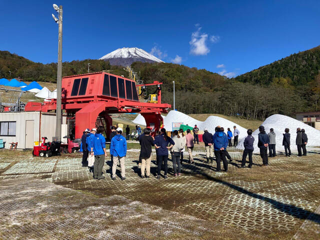
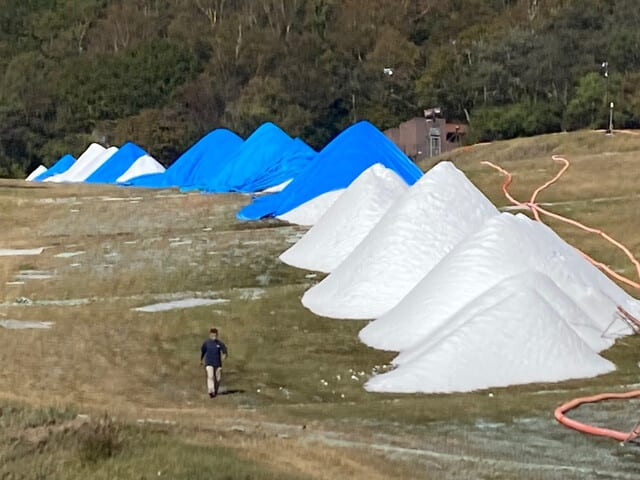
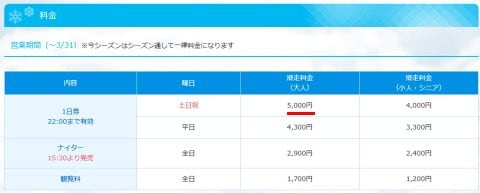
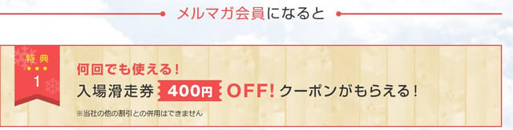
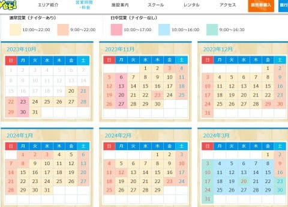

# 2024シーズンのイエティ，リフト券は値上がりしたけど駐車場無料！ただ，オールナイト営業はなくなり10，11月は月曜ナイター無しに

📅 投稿日時: 2023-10-17 01:30:42

えー．

ダイビング日記を書いていて，まだ気分は

夏を引きずっているけど，

そろそろシーズンインまで1週間を切っている

という事実を目の前にして．

そろそろ週末の天気を気にして，

天気図を眺める季節がやってきたわけ

ですが…←そんなところで季節感を感じてるのか？

この週末前後の天気図を見てみると…

イエティオープンの日の20日はまだこの時期

では普通な感じで，赤く記した850hpaの0℃線は

せいぜい北海道近辺．

本州には水色の+9℃線がかかるレベルで，

まだ雪が降るには程遠い感じですが…

21日の土曜日の850hpa気温図を見ると．

ええええ！！！！

赤い0℃線，本州にかかってますよ！

志賀高原には+3℃線がかかる程度なので…

これ，志賀高原とか高い山では雪が

降って，積もりかねないレベルの

冷え込みですね…！！

ただ，22日の日曜には，もう0℃線は

またはるか北まで上がるので…

冷え込みは21日の午後から22日

の昼くらいにかけてでしょうけど．

とりあえず，21日の夜から22日の朝に

かけて，志賀高原や標高が高い日本海側の

山では，雪が降りそうです…！

…ただ．

[QXVV24](https://www.sunny-spot.net/chart/QXVV24.pdf)で，2週間気温傾向を見ると…

水色で記した10月21，22日は冷え込むけど．

そのあと，24日以降は平年比+2度以上に

気温が上がりそうで…

冷え込みは一瞬です．その後，また気温が

上がります…（涙）

10月下旬は冷えなくていいんです！

昨年も10月に雪が結構降りましたが．

その反動か，11月から12月頭が暖かくて

悲惨だったので…

10月はいいから，11月中旬くらいになってから

しっかり冷えてほしいところ．

…という感じで，冷え込みが近づいている中，

イエティではアイスクラッシュでの造雪作業が

ガシガシ進んでいるようです…！！

（[スノーパークイエティFacebook](https://www.facebook.com/YetiSnowtown/)より）

見たところ造雪は順調に進んでいる

みたいですし．

これから週末まで，雪を溶かしちゃう

土砂降りの雨もなさそうだし．

20日は順調にオープンしそうですね…！！

ってことで．

今週末にイエティで初滑りを迎えるわけなので，

今シーズンのイエティの営業情報を調べて

みると…

をを！！

今シーズンのイエティ，駐車場が無料！！？？

これまで土日1200円取られていたから…

これが無料は大きい！！

（有料道路代は相変わらずかかるけど…）

（[スノーパークイエティホームページ](https://www.yeti-resort.com/service/#)より，以下同）

ただ．

やはりリフト券は値上がりのようですね…

土日祝　：2023シーズン4500円→2024シーズン5000円　500円↑

平日　　：2023シーズン3900円→2024シーズン4300円　400円↑

ナイター：2023シーズン2650円→2024シーズン2900円　250円↑

と，それぞれ値上がりしてます…（涙）

まぁ，メルマガ会員登録すれば400円割引になりますし．

今シーズンも，メルマガ会員なら何回かに1回に

半額になるサービスもやってくれると思うので…

実質上の料金表よりは安い感じかな．

…でも，昨シーズンはメルマガ会員，500円引き

だったような気が…

そして次に営業カレンダーを見てみると…

今シーズンも，

平日は朝10時スタート

土日祝は朝9時スタート

営業初日からナイター営業があり，

ナイター終了が22時

というのは変わらないみたいです．

が…

よく見ると．

土曜のオールナイト営業が無くなってるし，

10，11月は，月曜はナイター無しに

なってますね…

微妙に営業時間が短くなってます（涙）

まぁ，オールナイトで滑ったことがないので，

オールナイトが無くなるのは自分には

影響がないんだけど．

それでも，何らかの営業が縮小されていく

というのは，ちょっと寂しいですね…

ということで．

今シーズンも最初のうちはイエティ通いが

続くと思いますが．

昨シーズンみたいに，雪が降らずに

11月最終週までイエティしか滑れなかった…

という状態にならないように．

皆さん，久しぶりに冷え冷え踊りを

踊る準備のほど，よろしくお願いいた

します…

## 💬 コメント一覧

### 💬 コメント by (カンタロス)
**タイトル**: Unknown
**投稿日**: 2023-10-17 07:57:27

Ｓさま、こんにちは。

イエティのリフト券、今年はパスミー（ヤフー）、アソビューで事前購入できるようですね（去年まではどうだったか覚えてませんが…（笑））

事前購入での割引価格が気になる所です。

どちらにしても、わすがながらポイントがつくので（つかないよりまし）2回目以降の購入にポイントが充当できるのでちょっとは安くなりますね！

値上げも白馬とかにくらべたら許せる範囲かなぁ…て個人的感想です。

むしろアイスクラッシャーフル稼働でよくあの価格に抑えたと感じます。企業努力に感謝です。

今年も天気予報、よろしくおねがいします!

### 💬 コメント by (Skier_S)
**タイトル**: ＞カンタロスさま
**投稿日**: 2023-10-18 00:30:47

私も事前購入が気になっているんですが，まだ事前購入ページに飛べませんね…

でも，メルマガ会員のほうがお得なお値段かも？

とりあえず，今シーズンは駐車場も無料になったし，この値上げでよく抑えた…というのが

正しい感想かもしれませんね．

今シーズンも天気予想やりますので，お楽しみに～！

