# 2022/1/29(土)の志賀高原焼額山スキー場は…意外と一日晴れ！気温は冷えて雪はGood!

📅 投稿日時: 2022-01-29 22:58:15

本日の志賀高原ですが．

なんと．

予想外に，終日晴れました…！！

ええ．水曜段階に「土曜は晴れそう」と

予想したのをわざわざ訂正して．

昨日，「土曜は朝は雪降り～曇り，雪が降った

りやんだり，時折日が射したり…」

と書き直したのに．

ええ

この訂正した予想，見事に外れましたよ．

ええ．外しました．

外しましたとも！！←開き直り

むしろ水曜段階の予想が当たってた感じ…(涙)

予想修正しなきゃよかった…（泣）

でも，今朝，志賀を登ってくる前の段階で．

小布施から北(写真の左側)は雪雲がかかり，

それより南（写真の右側）は晴れている状況で．

ちょうど志賀高原が，曇りと晴れの境目っぽい

感じ…

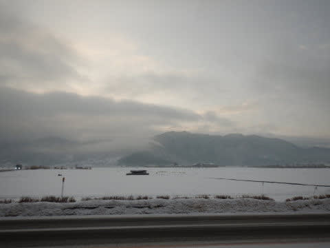

で．

志賀高原の登り坂では曇ってたのに．

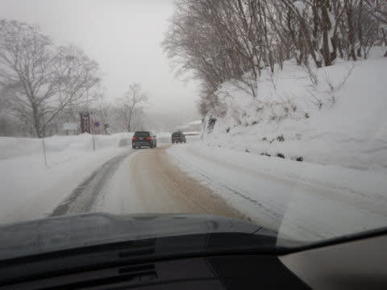

なぜか一の瀬近辺まで上がってくると

晴れているという，

この，微妙な晴れと曇りの境目にいる感…！！

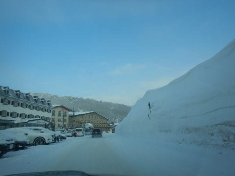

で．

実際．

焼額に到着すると…

晴れてますね．

ええ．晴れてますね．

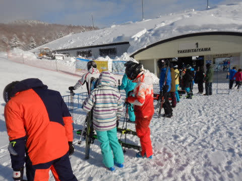

山頂に出ると，いかにも曇りと晴れの

境目って感じで．

北を見ると雲が，南を見ると晴れ間が…

という天気．

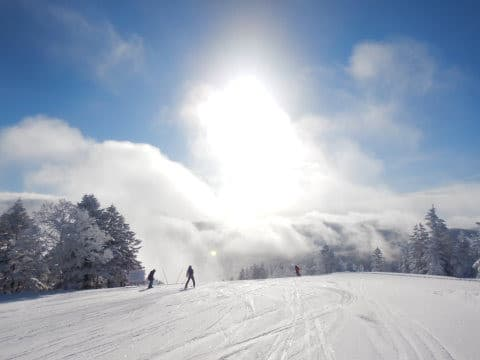

ただ…

志賀高原は，本日はその境目より晴れ側に

入ったようで…

なんだよ～！！

予想天気図，風がちょっと北風になったように

見えたので，土曜は曇り～雪の領域に入ると

予想しなおしたのに．

予想，外れたじゃないか！！（激涙）

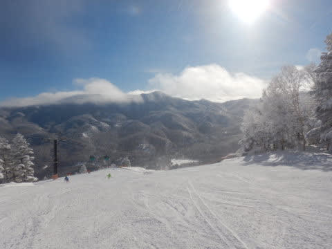

朝の気温は-11℃近くと，

気温はほぼぴったり当てたし…

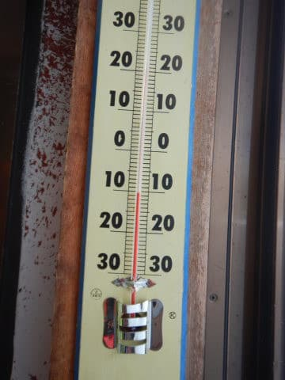

朝までにうっすら積雪，というところは

当てたけど…

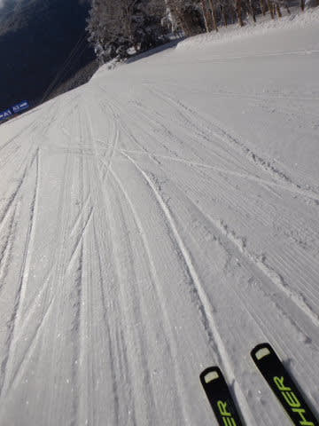

でも．

天気は晴天じゃないですか～！

予想を外して，

こんな晴天の最高雪質になるなんて…

…

…

…でも，

いいじゃないですか！！

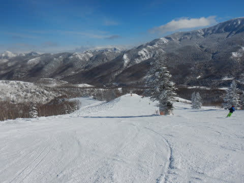

最高！！

午前中にはすっかり晴れになって，

予想は外したけど…

コンディションとしては最高！

まさかここまで晴れるとは…っ！！

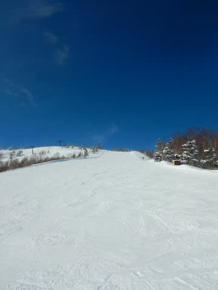

そして，今週もゴンドラ待ちのピークは

この程度，ゲートの外に出るのが数回

あった程度で．

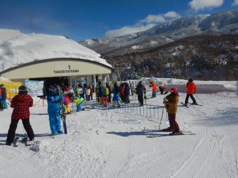

基本的にはガラガラでした…

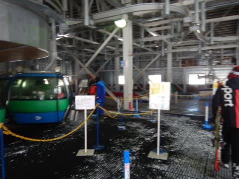

そして，最高気温も-3℃程度と

低かったので…

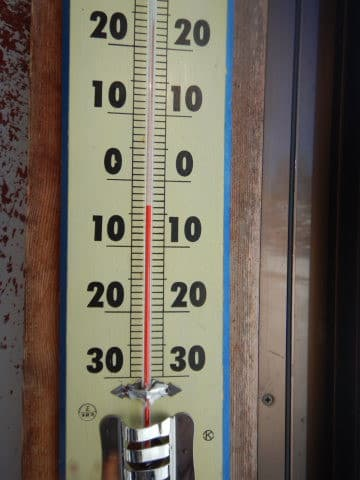

終日晴れてたのに，雪質は冷え冷えの

良いコンディションという．

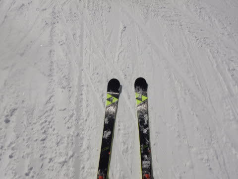

3週連続，週末は恵まれた絶好のスキー日和に

なりました…！！！

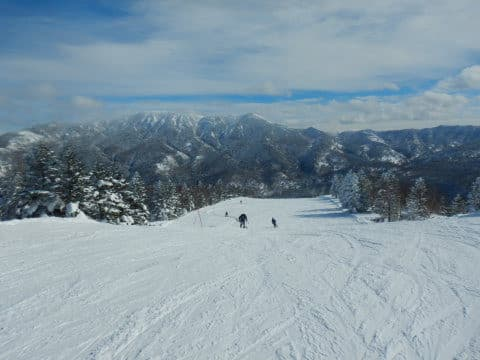

そして，

ゲレンデは夕方になってもほとんど荒れず，

ずっと大回り板を履いて快適に大回で

飛ばせるフラットバーンで…

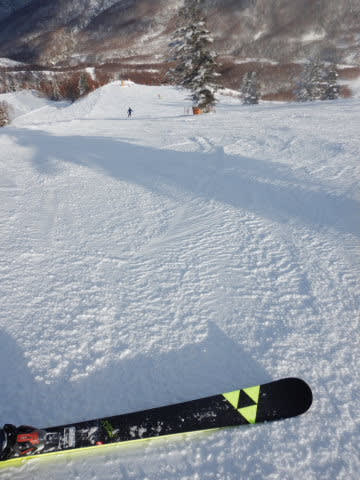

日が暮れる夕方ラストリフトまで，

思いっきり滑り倒したのでした…

いや．

今日も良かった．

そして，ここまで雪が荒れなくていい雪だと，

全然疲れない！！

まだまだ滑り足りない…！！

というときは．

…そうです．

そういう時は．

当然のごとく，ナイターへGo!

先週，先々週といろいろな事情で2週間

ナイターを滑れなかったので．

実に3週間ぶりのナイター！

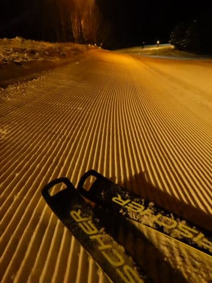

ファーストトラックと同じく，圧雪かけたての

誰も滑ってないピカピカシマシマバーン，

いただきま～す！

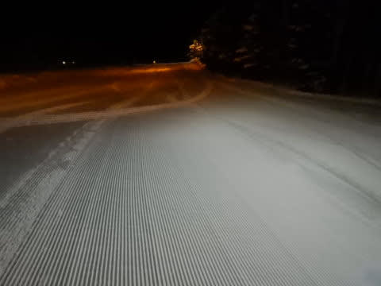

今日はそこそこナイターも人がいたけど．

でも，8時の営業終了時間になっても，

ところどころシマシマが残っているほど！！

ひたすらおいしい夜の冷え冷えの

いい感じに締まったバーンを，

営業終了までの2時間，ひたすら滑り倒したのでした…

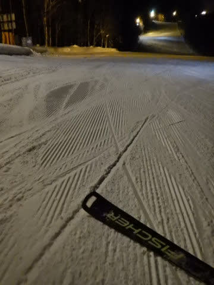

いやー．

まさか今日，朝からナイターまですっきり晴れ

続けるとは思わなかった…

ぎりぎり雪雲がかかる境界だった志賀高原．

見事に雪雲がかからず，晴れ続けました…！

でも．今晩はさすがに雪雲が飛んで来そうで．

明日の朝までには10～20㎝くらい積もりそう．

明日はさすが，朝は曇り，時々雪がぱらつく

天気でスタートかな…

でも，運が良ければ，昼間晴れ間も出てくれるかも！

## 💬 コメント一覧

### 💬 コメント by (レインボー74)
**タイトル**: Unknown
**投稿日**: 2022-01-29 23:24:46

土曜日の志賀高原情報

朝の上林-1℃　蓮池-7℃。道中雲の中。蓮池からはピーかん。雲海を突っ切って来たってことだね！ラッキー！

今日は期待外れの新雪だったけれど、明日こそ期待。

やけびを抜けてダイヤの新雪が貸し切り。

ファミリーの左側が新雪うはうはバーン。

たんねの通称ともくんバーンを下ると、ぎょえーっ！タンネが休止。

ここから戻るのにエネルギーを費やした74歳には、もはやあとの力は残っていませんでした。

ブナのいこい荘での昼食のあとは、もうなーんもありません。

### 💬 コメント by (かず)
**タイトル**: Unknown
**投稿日**: 2022-01-30 03:05:36

ヤケビゴンドラ降りたとこで2回位Sさん見かけましたよ！夜中3時ですけど上林でも結構降ってますね！

昨日やっと圧雪なので新しい板一枚目おろしました！Salmon！

試乗した時より相〜当良くて細くて短いのにパウダーも余裕

歴代No1！こんな板ずっと車においていて損した……

### 💬 コメント by (真美子)
**タイトル**: Unknown
**投稿日**: 2022-01-30 06:37:55

29日土曜日は本当に一日良い日でしたね。私は新幹線と長野からのバスで、志賀高原へ来ていますので、シーズンに1回か2回しか来ることが出来ません。そんななかでの素晴らしいお天気。そしてステッカーを頂けた事も嬉しかったです。ありがとうございました。

### 💬 コメント by (油漏れ@あちこち)
**タイトル**: Unknown
**投稿日**: 2022-01-30 07:23:15

私もタンネの運休にやられました。

幸い１０分後にバスが来るタイミングでしたので、それで脱出できました。

夕方一の瀬寮前付近の宿のまえで、焼額山方面に向かうレボーグを見かけましたが、、、ひょっとしてsさんだったのかなぁ。

### 💬 コメント by (みこみん)
**タイトル**: Unknown
**投稿日**: 2022-01-30 09:33:10

おはようございます☀

私も、昨日から焼額来てます！

今朝は最高ですねー☃️⛷

楽しみまーす⛷

### 💬 コメント by (Skier_S)
**タイトル**: 今週末の志賀は大雪になるかも…？
**投稿日**: 2022-01-31 02:19:48

＞レインボー74さま

タンネの運休，痛いですよね…

明日以降，曇~雪が降る天気が続きそうで，終日すっきり晴れの日は

しばらくなさそうです…

＞かずさま

あれ～？？見られてましたか…

新しい道具はすぐ使わないともったいない！！

…と思うのは，私だけ？

（保存用に同じ板を何セットかもっている場合を除く）

＞真美子さま

今日は午前中お疲れ様でした！

まさかの午前中ずっとご一緒でしたね…

楽しんでいただけたなら良かったです…

＞油漏れ＠あちこちさま

一の瀬寮前ですか…？？

5:30頃だったら，一の瀬で夕食終えてナイターに向かう私だった可能性が…

＞みこみんさま

朝は日が射してましたが，すぐに曇っちゃいましたね（涙）

でも，雪は良かったので，楽しめましたでしょうか…？？

