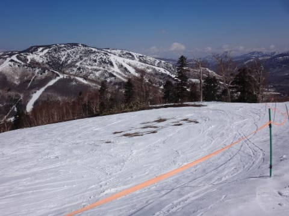

# 4月28日（金）の志賀高原は…晴天だけど雪は締まり気味！滑る雪だしガラガラだし…シアワセ…

📅 投稿日時: 2017-04-28 22:36:52

🏷️ カテゴリ: [2017スキー滑走日記](c7d777cecfc91bdf0fa464ad62c6d49ab.md)

えー．

普通の人より一日早く，GWに休みに突入した

Skier_Sです．

ってなわけで．

本日から志賀高原に来ているわけですが．

いやーーーーー．

良かった．

今日は良かった…

まず．

先週オープンした，志賀草津道ですが．

8時にならないとオープンせず．

8時に草津だと，志賀の一の瀬エリアは9時半

近くになってしまうので．

今日もいつも通り，信州中野ICから登ってきました…

で．

志賀高原に登ってくる道ですが．

完全にドライです．

トンネル内も凍結なく，今日は問題なく夏タイヤで

突っ切れるレベル．

＃何かあるかわからないので，スタッドレス履いてくることを

＃一応お勧めしますが…

…しかし，雪が多い今年．

サンバレーもまだ全面滑れそうですね…

で．

一の瀬ファミリースタートとした本日．

ゲレンデに出ると…

うむ！

晴天っ！！

…そして，ゲレンデは…

うはーー．

気持ちよさそうなピカピカ圧雪バーンっ！！

そして…

シマシマっ！！

…だけど…

これは…

か，硬いっ！

硬いんですけど？？

そして…

圧雪のかけ方が，荒いよ…（涙）

だもんで．

朝イチファミリーの正面バーンはかなり手ごわく．

朝のうちは，おとなしく緩いパノラマコースを滑って

ましょうか…

パノラマコースも硬いけど．

正面バーンよりエッジが利くので．

朝のうちはかなりかっ飛ばせて

快感っ！！

ちなみに．

パーフェクターコースは取りつき部分に

ちょっと土が出始め…

そして，今日は圧雪がかかっておらず（涙）

写真だとわかりにくいですが，

朝は荒れ荒れのまま固まっていたので．

本日は滑りませんでした…．

で．

本日はこんな感じのピカピカ晴天だったにも関わらず．

朝のうちはウエアのジャケットを着ないと寒いな…

というくらいの，割と低めの気温が続いたので．

…朝10時半になっても，まだ正面バーンは，

かなり硬いままなのですが…

でも．

このころになると，表面がわずかに緩んでエッジが

効き始めるようになったので．

…これは…

うほう！！

気持ちいい大回りバーン！

もうGWというのに．

朝10時半でこんなに気持ちよくていいの！？？？

…この日のゲレンデ最高混雑は

このくらい．

もう，これがこの日の最高の人出．

それ以外は…

こんな感じで，超ガラガラなんですが！？？

この時期の11時過ぎのゲレンデが，

こんなフラットでいいのですか！？？？

こんなピカピカ晴天というのに…

ゲレンデは昼前になっても，

驚くほどフラットなのですが？？

12時半になっても，

まだこんな感じで．

表面がちょっともっさり

してきたけど．

全然気持ちよく大回りできるんですけど…！？？

いいんですか？

もうすぐ5月になるという時期の昼過ぎで，

こんなに気持ちよくて，いいんだろうか…

今年はリフト下の土もまだ全く出てきてないし．

いやーー．

恵まれすぎてる…

午後になると，時折雲が飛んできたものの．

ゲレンデは，

まだこんな感じをキープ．

どうしたわけか．

まだ全然フラット大回り可能なんですが…？？

午後になっても，超快適大回りを

ひたすら続けられるのですが？

しかし．

さすがに最高気温が+7℃近くまで上がったので．

午後2時半ごろになると…

あ，さすがにちょっと荒れてきましたか…

でも，まだ大回り，行けるよっ！！

滑っている人が少ないので，

雪が柔らかくなってもゲレンデは荒れず．

それどころか．

人が少ないので，正面バーンの下半分．

まだこの時間でもシマシマが残ってるところが…

午後もほとんど荒れないまま時間が過ぎていき．

16:20のリフトストップのころになって．

うむ．

ようやく，「荒れてきたな～」

ってバーンになったかな…

でも．

すっきり晴天の本日．

人がガラガラだったのもあったけど．

午前いっぱいはしっかりしたバーンを

キープして，

午後遅くまでゲレンデが荒れず．

さらに夕方まで，しっかり滑る雪をキープして．

板が張り付くとかいうことはなくて．

…まさか，夕方のリフトストップまでひたすら

気持ちよく正面バーンを大回りできるとは…

リフトが減速運転だったにもかかわらず．

この時期に滑走標高差19000m近く滑れたのだから，

なんと恵まれていた一日だったことか…

＃リフトが減速じゃなかったら，昼間だけで20000m突破するところだった…危ないところだった！！←何が危ないんだ？

いやーーーー．

でも．

湯田中近辺でも，桜が満開を過ぎていると

いうのに…

この時期に，こんないいコンディションで滑れて．

4月のスキーとしては，今日がこれまでの人生で

最高に楽しかったかも？？

ホントにいい一日だったなぁ～！

PS1.…明日は朝晴れてるけど，午後に1時間ほど，

　通り雨がバラバラと降るかも…（涙）

PS2.…春の雪で，がしがしスピードを出して

　ひたすら大回りを続けると．

　スキーパンツの裾の部分にザラメ雪が当たって

　やすりのように擦れていくので…

　

　スキーパンツに穴が開きます（涙）

　春雪で，スピード出しすぎの大回りを

　えんえん続けることは避けましょう（泣）

　＃まだ3シーズン目のパンツなのに…

　＃板だけじゃなく，ウェアもあり得ない

　＃消耗のしかたなんですけど（涙）

## 💬 コメント一覧

### 💬 コメント by (YUMI)
**タイトル**: Sさん発見！
**投稿日**: 2017-04-29 20:22:09

W69さんに「Sさんのブログ面白いよ」って教えてもらい、３月末頃からちょくちょく楽しみに拝見しております。

・・・で、そのうち、どこかでお目にかかるかな？って思っていたところ、「スキーウエアが破れたのどうの」と、SAちゃんパパとお話をしている人物を発見！外に出てみれば、赤いATOちゃんと青いSちゃんが仲良く並んでいたので、ひょっとして、あの人がSさんかも？って思いつつ、帰ってからブログを見ると、ビンゴ！やっぱり！！って感じで少し嬉しかったです。

### 💬 コメント by (Skier_S)
**タイトル**: YUMIさま
**投稿日**: 2017-04-29 22:27:57

えーっと．

それは，間違いなく．

270%くらいの確率で，私です（笑）．

…今度発見したら，ぜひ声をかけてください．

しかし，Sちゃんパパをご存じとは，

志賀高原の常連さんですか？

つぎにお会いした際は，怪しいお札…

じゃなくて，シルバーステッカーお渡しします～

