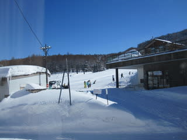

# 志賀高原にきたものの

📅 投稿日時: 2011-03-12 09:23:58

🏷️ カテゴリ: [スキー雑談](c1f9d2cb7478308da16419928ea3945e9.md)

昨晩．

職場で地震に見舞われ．

職場，自宅ともに停電，ガスも出ない状況．

真っ暗で料理もできず，シャワーも浴びれない家に

いても仕方ない…

と，家族を連れて，予定通り志賀高原に向かったわけですが．

朝4時前，その車の中で信じられないニュースが．

「長野北部で震度6弱」

ふげげげげげげげ．

悩んだ挙句，宿に確認すると「それほどゆれなかった．

停電はしてない．普通に営業してます」

とのことだったし，信州中野までの道路も中央道経由なら

問題なく通れるみたいなので，とりあえず志賀へ．

信州中野は震度4とそれほど強くなかったらしく，街中は

見た目はまったく地震があったとは思えないです．

志賀高原道路も通行止めなどなくいつもどおり．

で，さっき，志賀高原につきましたが…

リフトが止まってます．

安全点検のため，今日1日営業しないとのこと．

＃昨日の午後から動いてなかったらしい

下山するお客さんが多いですが，残ったお客さんは

恨めしそうに晴天で冷えて雪質がよいゲレンデを眺めてます…

現時点の情報は，

・サンバレー～奥志賀まで，本日一日点検のため営業せず

・熊の湯…リフト1本のみ運転

ということで，「本日営業中止」

を宣言していないのは，熊の湯のみ．

…しかし，この状況で熊の湯のリフトが1本動いているのが

驚き．

今日は，宿でのんびり一日過ごして，娘と

そり遊びしてます．

とりあえず，リフトは動いてませんが，志賀高原の宿は

ほんとに地震があったの？

って驚くほど，普通に営業してます．

