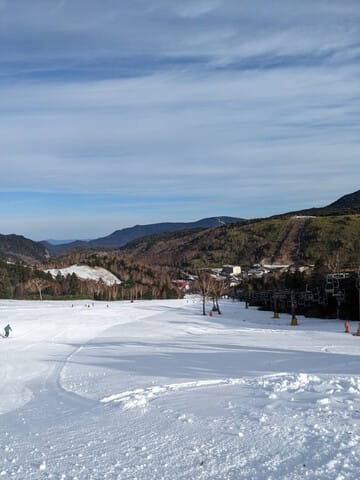

# 2023/11/23(祝)のイエティ速報＆志賀高原の熊の湯スキー場特派員レポート！

📅 投稿日時: 2023-11-24 04:21:18

🏷️ カテゴリ: [2024スキー滑走日記](c453f687e8a0f05679e95831d0a02cd0c.md)

ということで．

睡眠2時間を切った中，

行ってきましたよ…イエティへ．

で．

イエティのレポートをする前に．

志賀高原に忠誠心が高い特派員が，

本日オープンの熊の湯のゲレンデ写真を

送ってくれたので．

まずは熊の湯の特派員レポートです！

本日…というか，もう昨日になる，

勤労感謝の日の木曜日．

熊の湯スキー場，無事オープンしました～！

…それも，人工雪＋天然雪ミックスで，

思ったより雪質がよかったみたい…！！

ぐふーーーー！

あさイチはかなりおいしそうな感じの

シマシマですね…！

そして，特派員曰く．

拍子抜けするくらいガラガラで…

リフト待ちはほとんどなかったみたいです．

コースも思ったほど人がいなくて，

うらやましい…

そして．

思った以上に幅が広い！

天然雪が降ってくれたのもあり，

コース幅は想像より広い感じ…！！

これもうらやましいぞ…っ！！！

雪質は，天然雪が乗ってくれたので

結構いい感じだったみたいですが…

その上，人が少なくコースが広いという．

…今日の熊の湯は，かなりの当たり

だったみたいですね…（羨望）

しかし．

コース上はほとんど土が出てくるところが

なかったものの．

リフト乗り場付近が雪が薄く，ちょっと

ヤバくなって来ていて…

リフト乗り場付近の落ち込みの雪が薄く．

ラストのころは，石も浮き始めてきていて…

リフト乗り場近辺だけは，ちょっと残念

だったようです．

ただ．

リフト乗り場以外のコースは全然大丈夫で．

リフト降り場近辺も問題ないし…

営業終了時間まで，結構いいバーン

コンディションをキープしてくれて．

最後はガラガラで，かなり楽しめたみたい

です…！

うーん．

今日の熊の湯，激混みだと思ったんだけどなぁ…

思ったよりガラガラでうらやましいぞ！！！

ただ，路面は凍結してるみたいだし，

明日から本格的に雪が降るので，

行く方は運転にご注意を…

で．

ここからは本題のイエティのレポートですが．

今日も睡眠不足で滑りに行ったというのに．

滑りに行ってしまったせいでできなかった

仕事をやっつける必要があり，

気づくとてこんな時間…もう午前4時だよ…

今日の活動時間22時間なんですが(泣)

だもんで，今日も速報にて！

まず，今日は週の半ばの祭日というのもあり．

いつもの土日より待ちは少ない感じで

始まりました…！

おそらく週の半ばの祭日だから，

今日はそんなに混まないはず！！

…という読みで，かなりクリティカルな

状況にもかかわらず，わざわざ滑りに来た

本日．

予想通り，朝のゲレンデはガラガラ！！！

うはーーー！

やっぱり今日は無理してでも来てよかった…！！

そして，前回滑ってからまだ1週間たって

ないのに．かなりコース幅も広がりました…！！

コース幅も広いし，そんなに混んでないし．

今シーズンのイエティとしては，一番

マシですね…！

で．

朝は曇っていたものの，リフト営業開始の

頃には雲も消えていき，終日晴れ～薄曇りの

比較的いい天気！

天気の良い中，午前中は結構気持ちよく

滑れました…

午前中は，最大でもこのくらいのリフト待ちで．

いや…

やっぱり週の半ばの祭日は混まなくていいよね，

…と思っていたところ．

…なんだか，午後になると．

結局いつもの週末と同じ混雑になっていき．

午後はリフト待ち10分をこえてきちゃったん

ですが…？（涙）

コース上の混雑も，ガラガラの午前と

違って，午後はいつもの週末と同じ感じに

なってきましたが…

まぁ，それでも，コース幅が広がって人を

避けられるようになってきただけ，

まだマシだったかも…

ってな感じで．

まぁまぁ恵まれていた本日ですが．

あまりにも寝てないし，

家でやっつけなきゃいけない仕事も

残っているので．

午後は混んできたから，ナイターも

混むだろう…というのもあり．

私としては珍しく，ナイターをやらずに

16時に退散したのでした…

…ということで．

イエティとしてはよくて満足したけど．

熊の湯の特派員からの写真を見て．

コース状況も混雑もずっと恵まれている

熊の湯で滑りたかった

と，ちょっと幸せ感が減ってしまった，

Skier_Sだったのでした．

また明日，詳細レポート予定！

（眠くて死にそうだったらできないかも）

## 💬 コメント一覧

### 💬 コメント by (ねも)
**タイトル**: Unknown
**投稿日**: 2023-11-24 15:16:44

Ｓさん　お久しぶり(^^;)

まだ11月だというのに、熊ノ湯が気持ち良さそうです(^^*)　イエティは勘弁ですが(笑)、私も初滑りしたい！　でも遠すぎ。

来月中旬、白馬五竜に行く予定ですが、期待できる？　暖冬予報ですが、案外寒いような✌️

### 💬 コメント by (Skier_S)
**タイトル**: ＞ねもさま
**投稿日**: 2023-11-25 04:42:07

お久しぶりです～！！

熊の湯，よさそうですよね…

来月中旬なら，少なくともアルプス平とか上部は問題なく滑れると思います．

12月上旬まで，意外と冷えそうな感じです…！

少なくとも12月1日までは冷えるので，12月2日の週末には47，五竜ともシーズン

スタートするんじゃないでしょうか．

