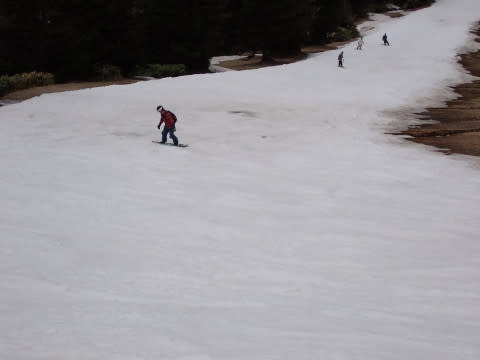

# 2023/5/1(月)GW谷間の志賀高原，横手＆渋峠スキー場は…晴天！昨日の雨のわりには雪は残って，第1リフトも滑れてガラガラ！

📅 投稿日時: 2023-05-02 00:28:02

🏷️ カテゴリ: [2023スキー滑走日記](cd943df30cfcc3d0896469e2ff98720cd.md)

ということで．

怒涛の7連勤を終えたあと，睡眠2時間半で

予告通り志賀高原にやってきました～！

今シーズン初の草津越えでの志賀への

アプローチでしたが…

雪の壁が，例年のGWに比べると圧倒的に

低いですね…（泣）

で．

今回は草津越えでのアプローチというのもあり，

ホームゲレンデの焼額もクローズしちゃったので．

一番最初に到着する，渋峠スタートにしました～！！

いやー．天気はすっきり晴天！！

…しかし．これだけ志賀高原に来ておきながら，

渋峠で滑るのは2018年以来という．

実に5年ぶりに渋＆横手に来ましたよ…

ってなことで．

6時から8:15まで早朝営業（料金3000円で

横手と共通）をやっていますが，私は

通常営業から参戦．

早朝営業終了後，いったん30分の休憩を入れて

8:45からの通常営業開始となるので，

通常営業開始の列に並びますが…

そんなに人は並んでませんね．

8:45スタートでリフトに乗りますが…

リフト乗り場にもしっかり雪がついてるし．

乗り場周りも，まだまだ雪はありますし…

中間駅にもしっかり雪がつけてあります！！

そして．

想像よりも雪が残ってますよ…！？？

なんだよ！！

昨日の雨にやられず，渋峠は雪がちゃんと

残ったんじゃないか！！

で．

気温もプラスで日差しも強く，

雪がもう緩んじゃって，早朝営業でバーンが

荒らされてるかと思ったら…

意外とフラット！

バーンにガンガン硫安が撒かれていて，

コース全面，硫安が効いて締まり気味なので，

早朝でも荒れずにいてくれたようです！！

そして，硫安が効いてるので，板が良く走る！！

昨日の雨＆今日の高温＆強烈な日差しで，

ダメダメバーンを覚悟してきたら…

意外と気持ちいいじゃないか！

まさかあの雨の後で，ここまでいい感じの

バーンが滑れると思わなかったよ…！

ところどころコース幅は狭いけど．

硫安が全面的に効いていて板も走るし，

結構楽しい！！

渋峠侮りがたし！！

ってなことで．

渋峠リフトは最大でもこの程度の待ち．

飛び乗りになることも多く，

平均的には2-3組の待ちで乗れた感じで

ガラガラだったのもあり．

ついつい渋峠で10時近くまで滑って

しまいましたが，ぼちぼち横手へ脱出！

おどろくことに，まだ第3リフトを下り乗車する

必要なく，コースを滑って降りられますよ…！！

ここも雪が解けないように，かなり気合の

入った硫安の撒き方をしているようで．

朝のうちは土も出てないし，板も滑るし．

意外と悪くない！

いや…いろいろ気合入れて雪出ししたん

だろうな…というコース維持の努力を

感じる…

そして，第2トリプルから降りていく道も

まだ雪は結構残っていて．

第2のメインバーン．

午前10時頃は多少荒れ始め感はあるものの，

まだフラットで幅もあるし，

ここも硫安が効いて板が走る！！

横手第2，まだまだ幅もあるし…

これはもう少し行けそう…！！

GW最終日まで持ってくれると嬉しいけど…

少なくとも5月5，6日まではもつんじゃないかな？？

リフト乗り場付近の雪もまだ大丈夫っぽいし…

雨が降ったりせず，今日みたいな天気が

続けば，まだあと5-6日は問題なく滑れそう！！

そして，リフト待ちもほぼ0の飛び乗り！

さらに驚くことに．

なんと，今日もまだ，横手山は一番下，

第1ペア乗り場まで滑っていくことが

できます…！！！

残った雪をかき集めて作った，雪と泥が

混ざったチョコアイス雪かとと思いきや…

ちゃんと真っ白な雪ですよ！！

ここは硫安を撒いてないので，さすがに表面に

汚れが浮いて，滑りもそんなに良くない感じ

ですが…

それでも，まさか第1ペア乗り場までのコースが

こんなまともな状態で残っていようとは…！！

一番最後の一部だけ，狭くなりかけてましたが…

でも，まだほかの場所から雪を持ってこれそうな

感じなので．

コース整備すればこれもあと数日は維持できそう…！

リフト乗り場付近も…

これ，予想よりも全然まともじゃないですか！！

どうせ石＆泥まじりのドロドロ雪でなんとか

強引につないでいると思いこんでましたが…

横手山，このコース整備力すごいよ…

乗り場にもちゃんと雪がついてるし…

ここ5年以上横手山に来てませんでしたが．

横手山のコース整備力に脱帽！！

第1ペアは，決して滑っていて楽しいコースでは

ないけど，ここがあれば山麓に車を止めて

滑れるので，コースがつながっているのは

ありがたい…

ってなことで．

横手山，まだ一番下まで滑って降りられ

ますよ～！！

（雪の滑りが悪いので，滑って楽しい src="https://blogimg.goo.ne.jp/user_image/7b/d8/01e3afbcc2f13284c458039153924da6.jpg" border="0">

第1リフト沿いのコースは一度滑れば

もう満足なので．

そのあとは，雪も比較的滑って，効率よく

高速リフトで滑れる第2トリプルをぐるぐる

していたのですが…

さすがに午後2時を過ぎると，ちょっと雪が

荒れてきて，滑りも悪くなってきました…

そして，ところどころ雪が薄くなり，

穴が開いてきたところも…(涙)

やっぱり雪はそこまで厚くないんだなぁ…

でも，雪の滑りが悪くなってきたとはいえ．

完全ストップ雪というほどではなく．

穴も十分よけられたので．

最後まで結構楽しく滑れました～！！

…ただ，

最後のほうになると，山頂から降りてくる

キングコースが，結構穴だらけに

なっていたので…

うーん．

第2，第1は持ちそうだけど．

第3ペアを滑って降りれるのは，

あと2-3日かも？？

ってなことで．

営業終了15:45に間に合うように，第3リフトに

乗って，車を止めた渋峠に戻りますが…

横手第3を降りてから渋峠に向かうコースも，

雪が少なくなると板を外して歩くように

なるところ．

まだまだ雪は残っていて…

横手→渋峠へはまだまだしばらく

滑っていくことができそうです…！！

そして，ラストの渋峠ですが…

ちょっと荒れてたものの，雪は滑るし，

コースに穴は開いてないし…

これなら少なくともGW最終日までは

もつんじゃないかな…？？

…ただ．

去年みたいに6月までは絶対無理だけど…

ってなことで．

昨日の雨で壊滅的にやられたと思っていた

志賀高原ですが．

横手・渋は予想以上に健闘しています！

そして，今日は終日リフトもガラガラだったし…

いい一日だった…

で．

驚くことに…

滑り終わって撤収中に．

雪が降り始めてきました…

まぁ，積もるほどではなかったですが…

[2日の朝は数㎝～10㎝くらいの積雪
と書きましたが，そこまで積雪はなさそうです…
明日朝の積雪は0かな．

ただ，明日，2日の朝は間違いなく氷点下には
冷えますので，冷え冷えバーンを滑れそうです…
明日は早朝狙いですね！！

ってなことで．
明日も滑ってます～！！]()

## 💬 コメント一覧

### 💬 コメント by (大阪のK)
**タイトル**: Unknown
**投稿日**: 2023-05-02 08:30:24

5月1日、同じところを滑ってました。

横手山からスタートしたので、Sさんとは真逆のタイミングです。

横手山、渋峠のスタッフには感謝ですね。

何とかゲレンデを繋げてくれました。

大阪のKは昨日をもってシーズン終了でございます。

Sさんのご無体な仕事のお陰で、余りご一緒出来なかったですが😅

焼額山のメンバーには大変お世話になりました。

来シーズンも、宜しくお願いいたします。

4月29日.1ゴンの営業ラストの搬器に乗れたので、少しセンチになったKでした(笑)

### 💬 コメント by (Skier_S)
**タイトル**: Unknown
**投稿日**: 2023-05-03 10:07:16

〉大阪のKさま

あら！横手滑ってらしたんですね…

全く気づきませんでした（笑）

でも、これでシーズン終了なんですか…

お疲れさまでした。また来シーズン、焼額でお会いしましょう！

