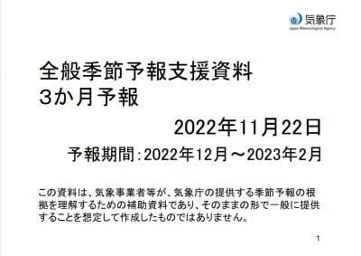
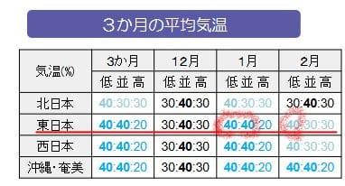

# 明日は雨の中イエティで滑ってきます…（涙）．そして3か月予報では1月は冷える予報

📅 投稿日時: 2022-11-23 00:37:40

🏷️ カテゴリ: [日記](cc4b5682fb7b8b144980957a978653fb0.md)

ってなことで．

本日を無事乗り切ったので．

濃厚接触者の観察期間5日間，

無事発熱せずに過ごせました～！！（ぱちぱちぱち）

これにて，23日からは無事外を

出歩けます…

なので．

先週土日に滑れなかった憂さを

晴らしに滑りに行きたいのですが…

明日の天気予報，見事に雨（激泣）

なぜ．

なぜ，滑りに行ける祭日を狙ったように

ピンポイントで雨が降るかなぁ…（涙）

でも．

先週末滑りに行けなかったので．

明日も滑りに行かなかったら

死にそうなので，明日は雨の中，

滑りに行きます…

かなり強い雨になりそうな予報なので，

もしかしたら昼過ぎにくじけるかも（泣）

しかし．

月，火と晴れて，木，金も晴れそうなのに．

狙ったように，祭日の水曜に雨に

なるかなぁ…（泣）

誰だ？？日ごろの行いが悪い人はっ！！？←あなたが滑る日に天気が悪くなるんだから，あなたでしょ

とりあえず．

改めて今後の天気図を見てみましたが．

相変わらず，

26，27日の週末のスキー場オープンは

絶対無理な天気図

ですね（激涙）

…まぁ．

12月2日あたりからしばらく，そこそこ

冷えてくれそうなので．

それに期待…

で．

本日，気象庁から3か月予報が発表

されました～！！！

これを見ると…

先月の3か月予報では，12月は気温が

低い確率40％，平年並み40％，高い確率20％の，

冷えそうな予想だったところ…

今回，12月は平年並みの気温になりそうな

予想に変わりました（泣）

でも，1月，2月は冷える確率40％なので．

まぁまだマシかな．

そして．

降水量を見ると…

12月は平年並み．

1，2月は平年よりちょっと多そうで．

3か月の積雪量も，平年よりはちょっと

多くなる確率が高い感じなので．

まぁ，スキーヤー殺しの冬になることは

なさそうな予感…

ただ，先月の予想では，12月から雪が多い

はずだったのが，12月は平年並みにちょっと

後退したのが残念…

ってなことで．

11月下旬はちょっとヤバいレベルの

気温上昇があったけど．

12月2日からは冷えて．

おそらくそのあとは平年並みには

冷えてくれそうだし．

まぁ，12月は大丈夫かな～…

…12月3，4日の週末はちょっと心配だけど

ただ．

気象庁の長期予報は外れることが多い

ので．

この予報，

そこら辺の雑誌に書いてある占い結果

くらいの感じで見ておくのが，正しい

使い方です…←とても気象庁のデータを読みこんでいる人とは思えない発言

ってなことで．

本来なら，明日がラストイエティの

はずだったのに．

今週末もイエティになりそうな予感が

する今日この頃ですが．

とりあえず，明日もイエティで滑ってきます～！

…あと5時間後に出発か…

今日も睡眠時間が…
