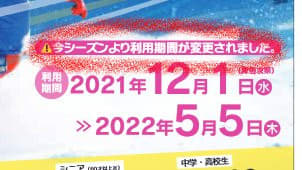
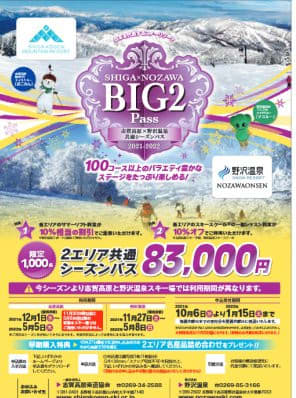
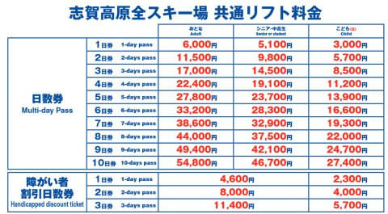
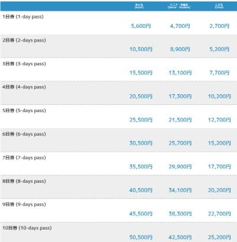
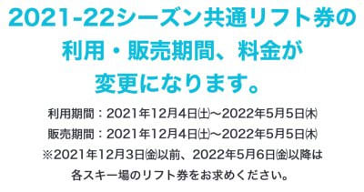
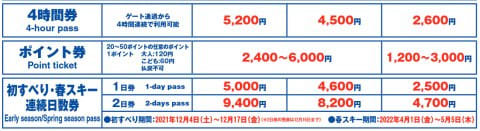

# 志賀高原スキー場，2022シーズンのシーズン券＆リフト券情報が出たよ！！…シーズン券利用期限短縮（涙）．日数券は値上げ

📅 投稿日時: 2021-09-18 04:30:02

えー．

やはり．

スキーヤーブログに求められているのは

ダイビングネタではない

ということが，昨日のアクセス数で明らかに

なっている今日この頃，皆様いかがお過ごし

でしょうか．

ってなことなので．

今日は本来のスキーネタに戻りますが．

先日，志賀高原索道協会のホームページを

見に行くと．

ようやく，2022シーズンのリフト券価格が

掲載されてました！！

ってなことで．

こいつをじっくり見てみるわけですが…

まずは，20000mな方々が気になるシーズン券の

情報から見てみると…

（[志賀高原索道組合ホームページより](https://www.shigakogen-ski.com/DL/21-22seasonlift.pdf)．以下同）

ををを！！！

志賀高原全山シーズン券．

77000円で，値上がりなしじゃないですか！！

良かった！！！

…と，思ったら．

なに？？

「利用期間が変更されました」？？

って…？？

うげげげげげっげげ！？？

利用期間，12月から！？？

11月は使えないの？？

…そして，焼額は5月8日まで営業予定

なのに…やっぱり5月5日までか…っ！！

予定通りにオープンできれば，横手山が

11月6日から営業するけど．

シーズン券を買った人も，11月はリフト券を

買わなくちゃならなくなったわけですね（涙）

なんてこった…

11月の熊の湯・横手で使えないのが痛い…っ！！

これは，今シーズンは11月に熊の湯に行くのは

無しかな…（涙）

スキー場がオープンしているのに，

シーズン券が使えない日があるってスキー場は

志賀高原くらいじゃなかろうか…（泣）

昨シーズンより利用期間が短くなって，

昨年と同じ77000円となると…

実質値上げですね（激涙）

あぁ…残念…

だとすると．

+6000円の83000円で志賀も野沢も滑れる

Big2パスの方が使いでがあるかも…

こっちは，志賀高原はやはり12月から5月5日

までの利用期間ですが．

野沢では，11月27日から5月8日まで滑れます！！

…普通そうですよね．

使えるスキー場がオープン予定の全日程で

シーズン券は使えますよね…

ってな感じで．

シーズン券情報はちょっと残念でしたが．

そのほかのリフト券情報も見てみると…

えええ！？？

日数券はかなりの値上げですよ！！！

一日券6000円！？？？

ちなみに，こっちが昨シーズンの料金なので…

比べると．

1日券は5600円⇒6000円で400円値上げ

2日券は10500円⇒11500円で1000円値上げ

3日券は15500円⇒17000円で1500円値上げ

4日券は20500円⇒22400円で1900円値上げ

5日券は25500円⇒27800円で2300円値上げ

…と，そのあとは1日当たり400円ずつ値上げとなり．

10日券は50500円⇒54800円で4300円値上げ

と…かなりの金額の値上げです（涙）

10日券の4300円値上げは大きい…

もうシーズン券と22200円しか差がないですね．

10日券＋4日券を買うと，シーズン券より

高くなります．

2日券以上は，不連続での利用がOKで，

今週1日滑って，また別の日にもう1日

使う…という使い方ができるのはいいのですが．

やはり，利用期限は12月から5月5日まで．

うーん．

なんというか…

で．

4時間券は昨シーズン4800円⇒5200円で400円値上げ

初滑り（12/1~12/17)，春スキー（4/1~5/5)は

1日券が400円値上げ，2日券が500円値上げ

です…

ちなみに，初滑り・春スキーの2日券は連続利用が前提です．

しかし…

やっぱり値上げか…

願わくば．

来シーズンは，

値上がりした分，いい雪質になるように．

シーズン券が使える12月~5月まで

たっぷりいい雪があるように．

そして，昨シーズンのように7回の週末で

6回雨が降るとかいう寂しいことが無いように，

全身全霊を込めて祈るばかりですね…

PS.スキー場開き祭は12月4日＠横手山ですが．

昨シーズンと同様，イベントやサービスがなにも

無い，神事のみのスキー場開き祭になるのかな…

## 💬 コメント一覧

### 💬 コメント by (かず)
**タイトル**: Unknown
**投稿日**: 2021-09-18 11:04:32

値上げ無しでしたか！毎日の方は超値上げ？

プレオープンの熊方面の価値が上がったのに対抗して焼奥券ですかね？  結局知りあいが野沢の外詳しくないみたいで焼奥共通にします

### 💬 コメント by (アリス)
**タイトル**: リフト料金情報ありがとうございます。
**投稿日**: 2021-09-18 15:58:38

S様

今シーズンの料金情報理解しました♪

シーズン券を使えない日々があるみたいですが、やはりシーズン券が一番お得みたいですね♪

ここ5年くらい前からの志賀高原のスキーシーズン始まりを思い出していましたが、11月中に焼額山を含め中央部をリフトやゴンドラを乗り継いで、好き放題に滑走したイメージがないです・・・

①焼額山は４ロマのみ運転

②一の瀬ファミリーは下側のダブルリフトのみ

③高天原はトリプルのみ

こんな感じの志賀高原です・・・

私の場合記憶が曖昧な部分がありますが、Sさんは毎年の積雪量とゴンドラ運航開始日は画像を含め記録していますすよね？

### 💬 コメント by (Skier_S)
**タイトル**: やっぱり値上げ（涙）
**投稿日**: 2021-09-19 04:37:16

＞かずさま

もう，日数券で滑る人は辛いんじゃないでしょうか．

一日券6000円だったら，「気軽に遊びに行こう」って金額じゃないですよね…

野沢に行くんなら，BIG2がお得かも．

＞アリスさま

焼額が12月からオープンですし，中央エリアも普通なら12月からオープンで，

11月から動くのは熊・横手だけで．

12月も上旬は焼額もリフトのみ，一の瀬も下半分だけ手って感じなので，

おっしゃる通り，たくさん滑れる感じは無いのですが…

だからこそ，「11月の熊の湯，シーズン券でタダで滑れるなら滑っておこう」って感じで，

わざわざリフト券を買ってまで滑ろう…と思わない，って感じです．

5月GW後の横手山も，シーズン券が使えればかぐらには行かないかもしれないなぁ…

と思ってます．

やっぱり，リフト券代を別に払わなきゃいけないのは結構痛いので（涙）

### 💬 コメント by (新米パパ)
**タイトル**: Unknown
**投稿日**: 2021-09-19 11:31:57

お久しぶりです、

志賀高原情報助かります。

アメリカやオーストラリアの知人と話すと日本は、こんな管理が行き届いて、高速リフトのスキー場のリフト券が格安だと申しております。

やはり、日本のデフレ一辺倒は問題ですから一日券が100ドルくらいが妥当なのかもしれませんよ。

とはいえ、志賀高原の主であるs様にはシーズン券が贈呈されても良いとおもいます。

今季もよろしくお願いします。

### 💬 コメント by (レインボー74)
**タイトル**: Unknown
**投稿日**: 2021-09-19 16:02:04

嫌な情報をありがとうございます。

まさに、ぎょぎょぎょです。

今年は11月半ばからやる気だったのですが、11月27日の野沢スタートにします。咋シーズン120日も滑った私としては、シーズン券はいくら値上げしてもいいのですが、こんなシステムは全くのノーThank Youです。

### 💬 コメント by (新米パパさん)
**タイトル**: Unknown
**投稿日**: 2021-09-19 18:42:39

諸先輩達にご質問なのですが、私をスキーに連れてって(万座と志賀がつながってる設定!?)　1987年の頃の志賀高原リフト一日券っておいくらだったのでしょうか？

当時自販機のコーラはまだ100円みたいですが。

### 💬 コメント by (Skier_S)
**タイトル**: シーズン券，11月の熊の湯が滑れないのが痛い
**投稿日**: 2021-09-19 22:06:55

＞新米パパさま

お久しぶりです！

確かに，これでも日本はリフト券安いんですよね…

海外は1日券1万円超えますから！！

1987年のリフト券代はわからないのですが…1995年では全山共通1日券4900円でした…

意外と，当時から高かったんですね．

＞レインボー74さま

数字がちゃんとひとつ増えてますね…

残念ながら，今シーズンのシーズン券では，11月の熊の湯・横手は滑れません（涙）

まさかの仕打ちです…

出来れば，5月もせめて8日まで使えるようにしてほしかった…（泣）

### 💬 コメント by (はやと)
**タイトル**: Unknown
**投稿日**: 2021-09-21 21:06:29

手元のリフト券を確認したところ

87-88シーズンの全山共通一日券は４２００円でした（まだエリア券は無かったと思います）。

ついでに86-87シーズンを見てみると

全山共通１日券３５００円だったので７００円の値上がりですね。

参考までに

83-84シーズン　３５００円

84-85シーズン　３５００円

85-86シーズン　３５００円

90-91シーズン　４５００円　でした。

### 💬 コメント by (Skier_S)
**タイトル**: ＞はやとさま
**投稿日**: 2021-09-22 08:10:17

そんな古いリフト券をちゃんと保存しているとは！

そして，86シーズンまで3500円だったんですね…

そんなに安かったとは．

でも，86シーズンって，私はまだ生まれる前ですね（噓）

### 💬 コメント by (新米パパさん)
**タイトル**: Unknown
**投稿日**: 2021-09-22 18:03:57

はやとさん、ありがとうございます。

当時4200円という値段を考えると、物価指数的に妥当ですね、今のリフト券代も。

あの頃は、世界で生産されるスキー用具の半数以上は日本に送られていたという話ですから、

ジャパン　アズ　ナンバーワンの良い時代だったんですね。

とはいえ、この環境を維持していくためにも、日本人にもっとスキーを楽しんで欲しいですね、

浦安のネズミ園には1日80ドル　気にせず使ってるわけですから。

### 💬 コメント by (Skier_S)
**タイトル**: ＞新米パパさんさま
**投稿日**: 2021-09-23 04:28:34

スキーバブルの頃は，ヨーロッパが逆にスキーが下火で，

日本のおかげで世界中のスキーメーカーが助かっていたという噂もありましたから…

そして，スキー場も人があふれてたから一人当たりのリフト券代が安くても

大儲け状態だったんでしょうね…

今はお客さんが少ないからリフト券を高くしないと経営が成り立たないという

値上げもあるでしょうが…

ただ，スキーバブルの頃みたいにリフト待ちが死ぬほど長いのは，リフト券が

安くても嫌なので．

スキーバブルの頃と比べると，今くらいの空き具合ならリフト券が倍のお値段でも，

待ち時間がない分倍以上滑れるってことでバランスしてるのかも？？

