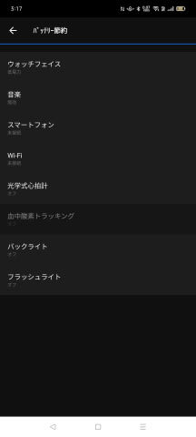
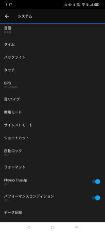
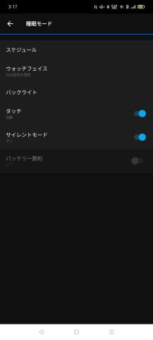
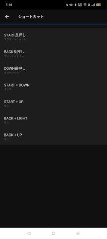
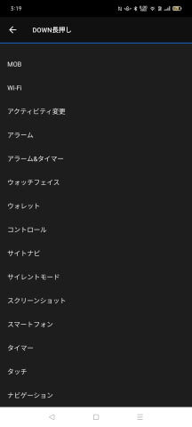

# 新しいスマートウォッチ，Garmin Fenix7Xを買ったよ！その12…スマホアプリ，Garmin Connectを使ってみる　最後

📅 投稿日時: 2022-09-02 09:35:57

🏷️ カテゴリ: [PC,カメラ&小物](c0d8caed13e597efe97b661a8ae56bed0.md)

ご無体デーが続いていますが…

とりあえず，今日もちゃんと更新！

えらい！偉いぞ自分！←自分で自分をほめておくスタイル

（しかし、間違えて下書きのまま放置してて、投稿されてなかったことに気づいた…（涙）

朝に改めて投稿！）

でも．

やっぱり少々疲れているので，

今日はGarminの紹介記事を，ちょっと

短めに…←いや，これでも長いから．いつもが長すぎるだけだから

（Garmin Fenix7Xのレポート全16回のもくじ

機能説明，登山用地図の作り方，登山で使ってみた…など

は[ここをクリック](e516b23a4874189de2e9208be87fa5184.md)）

前回でGarmin Connectの紹介は

最後のつもりだったんですが，

今回は書きそびれた細かい機能を，

ちょろっと書いておきます．

この，ウォッチの設定メニュー．

このメニューの下の方の，

「バッテリー管理」からは，

バッテリー節約メニューが選べて．

「バッテリー節約モード」を

選んだ時に何を動作させて

何をOffにするか選べたり…

「システム」からは，

バックライトの明るさ（アクティビティ時，

通常時，睡眠時で違う明るさが選べる…）

とか，タッチ操作On/Offが選べたり．

さらには，睡眠モード時の動作が

選べたり…

そして，GPSのモードが選べます．

GPSモード：GPS＋みちびきだけを使う

マルチGNSSモード：GPS＋みちびき＋GLONASS＋GALILEOの4種類をすべて使う

マルチGNSSマルチバンドモード：4種類の衛星で，さらにL1 信号と L5 信号の2種類を使う（精度がかなり上がるらしい…）

UltraTracモード：精度・取得頻度を下げる代わりに，数日間はGPS測位可能

って感じなんですが．

日本の場合は，みちびきの精度が高いのか…

山登りでは，

一番精度が高いマルチGNSSマルチバンドモードと

単なるGPSモードで，

精度はあんまり変わらない

感じです…

そして，ショートカット．

これは，特定ボタンを長押ししたり，

ふたつのボタン同時押しの組合せで，

良く使う機能をワンタッチで

呼び出せるようにできる設定

なんですが…

例えば，普通なら

LIGHTボタン長押し→メニューからウォレットを選択

しないといけないウォレット（スイカ）起動を，

DOWNボタン長押しで一発で呼び出せるように

設定できたりします．

…ってな感じで．

カスタマイズができまくるGarminウォッチ．

使っていけば使っていくほど，自分専用の

時計が出来上がっていくので．

これは楽しいですよ～！！

ってなことで．

やっとスマホアプリ，Garmin Connectの

説明が終わったので…

次回からは，PC版のGarmin Connectの

紹介で．

山登りの際のルートの事前作成と，

ウォッチへの転送の仕方を説明する

予定です…！

事前にコース設定をしておくと，

山登りの際のGarminウォッチの

便利さが100倍アップですよ～！
