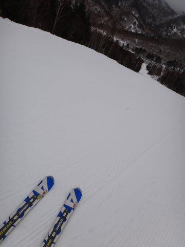

# 12月30日の志賀高原は…やっぱり雨(泣）．

📅 投稿日時: 2012-12-30 22:05:46

🏷️ カテゴリ: [2013スキー滑走日記](c91dbe557f9a69230b1600e48622fdd61.md)

えー

今日はなかなか微妙な天気になりそうということでしたが．

なんだか，志賀高原についても．

スキー場と信じられない気温なんですが…

朝から，ぽつん，ぽつん…とかすかな雨が降ったり止んだり．

んで．さらに．

強風で，焼額は朝から第1，第2ゴンドラともに止まってました…

こ…これは．踏んだり蹴ったり(涙)．

クワッドリフトは動いていて．

きれいな圧雪で，比較的すべりいいんですが…

まぁ，水を吸ってやわらかい，春の雪です．

昼過ぎ，1時ごろから第1ゴンドラは動き出しましたが．

山頂は何とか雪でしたね～．

でも，ふもとは雨…

せめてもの救いは，雨がザーザーじゃなく，

「あ，降ってるかな」って程度の雨だったことかな…

…と，思っていたら．

午後3時からは．

雨がひどくなってきました．

ゴンドラの窓を，雨粒がたたきます…

視界が悪く，びしょぬれ(悲)．

…なかなか，修行のようなスキーでした(泣)

救いは，3時ごろまで雨はぽつぽつ程度で．

天気が悪いから人も少なく．

この時期の志賀としてはありえないくらい暖かかったので．

娘が凍えることなく，すいているゲレンデを滑れた，ってのが救い

でした…

今は冷えて，2時間ほどすごい雪が降ってましたが…

今は止んでます．

うーむ．

もう少し積もってくれないと，明日は今日融けた雪が固まったアイスバーンが

顔を出しちゃいますね…

…明日までに積もってくれるかな．

＃あんまり積もらなさそうな気配…
