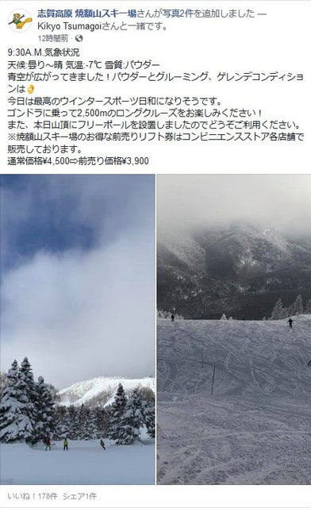
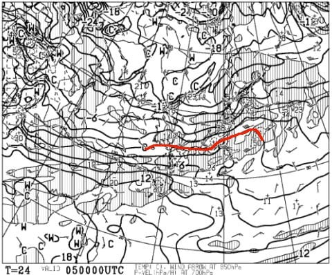
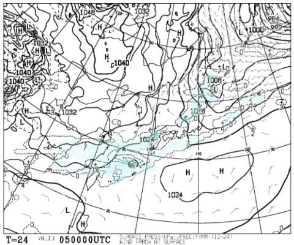
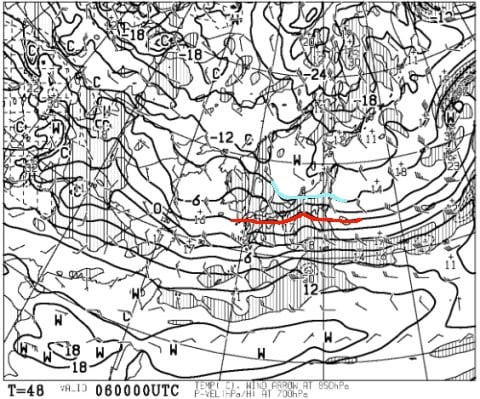
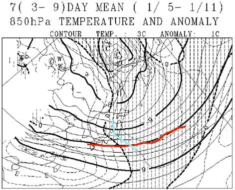
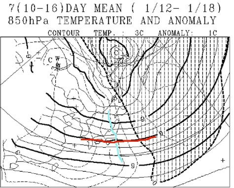
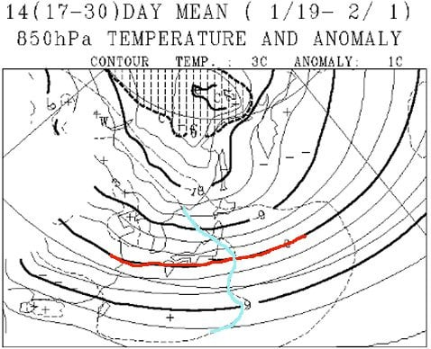
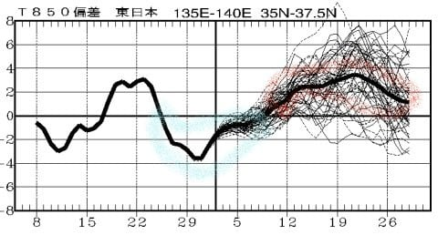

# 明日からまた志賀高原に復活！…5，6日は雪降りの天気だけど，それ以降の天気は冷えるのか？温まるのか？長期予報を読み解いてみる

📅 投稿日時: 2019-01-04 23:06:28

えー．

本日．

焼額は朝は曇り空でのスタートだったものの．

午前中から日が射し，いい天気だったようですね…

（[焼額山FB](https://www.facebook.com/yakebitaiyama/posts/1984156758346327)より）

私が滞在中の6日間．晴れたのは

元日の1日だけで，残る5日間は

ひたすら吹雪いていたのに．

私がいない日に，こんなに

天気がいいなんて…（涙）

…いや．

3日までの6日間は．

パウダー好きの私のために，神様がわざと

毎日パウダーにしようと努力してくれたに

違いなく．

今日は私がいないので，神様が

パウダー生産をひと休みした…

と，信じましょう．

そうに違いありません！←超ご都合主義

ってなことで．

私はまた明日，5日から志賀高原に

舞い戻るので．

この週末の5，6日，明日からの志賀高原の

天気を見てみましょうか…

5日の850hpa図面を見ると…

うむ．0℃線は本州を横切る程度と，

ここ数日と比べると，ちょっと北に寄ってます．

昼間でも0度を超えないけど，

年越し前後と比べるとちょいと暖かめの

気温になりそうですね．

で，5日の地上天気図は．

こんな感じで，降水域が志賀に近いところまで

近づいてますが．

…この降水域の形は，西風が北アルプスに

ぶつかって，それより東に雪雲が行かない

時の形ですね．

んだもんで…

志賀高原，朝は晴れてるんじゃないかな？

晴れなくても，前日夜からの積雪は全く

なさそう．

5日の朝は，放射冷却で結構冷え込み，

あさイチは冷え冷えピカピカ圧雪を

楽しめそう…！

この日は，おそらくほとんど雪は降らず．

朝は晴れ，昼に向かって雲が増えていくけど，

曇り時々晴れ間も，雪雲が飛んでくる

タイミングでパラパラと雪もぱらつく…

という感じかな．

続いて，翌日曜日．

6日の850hpa気温図ですが．

この日は，水色の-6℃線が志賀に近づくので．

土曜よりは気温が下がって，冷え気味の

一日ですね…

で．この日の地上天気図を見ると．

一見，水色の降水域が志賀に全くかかってないように

見えますが．

うーむ．

この日は冷えた北風が吹き付けるので．

里は降らなさそうだけど．

山の上は，朝から雪が降り始めそう…

ただ．

夜のうちの積雪はほとんどなさそうで．

朝から降り始め，昼はひたすら曇り＆雪で

視界があんまりよくなさそうな一日…

ってな感じなので．

まとめると．

土曜5日：朝はおそらく晴れ．

　晴れれば放射冷却で-10℃近くまで冷え込み，

　最高の冷え冷えシマシマ圧雪！

　昼に向かって雲が増えていくけど，

　曇り時々晴れ間もあり，雪雲が飛んでくる

　時はパラパラと雪もぱらつくことも．

　昼間の最高気温は-2～3℃くらい．

　ここ数日に比べると暖かい一日．

　午後になってもそれほどゲレンデは荒れず，

　吹雪の寒さに比べれば，穏やかな気温の

　いい感じの一日になるでしょう…

日曜6日：朝は曇り～雪がぱらつく．昨晩からの積雪は

　ほとんど無し．

　朝はピカピカ圧雪！

　もしかしたら，圧雪の上に積雪があるかもしれないけど．

　せいぜい1cmかな…

　でも，朝から雪が降り始め，昼間はずっと雪が

　舞い続けそう．

　気温は低め．朝は-10℃以下．昼も-6℃程度で，

　寒い一日．

ってな感じで．

この土日も，冷え冷えな感じですが．

…果たして，この冷え冷えはいつまで続くのか？？

一か月予想図をみてみましょうか…

1月5日から11日までの一週間の850hpa気温を

見てみると．

赤い0℃線は，日本より南．

そして，水色で示した平年比-1度の線が

志賀高原にかかっているので…

11日までの一週間は，平年より低い気温の

日々となりそうです．

…なのですが．

12日から18日までの1週間を見てみると…

…うげげげげげげ！

平年比+2度の水色線が志賀高原に！

一週間平均が平年比+2度って…

かなりの高温です（涙）

ただ，この時期は寒い時期なので．

平年比+2度でも，0℃線はまだ日本の南．

雨になるほど高温になるレベルでは

無いので，ご安心を…

そして．

19日から2/1までの2週間の850hpa気温を見てみると．

うーーーむ．

この2週間も，平年比+2度を示す水色線が

志賀高原に…（涙）

2週間平均が+2度って，激烈な高温です…（戦慄）

ただ，一年で一番冷える期間なので．

この期間に平年比+2度の高温でも，

赤い0℃線はまだ日本の南．

平均的にはちゃんと冷えてくれそうですけど．

運が悪いタイミングで，雨になったり

しないか心配…

ってことで．

年末の12月25日ごろから1月10日ごろまで．

水色で括ったような冷え冷え期間が続きましたが．

この冷え冷え期間は1月10日で終わり．

それ以降は，赤くくくったような，平年比+2～+3℃の

高温期間が続きそうです（涙）

まぁ．

とはいえ．

この時期は多少暖かくとも，

雨が降るほどのことはそうそうないと

思います…←運が悪いと雨の日もあるかも

ただ，気温が平年比より高いパターンだと．

積雪が少ないことが多いので．

また，雪不足にならないか心配…

うーむ．

ここしばらく，例の踊りを踊らなくても済むような

冷え冷え期間が続いていたけど．

それも，もう終わりなのか…！？？？

また昨年の，「雪が降らない1～2月」の

再現になってしまうのか！？？

そうなるか否かは．

皆さんの日ごろの行いのよさと．

踊りの熱心さにかかっているのです…！！

…ということで．

私はまた明日，志賀高原へ復活します．

あと4時間後に出発です…（また今日も睡眠不足（涙））

## 💬 コメント一覧

### 💬 コメント by (Hide)
**タイトル**: 今日のバーンは・・・
**投稿日**: 2019-01-05 00:22:35

S 様

今日はいらしてなかったのですね。

私は11～12月に仕事で忙殺されていてスキーの予定すら計画できず、本日やっと初陣で先ほど帰還しました。

朝はサイコーのバーンでした！

柔らかかったので直ぐに荒れだしましたが。

あと、朝の登りもツルツルピカピカでした。

次回お会いできる事を楽しみにしております。

### 💬 コメント by (Skier_S)
**タイトル**: Hideさま
**投稿日**: 2019-01-05 23:16:54

昨日は自宅で仕事していました…

天気が良くて，良かったですね！

次はいつ志賀にお越しでしょうか…

私はウェアを変えたので発見しにくいかもしれませんが，

またお会いしましょう～！

