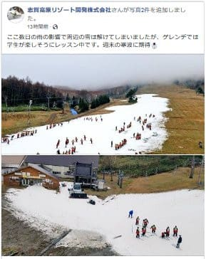
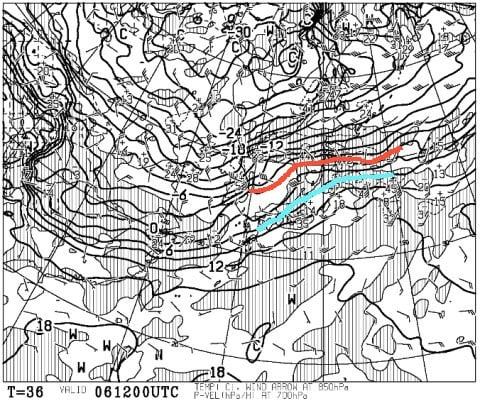
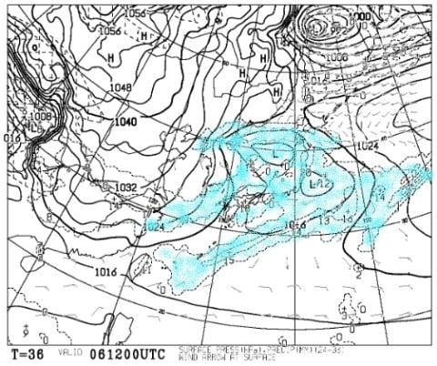
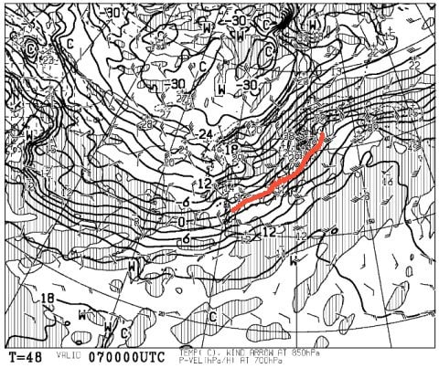
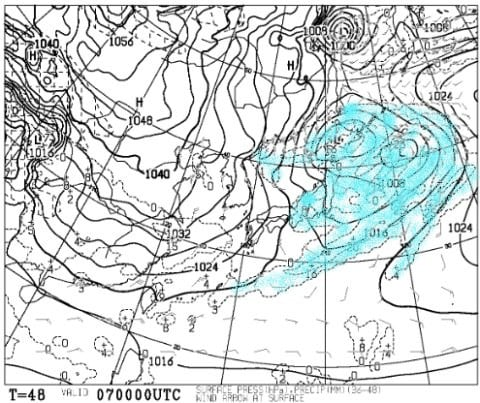
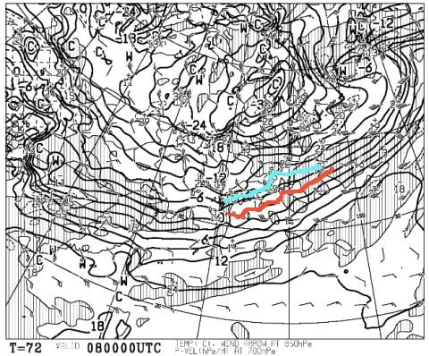
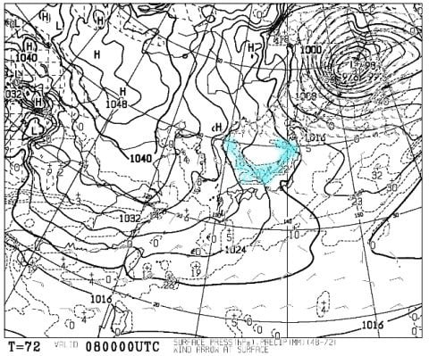
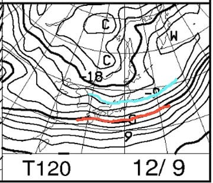
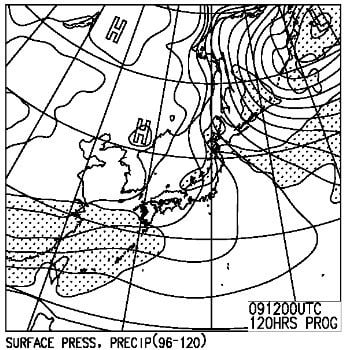
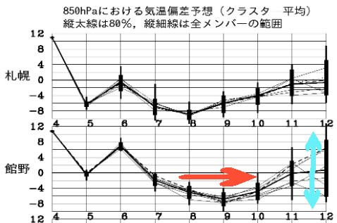

# 12月8，9日の週末の志賀高原スキー場の天気は…激冷え＆雪降りの2日間！だけど，積雪はぼちぼち

📅 投稿日時: 2018-12-06 01:30:52

🏷️ カテゴリ: [スキー天気予想](c6554f5c3c106093b511a8daae23757e8.md)

えー．

本日の志賀高原．

朝は雨だったようで…（涙）

熊の湯はゲレンデが維持できず，営業中止と

なりましたね（泣）．

一の瀬ファミリー，高天ヶ原，焼額は営業を

続けているようですが．

一の瀬ファミリーはなんだかすごい感じですね…

（[志賀高原リゾート開発FB](https://www.facebook.com/ShigaKogen.Ski/posts/1933166600132867?__xts__[0]=68.ARD35D32ffHX8w7mrQ7aJ3lz90vx1Rr5H5QJnSc4eckMegdjpyLEvjnJppM_IRVKP9aiSUgVwhxi2XjjAIydE9JT3N2X1Mu8pRysC5QT1AFhZJNLHv3BYtFfAkCiLSQHkD8UY8rRMEQ22WDeBF4GQjN79isLqdlGizL6rT5ONPv7Wh9F00U6V_gw3TH9sstJUVovNm3MLcxGGsPgIUy2s09kZqSlbNiJXIAzm5mo74l_CIWaKFZDAaE_gmyzglX_H4HRef4YMAWyhH1eEGuwa5nNDvkSUTDCN8R3QKM4wbv0vR1LDpzA9sZTdBLHYG6K1dObRizPO4y6kcRN2l07_EGDSQ&__tn__=-R)より）

熊の湯の他に，アサマ2000や湯の丸も

クローズになったようですね…（涙）

果たして．

この週末までに，ゲレンデは回復するのか？？

全人類が気にしているところかと思います．←いや，全人類は気にしてないから．

この時期にスキーするのは，スキーヤーでも限られた人たちだから

だもんで．水曜深夜恒例の天気予想で，

この週末までにゲレンデは回復するのか，

占ってみましょう…

えー．

まずは明日，6日の木曜の850hpa気温図ですが．

赤く記した0度線は志賀高原からはるか遠く，

津軽海峡近くまで上がっちゃってるどころか，

水色の＋6度線が志賀高原にかかってます…（涙）

そして，この日の地上天気図は…

水色の降水域が志賀にかかっているので．

雨ですね（激涙）

皆さん．

あきらめてください．

木曜は終日気温が高く．

大雨にはならなさそうですが．

小雨が時折ぱらつくような天気です…

6日の雨でさらにやられる一の瀬や焼額．

果たして，7日は営業できるのか？？？？

そして．

7日，金曜日の朝9時の850hpa気温図を見ると．

うむ．0度線がぎりぎり志賀高原にかかってますね…

このときの地上天気図を見ると．

うむ．

志賀高原には，水色の降水域がかかってますね！

だもんで．

木曜の雨が，木曜深夜から金曜早朝のタイミングで

雪に変わりそうです…！

ただ．

金曜一日，それほど積もる感じではないかな…

でも，冷えるので．

人工降雪機はフル稼働できます！

で．

肝心の週末．

8日の土曜の850hpa気温図ですが…

うおおおお！

これはすごいよ！

0℃線は太平洋側に南下し，

水色で塗った－6度線が志賀にかかってます！

これは，土曜の朝は－10℃程度の冷え冷えに

なりそう…！

このときの地上天気図ですが．

…見事に冬型特有の，

日本海に噴き出す雲が見えてますね…

でも．日本海側は降りそうだけど．

志賀に積もらない西風っぽい…（涙）

でも．金曜夜から土曜の朝にかけて．

人工降雪機フル稼働できるので．

バーンは回復するはず！！

次は，日曜の850hpa気温図を見てみると．

うむ！この日は水色の－9度線が志賀にかかり．

朝は－12℃くらいに冷えそう…！

激冷えです！

昼間も，最高気温が－7℃から8℃程度と，

かなりの冷え冷えデーです！

地上天気図も，降水域の網掛けが志賀に

かかっているので．

雪は降りそうですね…

でも．そんなに積もらないかな…

ってことで．

まとめると．

6日木曜：気温高く，終日小雨がぱらつく(涙）

7日金曜：深夜～早朝にかけて雨が雪に変わる．

　土曜日以来の，人工降雪機が稼働できる気温になり，

　久しぶりの人工降雪機フル稼働．この日に週末の

　ゲレンデを必死に作るのだ！

8日土曜：7日から雪がぱらついているが，

　この日の朝の積雪は10㎝あるかどうか．

　朝の路面は積雪路で，下地が凍ってるかもしれないので

　注意！

　朝イチは，雪降り天気だけど人工雪＋うっすら積もった

　新雪のミックスに圧雪がかかっていい感じ！

　ただ，しばらくたつと積もった雪が蹴散らされて

　ちょっと荒れ気味の雪面になり，斜度のあるところは

　下地の硬いのが出て来るかも…．

　気温は，朝イチは－10℃程度，昼間も‐5℃程度までしか

　上がらない冷え冷え．

　天気は，終日小雪がぱらつくような天気で，

　時折強く降るタイミングや，雲の切れ間で日が差す

　ことも．

　ただ…冷え込んでも積雪はそれほどなさそう．

　昼間で10㎝程度かな…

9日日曜：この日も朝にうっすら積雪．

　朝イチは－12℃程度まで冷え込み，寒いよ！

　朝イチは人工雪＆天然雪ミックスが圧雪されたいい感じ．

　この日の天気は，曇り時折雪がぱらつき，夕方ごろに

　晴れ間が広がってくるかも…

　終日気温は激冷えで，雪は緩まずいい感じだけど，

　やっぱり人が大勢滑る，斜度のあるところは人工雪の

　硬い下地が出てくるかも…

　気温は終日冷え冷え．寒いよ！

ってな感じでしょうか…

とりあえず．

この暖冬の中，8，9，10日と．奇跡の冷え込みが

続き，志賀高原では天然雪はそれほど積もらなさ

そうながら，人工降雪でかなりゲレンデ状況は改善

されそうだけど．

その後の12日．

水色矢印で示したように，

すごく冷え込むか，すごくあったかくなるか．

めちゃくちゃ幅の広い予想となってます…

ここは，無茶苦茶冷えることを祈りましょう…

## 💬 コメント一覧

### 💬 コメント by (mae)
**タイトル**: Unknown
**投稿日**: 2018-12-06 20:23:18

なんだか、今シーズンは記録的な雪不足だった3年前の再来の予感がします。

3年前のヤケビのオープン当時の記事を遡って見てました。それでも翌週には2高も運転出来ていたのに、今週末も4ロマだけで、雪降る中、修行ですねぇ。(T_T)

記事の写真に小生とyamaさんの姿が…何故かコンスケさんの姿も……（@_@）

こうやって過去の記事が見れるのは良いですね。

### 💬 コメント by (Skier_S)
**タイトル**: maeさま
**投稿日**: 2018-12-07 03:45:44

まさに，今のところ．

3シーズン前よりスタートはひどい状況です…

というか，これまでの最悪記録に近いと思います（涙）

…しかし．

私も「○シーズン前はどんな感じだったっけ？」というのを

思い出したいときは，このBlogの過去記事を見ています(笑)

