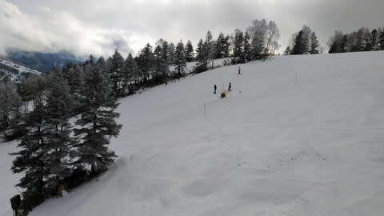
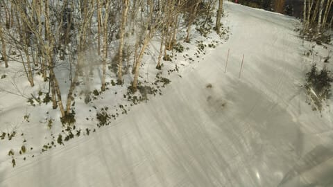
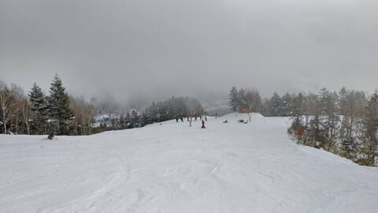
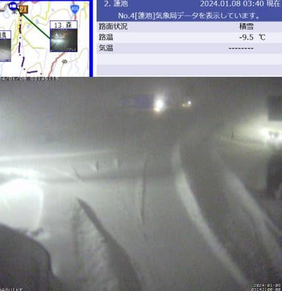

# 3連休全滅…仕事がそこまで忙しくなかったのに，3連休スキーに行けないなんてことがあっていいのか（涙）

📅 投稿日時: 2024-01-08 03:55:03

🏷️ カテゴリ: [日記](cc4b5682fb7b8b144980957a978653fb0.md)

残念ながら．

私の3連休は全滅となりました（涙）

3日間とも，スキーに行けませんでした

珍しく，休み明けまでにやらなくては

ならない急ぎ仕事がない3連休だった

のに…

宿のキャンセル料を取られて

さらにスキーに行けず，家でじっと

しているという，

すごい悲しい3連休となりました…（激涙）

まぁ，妻の熱は下がってきたので．

火曜から仕事には行けそうな感じで

すが．

3連休は全滅でした（泣）

あぁ…こんな3連休になろうとは…

仕事が殺人的に忙しかった昨シーズンでも，

3連休のうち最低でも1日は滑りに行って

板気がするので，

出社や出張じゃないのに，3日ともスキーに

行かなかった3連休って…コロナの時以外，

一度もなかった気がするんだけど…（泣）

あぁ…

こんな3連休を過ごすことになろうとは…！！

とりあえず．

3連休中日の本日の志賀高原は．

3連休というのに正月休み明けだからか，

意外と人が少なく，そこまで混まなかった

ようですが．

朝の積雪は2-3cmほどで，積雪の積み増しは

ほぼなかったので，ブッシュエリアが

だんだん増えていき…

唐松・サウスはまともだったけど，

GSコースの途中や迂回コースの最後は

かなりブッシュが出てきて，茶色い

ところも顔を出すようになり…

さらに，白樺コースは今日もクローズ

だったようです（涙）

…でも．

8日朝4時現在，志賀高原は20cmほど

積もっているように見えます…！

（[北信建設事務所道路気象状況カメラ](http://hokushin.pref-nagano-roadcamera.jp/)より）

リフト営業開始までにはもう少し

積もりそうなので，ちょっとは雪不足が

解消されるといいけど…

気温が低すぎるので，圧雪すると

かなり薄くなる雪だろうなぁ…

でも，明日からまた焼額は白樺コースも

オープンするみたいだし．

朝までの雪がたっぷり積もって，

ゲレンデ状況が回復することを期待…！

ちなみに，明日8日は朝には雪が弱まり，

昼頃には雪が完全にやんじゃいそうです（涙）

もう少し長く降り続いてほしいんだけど…

で，

そのあとは，10日から12日にかけて，

またちょっと降りそうな感じ．

これが積もってくれると，来週末の

コンディションは良くなってくれそうだけど…

とりあえず，1月1日の積雪からほとんど

積雪の積み増しがなく．

だんだんゲレンデ状況が悪くなっているらしい

志賀高原．

私が滑れない今週はもうどうでも

いいけど．←ひどい…

私が滑れる来週末までには，

ゲレンデが回復してくれるよう，

いのって踊り続けます…

## 💬 コメント一覧

### 💬 コメント by (ホンダ)
**タイトル**: Unknown
**投稿日**: 2024-01-08 05:39:48

今めっちゃ降ってますよ

かなり積もりました

### 💬 コメント by (地元民)
**タイトル**: Unknown
**投稿日**: 2024-01-08 18:00:27

飯山40㌢

中野市街地30㌢

小布施も30㌢

長野(善光寺付近)20㌢

須坂インターあたり10㌢

今回は長野市付近まで雪雲が侵入。中野と小布施で降雪量の差がなく、飯山と長野でも、あまり降雪量の差がない降り方でした。

このパターンの時は、志賀高原は大雪ではないかと・・・。

### 💬 コメント by (Skier_S)
**タイトル**: 滑りに行けなかった3連休
**投稿日**: 2024-01-09 03:44:59

＞ホンダさま

積もったみたいですね～…

でも，まだ雪不足の解消には足りない感じ（涙）

＞地元民さま

志賀高原でも，結構重めの積もる雪がそこそこ降ってくれたみたいです…40～50㎝は積もったようで．

このくらいの雪があと二降り，三降り欲しいです…

### 💬 コメント by (a-island4138　ゆうさん)
**タイトル**: Unknown
**投稿日**: 2024-01-09 15:19:06

35年ぶり志賀高原　高天ヶ原スキー場に着きました＼(^o^)／☀　ホテルタキモトに泊まっております。　いつも楽しいブログ読ませていただき有難うございます😊

### 💬 コメント by (Skier_S)
**タイトル**: ＞a-island4138　ゆうさんさま
**投稿日**: 2024-01-10 03:06:24

35年ぶりですか！

ようこそ志賀高原へ…

今シーズンはまれにみる雪の少なさですが，明日10日は天気もよさそうだし，

思う存分楽しんでいってください！

