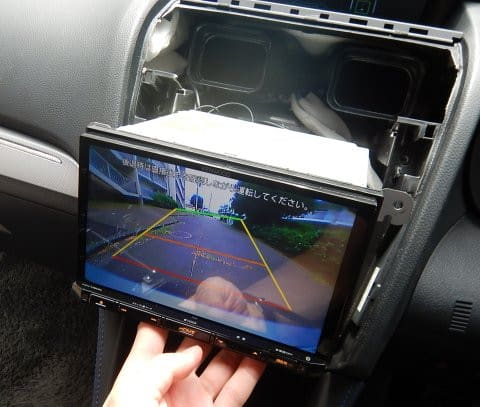
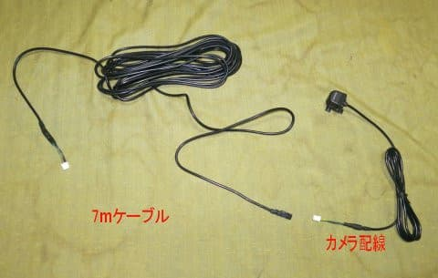
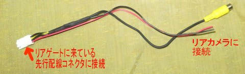
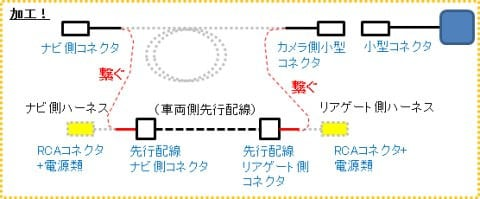
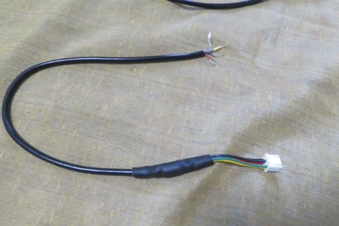
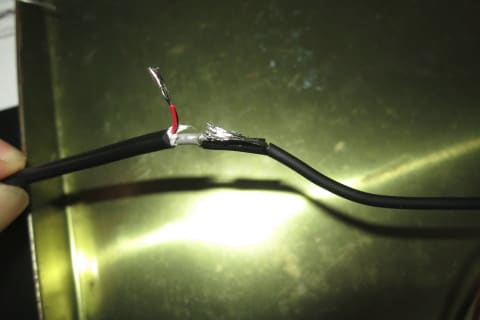
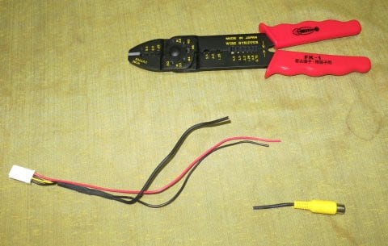
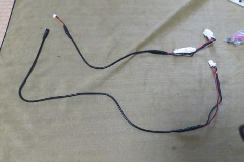

# プロジェクトX2第2章…LEVORG E型にリアカメラをつけてみた・配線加工，完成！

📅 投稿日時: 2018-07-25 04:00:10

ってなわけで．

予期せぬD型以降の仕様変更で，

追加の部品が必要になるという

想定外の事態が生じてしまい．

（詳細はまた追って報告します…）

納車1週間たってしまいましたが…

先日，無事ナビの取り付けが完了しました～！！

いやーー．

やっとついたよ…

これまでの7インチナビに慣れていると．

8インチナビは大きく感じますね～！！

リアカメラも無事動いてくれたので…

1週間ぶりにリアゲートの内装も

取り付けたし．

納車後に帰宅して以来初めて，

内装がすべて取り付けられた状態の

自分の車に乗りましたよ～！←何か基準がおかしい

…まだ，ナビはそんなに利用していないので．

しばらく使ってみたら，また使い勝手なんかを

報告します～！

ってことで．

本題．

前回のリアカメラ配線加工の続きです…

えー．

とりあえず．

7mケーブルがついた，リアカメラセットと…

純正配線利用中継ハーネス．

こっちがリアゲート側で…

こっちがナビ側．

このリアカメラと中継ハーネス．

コネクタ形状が全然違うため．

そのままだと全く繋がらないのだ．

だもんで．

繋げられるように加工するわけですが．

…どんなふうに加工するかというと．

こんな感じのカメラ＆ハーネスを…

途中でぶった切って，こんな風につないで…

で．

こんな感じのシンプルな配線にするわけです．

リアカメラセットにもともと付いているコネクタ．

こいつは，ナビ側もバックカメラ側も，画像と電源が

同時に接続できるスグレモノ．

普通のRCAコネクタ接続時だと．

ナビ側もバックカメラ側も，

映像コネクタ＋ACC電源＋アース

の3本を別につなぐ必要があり．

配線がごちゃごちゃします…

なので．

RCAコネクタや電源をごちゃごちゃ

繋がなくていい，スグレモノコネクタを

そのまま生かしつつ，車両側の純正カメラ用

先行配線も使いたい！

というワガママから．

こんな訳の分からん加工をしようと思ったわけですが…

そうそう．

こうしたらもっとシンプルになるのでは？

…という，ごもっともなご意見もあるでしょうが．

この写真にあるように，リアゲート側先行配線コネクタと，

カメラ側小型コネクタ．

コネクタの大きさが全く違います．

小さいコネクタなら，車外から車内に引き込む際．

あける穴を小さくできますし．

引き込みも楽です．

このリアカメラ．

そういうところを考慮して，わざわざ特殊な小型コネクタを

使っているので．

そこは生かしたいなぁ…

ってことで．

あえて図の「完成品」のような構成とすることにしました…

では．

実際に加工してみましょう！

まず．

ナビ側ケーブルから…

何にしろ，ちょん切る．

前回のレポートにあったように．

7mケーブルを何のためらいもなくぶった切るところから

始まります．

ぶった切った，この7mケーブル．

こいつは，映像用同軸ケーブルと

ACC線，GND線がまとめて束ねられたケーブルです…

灰色が同軸ケーブル，赤がACC，黒がGNDですね．

灰色の同軸ケーブルは，こんな感じで，

灰色の被覆を剥くと，中に編み線と，

編み線に囲まれた黄色い被覆の

ケーブルが出てきます．

同じように，中継ハーネスの方も

ちょん切りましょう…

何かあった時用に1Aのフューズが入ってますが．

こいつは切り落とさずに活かしておいた

方が正解です．

配線加工ミスなんかでショートした際に，

こいつが守ってくれるでしょう…

中継ハーネス側も，同軸ケーブルを剥いてやります．

左が中継ハーネス側，右がカメラ付属の7mケーブル側．

同軸ケーブルだけじゃなく，ACCとGND線も

繋がないといけないのですが．

この線，ものすごく細いので．

とてもギボシ加工は無理です…

どっちにしろ，同軸ケーブルははんだ付け

するしかないわけですから．

この際，全ての線をはんだ付けしてしまい

ましょう…！

注：自動車に載せる配線をはんだ付けするのはおススメしません…

　上手くやらないと耐久性が確保できないし，なにかあった時に

　ショートする危険性もあるので…自信ない人はやめて

　おきましょう←自分ではやってるけど

　今の市販車で，配線同士の接続にはんだ付けを使っている例はありませんから…

まず，同軸の心線どうしをはんだ付けして…

心線のはんだ付け部分を絶縁テープで処理したら，

被覆同志をはんだ付け．

後は同様に，ACC線とGND線もはんだ付けして，

絶縁テープ処理します…

このあと，全体を絶縁テープか熱収縮

チューブで仕上げましょう．

これで，ナビ側は完成！

同じような感じで．

リアゲート側のケーブルも加工していきます…

7mケーブルをちょん切って．

リアゲート側の中継ハーネスも

ぶった切り．

そして，また同軸の心線と被覆を繋ぎ．

そのあとに，さっきと同様にACCとGNDを繋いで，

絶縁テープで仕上げれば…

はい，Skier_S仕様の，シンプル版

先行配線利用中継ハーネスの完成！

上がナビ側，下がリアゲート側です．

このケーブルをナビと中継配線につなげば．

ナビ側のKENWOOD専用コネクタから，

このハーネスを介して

カメラに12Vが供給されます…

だもんで．

…巨大なRCAコネクタも不要なら，

GND線，ACC線を繋ぐコネクタも不要で．

かなりコネクタ数が減らせます．

そして，純正バックカメラの先行配線が利用できて．

余計なハーネスも不要という．

いやー．

工作にはちょっと手間がかかるけど．

それだけの価値はあるなぁ…（むふふ）

…と，この時は思っていたのだった…

（このあと，衝撃の事実編（？）へ続く）

## 💬 コメント一覧

### 💬 コメント by (Hide)
**タイトル**: 同軸ケーブル
**投稿日**: 2018-07-25 07:19:27

S 様

着々と仕上がってますね～

ちょっと気になったのですが、同軸ケーブルの接続はF型コネクター等で接続しないと・・・

映らない　な～んてオチがなかったでしょうか？

### 💬 コメント by (Skier_S)
**タイトル**: Hideさま
**投稿日**: 2018-07-26 00:47:43

細線同軸ケーブルなので，F型コネクタを

つけるのはちょっと無理な細さです…

リアカメラ程度の映像信号だと，

せいぜい10MHzも通れば十分なので，

無造作にはんだ付けしても十分大丈夫でした～！

余談ですが，私は昔，10GHz以上の高周波向け極細線同軸を

はんだ付けするような技を持っていました…

