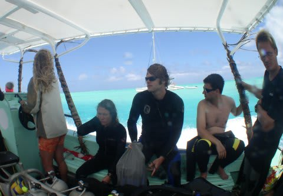
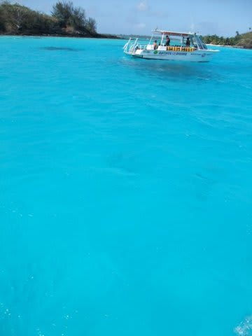
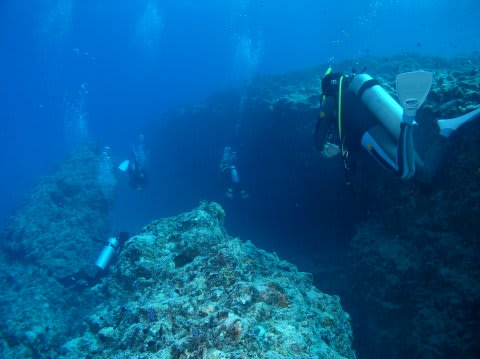
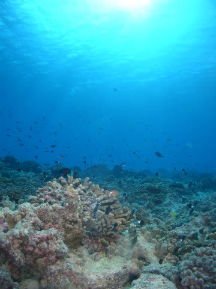
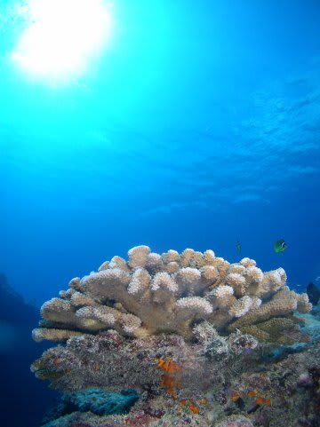
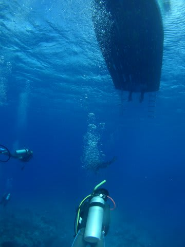

# 2009年　初の海外子連れダイビング旅行記　7　First dive in Borabora

📅 投稿日時: 2012-09-02 00:09:10

🏷️ カテゴリ: [ダイビング日記](ce3a7a8d424d112fce83ee85c81a0e344.md)

さらば，わが子よ．

これも試練のひとつ…

と，心を鬼にして向かったダイビング．

でも，ボートに乗って3分で，心配よりも海のきれいさに

心を奪われます．

(ええんか！そんなことでっ！）

なんてったって，ボートの上からの海の色がきれいなんですよ～．

こればかりは，実際に見てみないと伝えられない…．

マグロの大トロを食べたことの無い人に，そのおいしさをどれだけ

言葉で伝えようとしても伝わらないもどかしさに近いですね～．

で，ボートで10分ほど．1本目のポイントへ．

ホントは，「ムリムリ」というポイントに行く予定でしたが，

波が高くて無理無理，ということらしく．

＃私のネタではないっ！ガイドさんの発言ですのでっ！

ポイント変更．

変更したポイントは「パス」．

その名のとおり，ボラボラ島を囲む珊瑚礁のチャネルのポイントです．

いざ，タヒチの海へエントリー！

…

…うーーーーーん．

透明度が20mあるかないか．

期待ほどじゃないなぁ…

（普通なら20mあればいいほうだろうけど，タヒチだともっと期待してしまう）

珊瑚はそこそこあるけど，魚影はちょいとイマイチ…

まず，チャネルを横切る間にマダラトビエイ1匹．

20分ほどチャネルの間をうろつくけど，あとは

ブラックチップシャークとかカメがスーッと横切るくらい．

どれも，ちょっと遠くて写真に写らず…

後半はチャネルの外，ボートの下の浅瀬でそこそこの珊瑚を眺めつつ…

南太平洋で平均的に見られる魚を眺めて終了．

…あ，あれ？

これで終わりですかっ…？

ちょっと寂しくないですか……？？

まぁ，予定変更して急遽潜ったポイントだから，こんなもんなのかな… 

ということで．

ボートは2本目のポイントへ向かいます

（初めて娘を預けて，2本連続で潜るんかい！)
