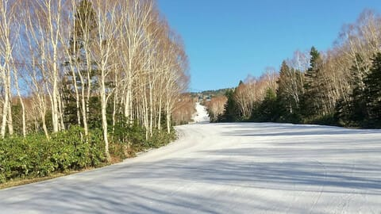

# 4月28日，GW前半3連休中日の志賀高原スキー場特派員情報！…終日晴れ，雪はかなり解けて昼頃にはストップ雪気味に（涙）

📅 投稿日時: 2024-04-29 00:17:21

🏷️ カテゴリ: [日記](cc4b5682fb7b8b144980957a978653fb0.md)

本日もちょっと家族の用事でお出かけ

しており，志賀にはいっていないSkier_Sです…

でも，今日はさすが3連休の中日．

数多くの特派員が志賀高原で滑っていたので，

写真がいっぱい送られてきましたよ…！

今日も早朝の朝イチから晴天！

早朝はさすが3連休中日の晴天なだけあって，

結構な人がいたみたいですが…

早朝から気温は+5℃（泣）

でも，朝は放射冷却で冷えたからか，

しっかり締まった硬めのバーン！

朝のうちは硬くしまったいい感じの

シマシマバーンで楽しめたようです…！

やっぱり早朝は気持ちよさそうですね…

ただ．

バーンが硬かったのは早朝の早いうち．

気温も高く，日差しも強かったので，

朝8時前には結構緩み始めて…

さらに昼間の最高気温は+15℃を越える

という，標高2000mの山頂では

真夏レベルの気温になってしまった

ようです（泣）

そのせいで，午前中の早いうちから

バーンは荒れ始め．

昼頃には，緩めの斜面は雪の滑りが

かなり悪くなってきちゃったみたい

です…（泣）

ただ．

午後のコースは荒れたものの，

GW中日にもかかわらず，昼頃には

コース上の人はほとんどいなくなった

みたいで．

午後のラストのバーンはかなり荒れ気味

だったものの，荒れ荒れ＆混雑という

悲惨な状況にはならず，晴天のゲレンデで

のんびり春スキーを楽しめたようです…

ただ，気温が高かった本日．

雪がやっぱり解けて，パノラマコースの

落ち込み部分にちょっと土が出てきてたり…

サウスコースから1ゴンへ戻る連絡路の

部分に，ちょっとヤバい部分が出てきた

みたいだけど．

まだサウスコースとかは，幅いっぱい

行けるみたいだし．

かなりいろんなところから雪出しをして

コース維持の努力もしてくれている

ようなので．

まだもう少し，ゲレンデはもってくれそうです…！

ってなことで．

私は明日から志賀高原で滑ってます～！！

…でも．

30，1日あたり，天気が崩れて雨になりそう（泣）

うーん．

30日の夜から1日の朝は，雨じゃなく

雪になってくれるといいんだけどなぁ…

山頂では雪の可能性がかすかに存在…！！

とりあえず．

明日も朝3時起きなのでもう寝ます．

おやすみなさい…

## 💬 コメント一覧

### 💬 コメント by (かず)
**タイトル**: Unknown
**投稿日**: 2024-04-29 03:57:28

今日は昼までは雨大丈夫そうですよね？明日は早朝完全に雨ですか？それなら本日で最終にしようかな…

雨予報がころころ変わりますがこの時期って難しいんでしょうか？

### 💬 コメント by (アリス)
**タイトル**: Unknown
**投稿日**: 2024-04-29 08:34:49

S様

こんにちは☀

志賀高原には行ってなかったのですね(^_^;)

GWでゴンドラのロングコースが滑れるって夢のようですね。

私も最後に5月になってから参戦しようと思っています。

八重桜、りんごの花、水芭蕉も楽しみです。

### 💬 コメント by (Skier_S)
**タイトル**: 今日は志賀高原！
**投稿日**: 2024-04-29 18:52:01

＞かずさま

明日の天気は難しいですね～…

降るなら早ければ深夜から降り始めます．

運が良ければ一日降りません．

降ったとしても，ぽつぽつパラパラと降ったりやんだりだと思います．

うーん…低気圧が志賀より北に行って南風だから，ほぼ降らないと信じたい．

＞アリスさま

今日から志賀高原に来ています～！

この暖冬で，GWまで滑れるとは思ってませんでした…

GSコースは明日で営業終了です！！

5月までもちませんでした…（泣 ）

