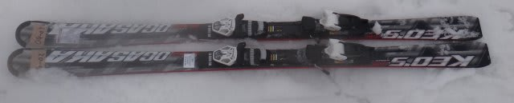

# 2014シーズンモデルのスキー試乗レポートその9…OGASAKA編

📅 投稿日時: 2013-04-12 01:19:28

あー．

どうやら，今日の志賀高原．

[10cmくらい積もった](http://blog.goo.ne.jp/ginrei1/e/90f2fe369a95545f850d20c145f92fab)ようですね～！(喜）

やはり，私の日ごろの行いがいいからですね～←だから，違うって

昨日の予想通り，土曜日はいいコンディションになりそうな予感！

＃日曜は朝から気温が上がってざぶざぶ雪っぽいけど

…で．

本題．

まだまだ続く，試乗レポートですが．

今度はオガサカです．

オガサカはKeo's MDのプレート＆長さ違い2種類と，

Triun SL，TC-MG，TC-SGを履いたんですが．

今回は，Keo's　MDの2種類の試乗インプレッションです．

では，どうぞ～！

-------

OGASAKA

○OGASAKA Keo's MD + RC600FL 170cm

…これは，いい！

ATOMIC BLUESTER DEMO SXに近いフィーリングですね～．

圧をかけるとすっとたわみ，たわみに沿って板が曲がります．

しっかりエッジグリップ系で，たわんだエッジに乗ってターンしていく板です．

んで，たわみに沿って曲がった後，板が比較的元気に返ってきます．

すっとたわんで，くいっと戻ってくる．

板にエネルギーがためられる感じ．

圧のかけ具合で，自由にたわみが作れ，回転弧の自由度が大きいです．

トップからテールまでしっかりグリップして，板を長く使える感じ．

はいた感じは軽快で，荒地もあまり気にせず走破できます．

コブもいけそうな予感．

で．板がすっとたわむので，しっかりたわませて比較的小さな弧まで作れます．

170cmでも，ちょっとゆったり目の小回りまではエッジに乗ったままで問題なく行けますね．

で，ロングまで引っ張ろうと思えばOK.

170cmがベストな長さかな～．この長さで，ロングからショートまで快適に行けます．

しっかりエッジグリップ系の板だけど，そこは当然OGASAKAらしく，

ずらして行ってもかなり快適なコントロール性．

これは…かなり無敵なオールラウンド板ですね～．

○OGASAKA

同じMDですが，今度は長さが165cmと短く，プレートも弱いFM600の板を履いてみました．

うーーん…

プレートでここまで性格が変わるのか…

トップとテールのエッジグリップが，RC600プレートの板よりルーズになります．

ずるずるになるわけじゃなく，ちょっとエッジを外していこうか…

と思うと，簡単にエッジを逃がせる感じ．

圧のたまりも弱くなり，返りもマイルドに．

旋回半径は，170も165もそれほど大きく変わらないなぁ…

長さよりむしろ，プレート選びが重要っぽい感じ．

ある程度ルーズなエッジグリップで，切れ・ずれの出し入れを自由にしたければFM.

しっかりトップからテールのエッジを利かせて，板にたまったエネルギーを

開放して走らせていくような攻撃的な滑りをするなら，絶対RCプレートをお勧め．

＃私はハイスピードでもエッジに乗って気持ちよく切れていくRCプレートが好きだなぁ…
