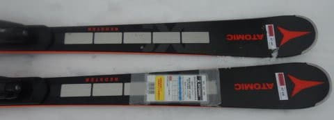

# 2023シーズンモデルのスキー板，試乗レポートその14…ATOMIC REDSTER X9i REVOSHOCK

📅 投稿日時: 2022-06-18 00:53:18

えー．

ウクライナの状況が不安定だったり

なんだったりの影響で．

来シーズンのスキー板は生産数も少なく，

もうメーカー在庫が無くなってしまい，

早くも手に入らないものが出てきている

ようです…

SALOMONのS/RACE PRIMEとか，

[FISCHER RC4 Worldcup SC Pro](e987349984f149be3ae8d6c1ecb1daa55.md)とか，

同じく[RC4 Worldcup SC M-track の水色](e17b5a41d21de3298bda2d452a2a4d873.md)とか，

もうメーカー在庫がないので，お店が在庫で

もってなければ，今から注文しても

手に入らないかも…

って状況みたいです．

一部通販サイトではまだ注文できますが，

メーカー問い合わせでも「在庫なしです」って

言われちゃうのかな…？

うーん．

SALOMONのS/RACE PRIMEは試乗したけど，

まだ試乗レポート書いてないうちに，

もう買えない幻の板になっちゃったのかも…？

ってなことで．

今日もスキー板試乗レポート．

今回はアトミック編です．

では，どうぞ～！

○ATOMIC REDSTER X9i REVOSHOCK S 166cm

基礎オールラウンド

見た目，S9iか？

と思う板ですが．

R=14.2mと，S9よりちょっと半径が大きめの

オールラウンド的なサイドカーブをもった

X9iです．

S9iが結構フレックスが柔らかめで，

良くたわむ板なので，そのつもりで履いてみると…

いや．全然違う．

かなりがっしりとした感じの，硬めの板で，

ずらしやすい板です．

すごい素直にずれて，板をずらして

動かしていくと旋回力を発揮して，

166cmという長さもあって，小回りで

回っていきます．

思ったよりフレックスがしっかりしているので，

板の強さは感じるんだけど，軽快で動かし

やすいです．

かなり軽快さを感じます．

板自体もかなり軽いです．

それでいて，板が谷回りから勝手に捉えて

まわって行くというより，自分からしっかり

谷回りで板を動かした分まわって行くという，

比較的玄人好みっぽい板．

高速オンリーのカービングマシンではないので，

しっかり基本的技術を身に着けようという

基礎スキーヤーに向くんじゃなかろうか？

フレックスはかなり強いので，

スピードを出して行っても板が負けたり

ズルズルと逃げていくことは無く．

低速から高速まで，しっかり板を動かした分

回ってくれる感じでしょうか．

昔のフルオートマチックに曲がっていく

ATOMICを知っている人には，

「ATOMICも変わったなぁ…」

と思う板でした．

ただ，私はオートマチックな板が好きなので．

もう少しトップとテールがガッツリ食いついて

撓んでくれると私好みなんだけど…

もしかするとエッジの仕上げが甘かっただけ

かも…？
