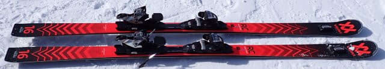
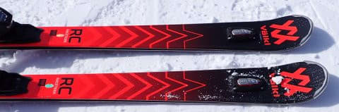
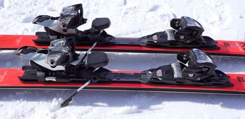
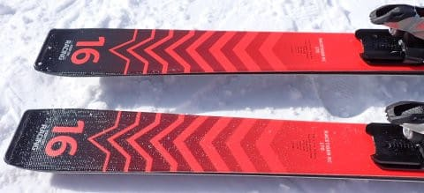
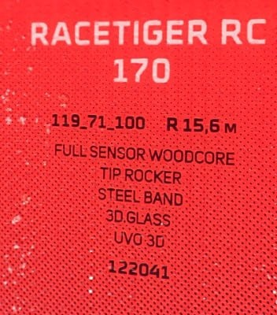

# 試乗レポート番外…2023モデルのVOLKL RACETIGER RCも試乗してみた

📅 投稿日時: 2023-06-14 04:58:00

🏷️ カテゴリ: [スキー板試乗](c0bd8048615710cee890e403a36cc9a2b.md)

ダメだ…

今日もこんな時間まで起きていてしまった…

でも，仕事が終わってない（涙）

もう朝5時なので，この時期だと外は完全に

明るいですね（泣）

眠い…

とりあえず．

眠いし仕事が終わってないけど更新！！

書き溜めておいた試乗レポートです…

えー．

3月4，5日に焼額で行われた，エキップさんの試乗会の

試乗レポートをお送りしていますが…

エキップさんの試乗会，2024シーズンモデル

だけじゃなく，2023シーズンモデルも試乗板が

いくつか出てたんですよね…

で．

今回，2023シーズンモデルも2種類ほど試乗

してきたので，いまさら感はありますが，

2023シーズンモデルの試乗レポートを番外編

としてお送りします…！

2種類ともフォルクルです．

まずは昨シーズンも試乗した，Racetiger RCから．

では，どうぞ～！

〇VOLKL RACETIGER RC　170㎝

オールラウンド

これ，昨年試乗した板と全く同じなので，

繰り返しの試乗レポートになっちゃいますが…

170㎝でR15.6と，大回りも小回りの中間くらいの

サイドカーブを持った，オールラウンド性が高い

ゲレンデ板ですね．

滑ってみたところ．

楽！！！！

すごい軽い．

カタログ上も片側3㎏ないので，かなり軽めの

板ですが…

物理的にも軽いけど，履いた感じの取り回しも

軽い！

そして．

角付けしただけで，踏んだり圧をかけたり

しなくても気もしよく楽に回っていきます．

何もしないで板任せで勝手に気持ちよく

カービングしていきます．

板なりにしっかりカービングで回っていくのに，

でも軽快！！

キレキレの深回りとかいう面白味を求めるより，

板なりに落ちて行って左右に傾けるだけで，

そこそこのスピードの中でちょうどいい

中回りから大回りくらいの回転弧で軽快に

カービングで回っていく，非常に楽な板．

一日履いて滑る板としては，疲れないし，

それでいてしっかりカービングで落ちて

いけて，ダルで退屈な板じゃないし…

それでいて，板に圧をかけたり踏んだりする

必要なく，傾く量だけで回転弧がコントロール

できて．

大きく傾ければ比較的小回りで，

余り傾けなければ大回りで滑っていける

という超らくちんなオールラウンド性が

あります．

でも，そこそこのスピードを出しても板が

負けるヤワさも感じない程度にしっかり

フレックスがあるので，結構スピードを

出しても大丈夫ですよ～！

大体，履いた感じの感想は[昨シーズンの試乗時と
同じ感じ](ee1fa0e8e0e07c97b5223b953544e3ff8.md)ですね．

お値段もお手ごろだし，あんまり気合を入れずに，

楽しむスキーをするにはいいかも！

もし，普段ゲレンデ履きのオールラウンド板が

欲しい人で，体力をガンガンに使わずとも

キレキレカービングができる，楽な板が

好きな感じだったら……

この今シーズンモデルが安く出てたら，

狙ってもいいかも．

ただ，2024シーズンモデルはフルモデルチェンジ

して，センター幅が71㎜から69㎜になるなど，

結構変わるっぽいですので．

2024シーズンモデルがどう変わったのか．

ちょっと興味があるところ…

## 💬 コメント一覧

### 💬 コメント by (ヒータロゥ)
**タイトル**: Unknown
**投稿日**: 2023-06-14 19:04:15

昨シーズンのSさんのレポートを見てこの板が自分の好みに合いそうだと感じておりました。結果、物欲に負けて今年の2月からこの板が主力戦闘機になっています。自分の足前では楽に曲がれるこの板がとても気に入っております。レポートかなり参考になりますので引き続き素晴らしい文章を期待しております。

追伸　このブログの影響でエキップでブーツも買ってしまいました。。物欲に負け続けております。

### 💬 コメント by (Skier_S)
**タイトル**: ＞ヒータロゥさま
**投稿日**: 2023-06-15 02:49:24

レポートが参考になったならよかったです～！

しかし，この板買いましたか！なかなかいいチョイスだと思います…

そして，エキップさんでブーツも買われたんですね！

滑りがかなり変わったんじゃないでしょうか…？

長岡まで行く価値は十分あると思います！

