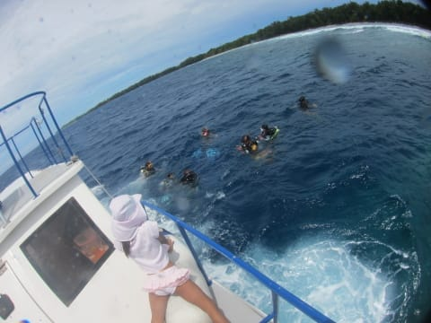
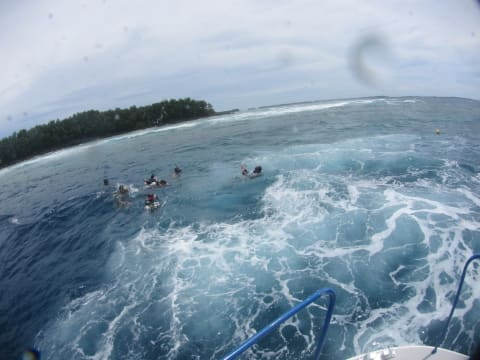
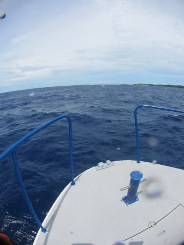
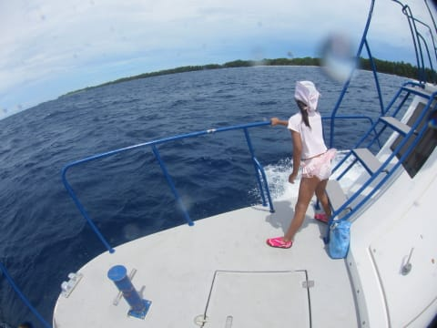
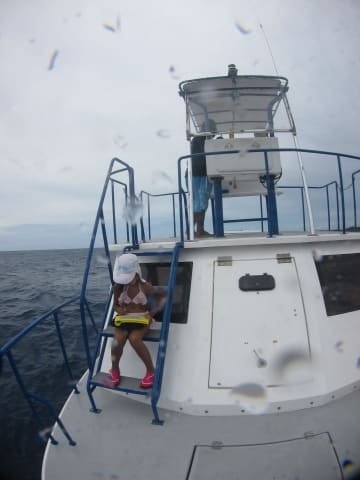
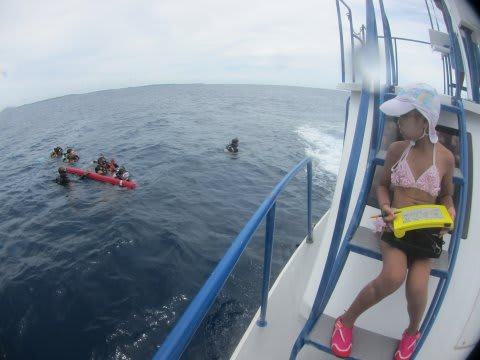

# 2014年10月，小学生の子連れでパラオへダイビングに行ってみた，その22…お留守番＆お昼ご飯

📅 投稿日時: 2015-09-04 01:44:18

ということで．

徒然スキーヤー日記ですから．

ちっとはスキーに絡むネタをやらねばっ！！

と．

しばらく，夏の志賀高原レポートが続いてましたが…

ここでまた，パラオ旅行記，復活です．

…このネタの，どこがスキーヤーブログだ…？

という疑問が湧かないでもない，パラオ旅行記へ，Go!

---

ということで．

透明度の悪いマンタポイントでの1本目が終了後．

次の2本目のポイントは，ブルーコーナーかな～…

と思っていたところ．

到着したのは，「ニュードロップオフ」．

…次は，1本目を潜りに行った私が，娘とお留守番になります．

ちょっと天気は回復しだして．

薄日が射すようになったものの…

海は引き続き，結構荒れてますね～…

荒れた海に，ダイバーが飛び込んでいきました．

「いってらっしゃーい！」

かなり海が荒れていて，船が波で浅瀬に押されていくと危険なので，

ダイバーを置いた船は，ただちにドロップオフから離れます…

海に潜っていくダイバーを置いて，船はドロップオフの外洋側，

海がざっぱんざっぱんいってる中を進んでいきます…

…写真だと分かりにくいんですが．

これ，かなり波が高く，結構揺れてるんです…．

この，すごい揺れる船の上で，波を見て

「でっかい波，来た～！」

とか言って，喜んでいた娘．

船に弱い人なら，一発アウトレベルの揺れなんだけど．これ．

…船に強い娘で，良かった…

とりあえず．

揺れは収まらないまでも．

船を泊めても大丈夫なレベルのところで，

しばし停泊．

…当然，娘が泳ぎに行けるような状況ではなく．

娘も，この海で泳いだら「死ぬ」と，素直に思ったらしく．

「泳ぐ」

などという無謀なことをと言うこともなく．

船の上で，お絵かきして過ごしてました…

＃すごく揺れてたので，手元観てお絵かきなんて…

＃船に弱かったら，酔う．一発で，酔う．

ってことで，停泊すること30分ほど．

ピックアップポイントへ向かった船に，

ダイバーが戻ってきました…

