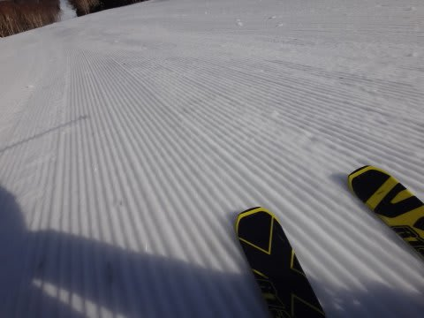

# 4月19日の志賀高原詳細モード…晴天最高の早朝と，雨で最悪の午後（涙）

📅 投稿日時: 2015-04-21 02:42:12

うーむ．

なんだか，月曜は一日強風で，

志賀高原は終日，リフトが1本も動かなかった

みたいですね～．

…日曜の午後は，呪われた雨で凹んでましたが．

リフトが動かなかったのに比べれば，まだマシだった

…と，自分を慰めている，Skier_Sです．

＃しかし，強風になるのが一日ずれてたらヤバかった．

＃ってか，日曜一日リフト動かなかったら暴れる．

＃間違いなく暴れる．

ってことで．

昨日速報した，日曜の詳細レポートをば…

えー．

日曜の朝は．

速報で報告したように，朝6:30から営業開始の，

焼額第2ゴンドラ早朝営業にやってくるわけですが…

うむ．

すっきり晴天の今日．

早朝営業を狙う人が多かったようで．

…まさか営業開始前に，こんなに並ぶとは…

列の最後尾は，5分待ち程度くらいかな…

あ，ゴンドラ待ちの列があったのは開始前だけですよ～．

で．山頂に登ると…

うほうっ！！

晴天だよっ！！！

んで．

山頂の気温は…

あら．

早朝からプラス3℃と，ちょいと高めではあるけれども．

でも．

夜の間にしっかり冷え込んだおかげで…

バーンはいい感じの冷え冷えシマシマ！！

それも，むやみやたらにガリガリではなく，

エッジがしっかり効く感じのガッチリバーン！

ふはははははは！！！！

気持ちいい！

気持ちいいよ！

トップシーズンの朝イチもいいけど，

実はこの時期の固くなった早朝も，シーズン中で

一番楽しいゲレンデコンディションかも！？？

＃固いのが嫌いな人はダメだろうけど

いやー．

しかし．

やっぱり，SALOMONのX-Raceは，こーゆー固い雪ではすごくいい！

固い雪でスピードがガンガン出ても，ビリビリ振動でエッジが逃げる

ようなことはなく．

ガッツリしっかりエッジが食い込んで，さらにさらにスピードを

求めていくという，

スピード狂にとっては，ある意味大変危険な板

です（笑）．

って感じで．

満足の早朝営業のあとは8:30から通常営業ですが…

雪は柔らかくなってきたけど，9時過ぎくらいまでは

ひどく緩むことなく，いい感じの雪質でしたね～！

んで．

通常営業開始後は，私にしては珍しく，一の瀬エリアを滑ったわけですが．

一の瀬エリア，リフト待ちは無かったけど，

結構人がいますね～．

そういえば，例年に比べ，雪が多い今年ですが．

パーフェクターのとりつき部分は，

なんだかもうかなり土が出てきてますね…

で，しばらく滑っていると…

うむ？？

なんだか…

私の予想より早く，9時過ぎにはもう，太陽が

雲に隠れちゃってますねぇ…（不安）．

寺子屋方面にやってきましたが…

10時過ぎには，なんだか今にも降り出しそうな

雲行きになり…

そして．

11時には．

なんですか？

これは？

え？

雪？

なに？

夕方までは降らずにもつと思ってたのに，もう降ってきちゃったの？？

でも．まぁ，雪なだけ良かった．

雨だと悲惨だしなぁ…

気温プラス3℃超えてるけど，雪でよかった…

と，思ったのもしばらく．

11時半には…

…

おーまいがーっ！！

何てことだっ！！

雨になってきちゃったよ…（激烈涙）．

午前中はぽつぽつ程度で，

降ったりやんだり，って感じでしたが…

雨のおかげで，雪質は水を吸った重い雪になってきました…（泣）．

そして．

午後2時過ぎには．

レインウェアを着てないとつらいくらいの降りに…

なんてこった…．

早朝の晴天からは，全く想像がつかなかった急展開っ…！

…どうしたことだ．

…これは，

早朝に来れなかったけど，通常営業から来た人に，

日ごろの行いが悪い人がいたのでは…？？？

と思わずにいられないのですが…

そして．

雨に濡れた雪は，粘るような重さの雪質に

なっていき…

こんな状況ですから．

もう，あれですね．

ゲレンデには，常識的感覚を持った普通のヒトは滑ってませんね．

こんな状況で滑っているのは．

雨にもめげず．

悪雪にもめげず．

いろいろな悪条件にもかかわらず，

ゲレンデ上に生き残った，

いわゆる「選ばれし民」

ばかりです．

…でも．なんだか．

この状況で残っているのは．

「選ばれし民」というより．

氷河期や隕石衝突などの天変地異でも生き残ってしまった，

そういう生命力が強い生き物の方が近いような気がするのは…

気のせい？？

という感じで．

超快感な早朝から，急転直下，雨の午後…という一日でしたが．

まぁ，リフトストップになっても「まだ滑りたい～！！」

というわが娘も．

雨が降ったら，意外とあっさり

「もういい，帰る」

と言ったので．

…わが娘，まだ普通の人間だったんだ…

と，いろいろと胸をなでおろした，Skier_Sなのだった…

## 💬 コメント一覧

### 💬 コメント by (Goku)
**タイトル**: Unknown
**投稿日**: 2015-04-21 23:14:12

たしかに、シーズン中よりスピードは上ですねー

カミさんは「今シーズンで一番サイコー！」と子供のようにはしゃいでいました。

しかも、このバーン用に大回りの板が欲しい！とまで・・・

うーん、私もあのバーンでＸ－ＲＡＣＥ乗ってみたいかも・・・

### 💬 コメント by (Skier_S)
**タイトル**: Gokuさま
**投稿日**: 2015-04-22 00:55:22

この時期の冷え冷え早朝，やっぱり

トップシーズンにはない楽しさがありますよね～．

トップシーズンでもすごい切れ味を発揮したX-Race，

固い雪ではさらに本領を発揮します…

すごい高速安定性です…

