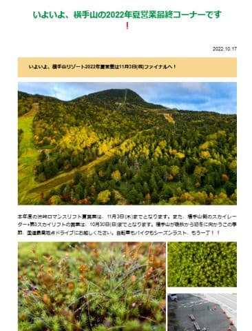
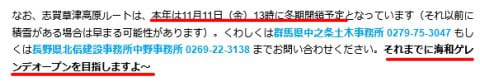

# なぬ？？2022/2023シーズンの横手山スキー場，11月11日以前の海和ゲレンデオープンを目指すって！？？

📅 投稿日時: 2022-10-18 01:20:35

えー．

今日はちょっといろいろあって眠いので，

短めの記事で更新…

本日．

横手山のホームページを見てみると…

（[横手山ホームページ](https://yokoteyama2307.com/news/18465/)より）

うむ．

11月3日に横手山の観光リフト営業が終わるのね．

そして，11月11日から，志賀草津道は冬季

通行止めなのね…

と，何気なく記事をさらっと読み飛ばしそうに

なった時．

この記事の最後の部分を見ると…

うむむむむ！！

なんだと！？？

（[横手山ホームページ](https://yokoteyama2307.com/news/18465/)より）

志賀草津道通行止めの11月11日までの

海和ゲレンデオープンを目指す

だと！？？

それが実現すれば，アイスクラッシュ以外の

スキー場としては最速のオープンだけど…

去年も11月6日オープンを狙って，

実態は11月19日オープンだったので．

さすがに11日オープンは無理じゃないかな～…

でも．

11日にオープン目指してくれるなら．

それは素晴らしいので，ぜひ狙ってほしいところ！！

…だけど．

11月は志賀高原シーズン券が使えないので，

私は行きませんが…（ちょいと残念）

とりあえず．

今年の11月は冷えるのか？

予定通り，11日以前に横手がオープンできるのか？？

乞うご期待！！
