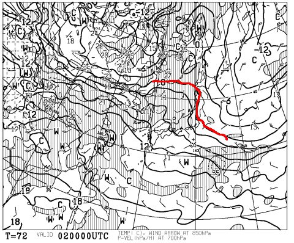
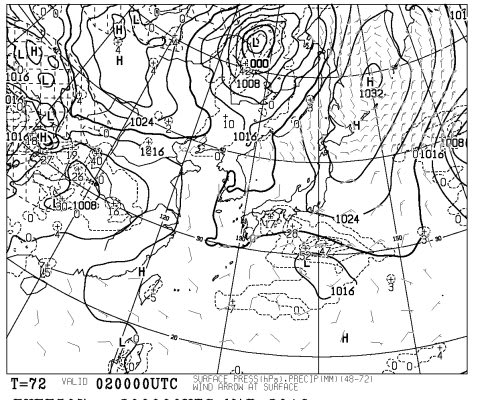
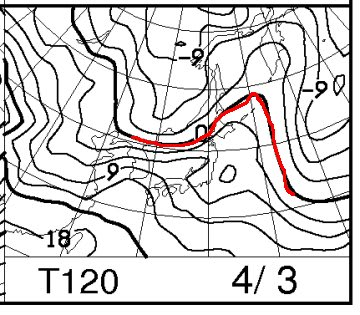
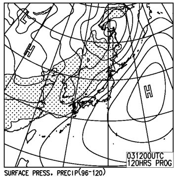

# 4月2日の週末の志賀高原の天気予想は…暖かい晴れの，典型的な春スキーかな…

📅 投稿日時: 2016-03-31 01:29:22

🏷️ カテゴリ: [スキー天気予想](c6554f5c3c106093b511a8daae23757e8.md)

ここ3日間の高温で，

[かなり雪が解けているらしい](http://red.ap.teacup.com/applet/gokurakuskier/20160330/archive)状況に，

悲しみを隠せないSkier_Sです．

…とりあえず．

本来であればまだ1か月以上シーズンが続くはずの志賀高原．

早くも末期的状態になりつつあるようですが…

ってことで．

水曜深夜定番の．

今週末の志賀高原の天気を見てみましょう…

えー．

2日土曜日，朝9時の850hpa気温図を見てみると．

…

あー．

春ですね．

0℃線は，志賀高原からはるか北東へ離れていっています…

これで降っちゃうと，雨なんですが…

地上天気図を見ると．

ふーむ．

まぁ，雨は降らなさそうです．

気温はかなり上がりそうだけど…

基本的には，晴れそうかな？

で．

3日日曜の850hpa気温図は…

…この日も，0℃線ははるか北（涙）．

それどころか，志賀には+6℃線がかかり．

朝から気温が高そうな一日です…

日曜の地上天気図は．

うむ．

基本的に高気圧に覆われ，この日も天気がよさそう…

…しかし．

この時期の晴天って…

雪は張り付く感じのストップスノーになる可能性が…（涙）．

ってことなので．

まとめると．

土曜：朝からおそらく晴れ．朝イチの気温は0℃前後．

　朝イチからすっきり晴れれば，放射冷却で固めの斜面でスタート．

　ただ，強い日差しと高温で，雪は午前の早いうちから緩み始めそう…

　昼にはザブザブな春の雪となり．

　暖かい気温＆日差しの中，典型的な暖か春スキーの一日になりそう．

日曜：朝イチは，今の天気図だと雲が多いものの，晴れかな…

　すっきり晴れれば，冷えた固い斜面だけど．

　雲が多くて放射冷却にならなければ，朝から緩めの雪で

　スタートな一日．

　どちらにしろ，昼間の気温はぐんぐん上がり．

　雪質はザブザブの荒れ荒れ．

　のんびり滑るしかない，暖か春スキーの一日かな…

　今のままの天気図だと，日曜はちょっと雲が多そう．

という感じで．

ガツガツ滑るというより．

うららかな日差しの中，日向ぼっこをしたくなるような

暖かい土日になりそうです…（涙）．

あぁ．

晴天はいいけど．

強い日差しで雪が解けそう…（泣）．

うーむ．

なんだか．

天気図からも．

もうすぐ，春ですね～♪

という音楽が聞こえてきそうですが．

スキーヤーとしては．

「春はいいから！いつまでも冬でいてていいから！」

と，言いたい気分のSkier_Sなのでした…

## 💬 コメント一覧

### 💬 コメント by (まいる)
**タイトル**: ラスト2回
**投稿日**: 2016-03-31 18:25:13

Sさん、お疲れ様です(^^)v

今週末は、私の行く猫魔も高温の予報です(>_

### 💬 コメント by (takac)
**タイトル**: こころなしか…
**投稿日**: 2016-03-31 18:54:00

今週末は志賀高原行けないとのこと、

お察しします。（ ;  ; ）

いつもの週末天気予想の文面がこころなしか元気がないように感じるのは私だけでしょうか…

### 💬 コメント by (Skier_S)
**タイトル**: ということで，引っ越し準備中
**投稿日**: 2016-04-01 02:33:40

＞まいるさま

この4月は，ずっと高温が続きそうです（涙）

今週スキー行けないけど，来週以降も雪があるかなぁ…（泣）．

＞takacさま

もう，行きたくても行けないんです（泣）．

引っ越しの合間にスキーに行く手はないかと

考えたのですが…無理でした←当たり前だ

この週末の天気予想．

「どうせ自分は行けないんだし～」

と，ちょっと天気図の読み込みが甘かったのは

事実です…（＾＾；

文面も，やっぱり元気が出せない感じでした（涙）．

