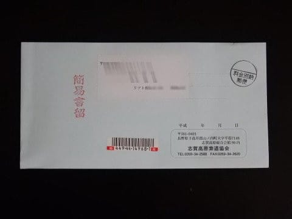
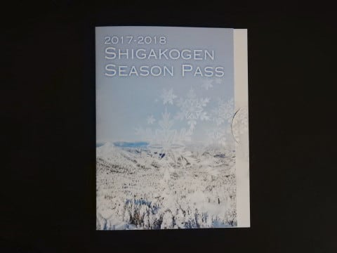
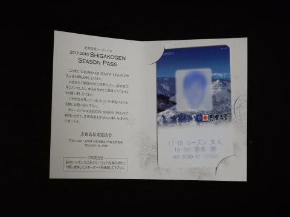
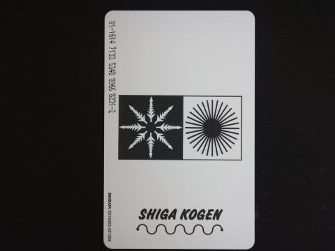

# この時期定番の，スキー必須アイテムが届いたよ！！

📅 投稿日時: 2017-11-03 01:13:04

えー．

やっぱり，4日から5日にかけて．

結構冷えそうで…

5日の朝は，各地のスキー場で，

結構な雪が積もってくれそうな感じに

なってきましたね～！

…でも．

今降っても，ちょっと早いのだ．

各スキー場オープン直前の，あと2週間くらい後で

ドサドサ降ってくれた方が，

嬉しい気がする今日この頃．

皆様いかがお過ごしでしょうか．

ということで．

本日我が家に，簡易書留が届きましたが…

ふむ？？

志賀高原索道協会からの郵便？？

ってことは…

はい．そうです．

この時期定番の，志賀高原シーズン券が

届きましたよっ！！

…いつもと同じように，このような台紙に

挟まれて送られてきましたが…

中を見るとこんな感じで．

うーむ．

やはり今年も，デザインの変更はないみたいですね…

このキーカードになって7シーズン目．

全く同じデザインですね．

このキーカードになって7シーズン目ってことは…

Skiline開始から，もう7シーズンになるのか…（しみじみ）．

…このSkilineが入ってから．

絶対不可能と思える量を滑り続けるサイボーグ人が，

こんなにいたのか…と，感動してみたり．

だんだん毎年，そのレベルが上がっていくことに

戦慄を覚えたり．

…そして，奥志賀ゴンドラ48本滑る人が出てきたり．

このキーカードになってから，いろんなドラマを

生みましたね…

＃このキーカードが無ければSkilineもなく，20000mクラブもなかったなぁ…

このシーズン券．

デザインは変わってないけど．

去年までは代金引換じゃないと受け取れなくて．

代金引換に800円くらいの手数料が取られるという，

悲しい状況でしたが．

今年から，クレジットカード払いができるようになり．

送料込みのシーズン券70000円+キーカード保証料500円だけで

入手できるようになったのが，

進歩ですかね…

とりあえず．

こいつが届くと．

もう本格シーズンはすぐそこ

という感じになってきますね～！！

あぁ…

早く志賀高原で滑りたくなってきたっ！！

## 💬 コメント一覧

### 💬 コメント by (かず)
**タイトル**: Unknown
**投稿日**: 2017-11-03 11:23:26

今年から枚数限定じゃなくなったので僕はギリギリ申し込み派です　12月まで何があるか分からないので　笑　今年のSさんのイメージカラーは去年と同じですか？

### 💬 コメント by (Skier_S)
**タイトル**: かずさま
**投稿日**: 2017-11-03 12:23:38

そういわれてはじめて気づきました…

今シーズン，枚数限定じゃないんですね！！

ちなみに，今年のイメージカラーは昨シーズンと全く

同じです（笑）

### 💬 コメント by (サトシ父)
**タイトル**: 早く送らなくちゃ
**投稿日**: 2017-11-03 12:54:41

申込書に写真を添付する理由がわかりました！顔写真入りのチケットだったとは…

早く写真撮りにいかなちゃ。

### 💬 コメント by (いか)
**タイトル**: Unknown
**投稿日**: 2017-11-03 17:04:00

気付けば11月なのであと２，３週間で私もシーズンイン、、、という実感がありません汗

とりあえず私も先日、ホームゲレンデに「納税」しましたが、取りに行かないと行けません。届くほうが気分が盛り上がってよいかもですね！

### 💬 コメント by (Skier_S)
**タイトル**: もうすぐ志賀高原オープン！
**投稿日**: 2017-11-03 22:17:27

＞サトシ父さま

私はデジカメで撮った写真のプリントアウトを使ってます（笑）

送られてくるまで数日かかるので，初滑りから1週間くらいは

余裕を持っての申し込みをお勧めします…

＞いかさま

そうなんですよ．

もう2-3週間で本格シーズン突入ですよ！

…ってか，Yetiにくれば明日からでもシーズンイン

できますが…

しかし，なぜ志賀高原のシーズン券は郵送なのか…

他のスキー場では聞いたことがない気がします．

