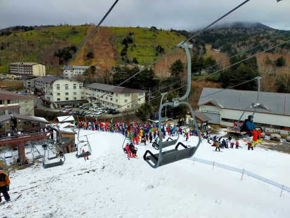

# 2022/12/4(日)の志賀高原特派員情報…横手山はリフト30分待ち，熊の湯は最大15分待ち

📅 投稿日時: 2022-12-05 01:40:30

ってなことで．

大変悲しいことに，今日も一日

家の自分の部屋にこもって仕事を

していたSkier_Sです…

でも．

志賀高原への忠誠心の強い方が

今日もたくさん志賀からレポートを

送ってくれたので．

今日も志賀高原特派員レポートです！

…なんだか．

毎週特派員にレポートしてもらえば，

自分が週末志賀に行かなくてもこのBlogは

成り立つんじゃないか？

…という気分になってきている今日この頃

ですが．

とりあえず，横手山の報告からお送りすると．

あさイチは天気も良く．

昨晩から人工降雪機も動いていたので，

バーン状況は悪くなさそうに見えますね！！

ただ…

熊の湯より横手の方がバーンコンディションが

良く，かつリフトが1本だけなので．

人が集まってリフト待ちがすごいことになり．

朝8時の1本目が20分待ち，それ以降はずっと

リフト30分待ちが続いたようです…

リフト30分待ちって…1時間2本も

滑れないってことですね…！！！

ただ，11時過ぎには雪が降り出して…

なんだか，午後は横殴りの雪になったようです！

だもんで．午後2時くらいからは人が減って，

リフト15分待ちぐらいまで短くなり，

15時の営業終了時にはリフト待ちほぼ

ゼロになったみたいです．

ただ…

午後は横殴りの雪になったとはいえ．

積もったのは実際3mm程度と．

寒いのに積もらないという，大変残念な

天気だったようです．

…一方，熊の湯．

こちらも朝イチは天気が良かったものの…

うーん．

雪はかなり薄い感じで．

残念ながら，ところどころブッシュさんが

顔をお出しになってますね…（泣）

それだけじゃなく．

リフト降り場の雪も足りないみたいで…

リフトを降りたところは，スノーマットの

上をすべる形になるみたいです．

そして．

リフト2本でゲレンデに人を送り込んでいるので．

狭いゲレンデはかなりの人口密度で…

うーん．

かすかにイエティを彷彿とさせる感じが…

でも，リフトが2本動いている分，リフト

待ちは横手山より短かったみたいですが．

…それでも，朝9時ごろからは15分待ち！！

で．

熊の湯も昼ごろにはガスがひどくなり…

ゲレンデが見えず，ちょっと怖かった

みたいで．

そのせいで，昼ごろにはリフト待ちが

3分くらいまで減ったみたいです…

熊の湯特派員はラストまで滑るような

根性のある特派員じゃなかったので，

（こっちの方が普通という説あり）

熊の湯の午後の状況は不明です…

ってなことで．

特派員頼みの他力本願でBlogを更新した

この3日間でしたが．

自分が志賀高原に行ってレポートしなくても，

このBlogは志賀高原Blogとして成り立つ

という事実に気づいてしまい．

自分の存在意義に疑問を抱いた

Skier_Sだったのでした…

## 💬 コメント一覧

### 💬 コメント by (カンタロス)
**タイトル**: Unknown
**投稿日**: 2022-12-05 06:43:14

Sさま、こんにちは。

志賀高原ブログもそうですが、やはり物欲選手権!

あれのおかげで、うん、まだ自分は大丈夫。

という免罪符を得ています（笑）

貴重な天気図解説も楽しみにしております。

今シーズンもスキー場天気予報より正確な天気予報をおねがいします。

### 💬 コメント by (Skier_S)
**タイトル**: ＞カンタロスさま
**投稿日**: 2022-12-06 01:25:00

物欲選手権，なぜか人気がありますね…

天気予想も引き続きやっていきますので，暇がない中何とか記事を書いていきます…

コメントを励みに記事を書いていますので，コメント感謝です！！

