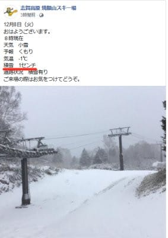
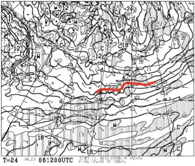
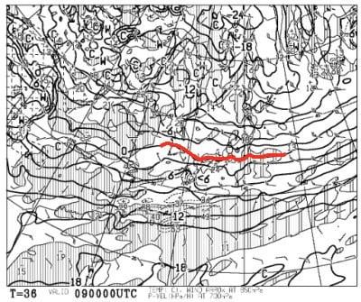
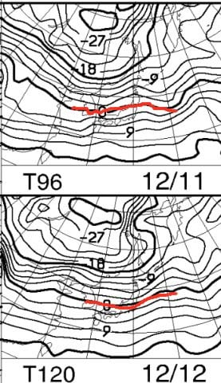
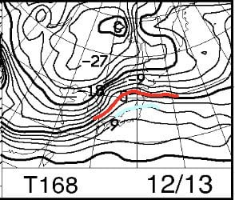
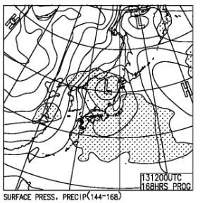
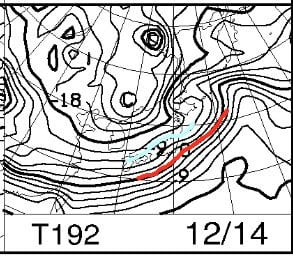
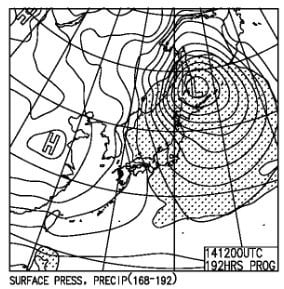
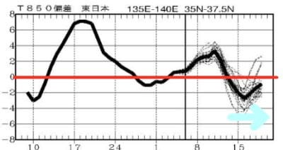

# 今週末まで雪は降るのか？…昨日はまた寝てしまったので昼間に更新！

📅 投稿日時: 2020-12-08 12:46:45

🏷️ カテゴリ: [日記](cc4b5682fb7b8b144980957a978653fb0.md)

えー．

どうやら最近，スキー翌日の月曜の夜は，

仕事が終わった後強烈な睡魔（泳ぐ人のことではない）←それはスイマー

に襲われるパターンで，即落ちしてしまい．

昨日も帰宅後着替えないまま布団で

寝てしまっていたので（涙）

今日は昼休みに更新…

ってなことで，

志賀高原ですが．

どうやら昨晩から今朝にかけて，

雪がちょっとだけ積もったようですが…

…

積もったのはわずか1cmですか…(泣）

([焼額山スキー場Faceboo](https://ja-jp.facebook.com/yakebitaiyama/posts/3483293608432627)kより）

でも，これから9日朝までは，冷えてくれそうで．

8日の850hpa気温図も…

9日の850hpa気温図を見ても…

一応，赤い0℃線は志賀高原より南なので，

9日の朝までは人工降雪機がガンガン

動かせそうな気温ですね…

…

でも，気温は低いものの，天然雪は

降らなさそうですが（泣）

そして，11日金，12日土と，2日間は

微妙な感じ．

赤い0℃線がギリギリ志賀のあたりを

漂う感じで，ガンガン冷え込むわけではなく，

積雪も全く無さそうな日が続き…

まぁ，12日土曜も人工雪オンリーの

ゲレンデ状況となりそうです…

そして，ヤバいのは，日曜13日．

えええ？？

水色の+6℃線が志賀高原に近づいている

ってことは…

降ったら液体？？

そして，地上天気図を見ると…

うぐ．

きわどい．

ギリギリ志賀近辺だけ降水域は

かかってなさそうだけど…

降れば液体．降るか降らないかギリギリと

言ったあたり…

どちらにしろ，13日の日曜は，気温が上がり

人工降雪機は動かせず，雪も解けて

コンディションはちょい悪化しそう（泣）

でも．

次の14日の予想を見ると…

…

ををを！！

これは…冷えるっ！

14日は冷える！

水色の-9℃線が志賀に近づき…

そして，地上天気図も完全冬型！

志賀高原にも降水域がかかって，

14日はかなりの積雪がありそう！！

…そして．

2週間気温傾向，QXVV24を見ても…

うぉぉぉ！

14日以降，久しぶりに冷えてくれそうです！

これは…19日の週末は期待できそう！

ということで．

今週末は残念ながら人工雪オンリー，

さらに13日の日曜はヤバそうな感じ

ですが…

来週は期待できそうです！！！

PS.すみません．コメント回答は今晩に…

## 💬 コメント一覧

### 💬 コメント by (Noname)
**タイトル**: Unknown
**投稿日**: 2020-12-08 20:38:09

ちゃんと布団で寝ているならまだ大丈夫！

（なにが？？）

### 💬 コメント by (レインボー73)
**タイトル**: Unknown
**投稿日**: 2020-12-09 20:01:04

水曜日の志賀高原

ヤケビは４ロマのみ。係員によると週末には唐松を動かしたいとのこと。期待したいですね。

４ロマだけでかなりの満足度。すべり台みたいに、凹凸が皆無。なんて素晴らしい整備力！　

早い昼食のあとファミリーへ。広い!　好きなコースを選べる喜び。ヤケビに比べると整備は悪いけど、楽しくて楽しくて。À線Ｂ線二本のうち、長いほうが動いていたので、満足です。

### 💬 コメント by (Skier_S)
**タイトル**: 昨日は死んでました
**投稿日**: 2020-12-10 02:40:24

＞Nonameさま

そうなんです…布団で寝てただけ，床で寝ているよりはマシでした．

そして，昨日はいつ寝たのか知らないうちに椅子に座ったまま

意識を失っていて，そのまま明け方に布団になだれ込んでました…

＞レインボー73さま

おっと！

今週末，唐松が動いてくれると嬉しいですが…

天然雪が全く降りそうにないこの状態で大丈夫か，

ちょっと心配です…

でも，焼額の圧雪整備はやっぱり他のスキー場よりレベル高いですよね！

### 💬 コメント by (Noname)
**タイトル**: Unknown
**投稿日**: 2020-12-10 08:42:48

椅子で寝ていた…

Outです！！

危険水域突入！！！

仕事をしている場合じゃ無い！！

「スキーやらないと死んじゃう」じゃなくて

「死んじゃってスキー出来ない」なんて事の無きよう､仕事は三の次にして、先ず寝て・食べて・スキーをしてください

### 💬 コメント by (Skier_S)
**タイトル**: ＞Nonameさま
**投稿日**: 2020-12-11 08:04:13

もう，数年間危険水準かも…

今日も朝気づいたら床で寝てました（泣）

Blog更新している場合じゃないんですが…

