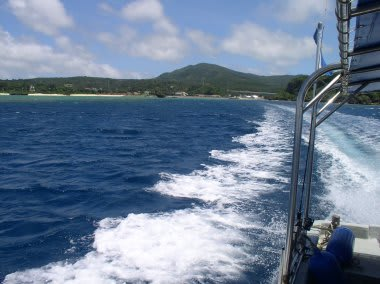

# 初の子連れダイビング旅行記＠2009年　その5　1本目のエントリー

📅 投稿日時: 2012-07-16 01:03:13

というわけで．

うちの妻の3年ぶりのダイビング＆子連れダイビング1本目という

大きなイベントを終えたわけですが．

多少のどたばたはあったものの，何とか無事乗り越えることができたわけで．

次の午後のダイビングは，私が潜る番だっ！

…ってことで，昼食後．

恩名の1本目へ行くべくダイビングセンターへ．

今度は妻が留守番です．

ダイビングセンターの壁に貼ってあるポイント紹介を見てみると…

トウアカクマノミとヒレナガネジリンボウがいるポイントがある！

ここ，行ってみたいなぁ～っ！

…と考えつつ準備をしていたところ，ガイドが近寄ってきます．

ガイド「なにか，ポイントのリクエストはあり…」

S「トウアカとヒレネジ！！！！」

ガイド「…分かりました．そのポイントに向かいます」

やったー！リクエスト一発で希望のポイントにつれてってくれるなんて，ラッキー．

準備を終えたら，娘と一緒にボート乗り場へ向かい…

ボートに乗り込み，機材を準備していると．

うーむ．

ほとんどの参加者がレンタル機材の方ですな．

マイ機材を持っている人でも，まだ買ったばかりなのか，

グローブもフィンもピカピカなのが眩しい！！

ある程度予想してましたが，リゾートホテル内のダイビングショップって，

こんな感じなんですね～．

ここしばらく，コモドとかの「300本程度ではゲストの中で最も経験本数が少ないレベル」って

感じのダイビングばかり行っていたので，なかなか新鮮な感覚…

ガイド「機材セッティングに自信のない方は言ってください～」

うーん…．こういう言葉もなかなか新鮮だ…

ポイントまではボートに乗って10分弱です．

ポイントに到着したとき，だれも何も言った訳でないのに

全員が無言で器材を準備し始める，あの秩序感が全くなく，

「何するんだっけ？」

感がボートに漂います．

うーん．歴戦のツワモノとばっかり潜っていた最近ではなかなか新鮮…

ガイド「バルブがあいてるのを確認したら，先にフィンを履いちゃって下さい．

器材は背負わせてあげますので…」

フィンを先に履いてから器材を背負うのかっ…

うーん．新鮮だ…

全員の準備が揃ったらエントリーです．

なんだかんだ言ってますが．

よく考えたら．私も実は，10ヶ月潜っていないブランクダイバーじゃないですか．

人のことは言えないよな…

果たして，無事トラブルなく潜れるのか？

ちゃんと耳が抜けるか？

レギュと間違えてシュノーケルくわえてエントリーしないか？

タンク背負い忘れてないか？

フィンと間違えてグローブを足にはめてないか？

などとドキドキで，いざエントリー．

エントリー後，耳も問題なく抜けて，

さらに無意識のうちに

「カメラon, 絞り優先AE，F2.8，露出補正-1.7段，フラッシュ強制発光モード，

外部フラッシュ電源on，ターゲットライト消灯確認，フラッシュ調光F2.8…」

とエントリー後の儀式であるカメラ設定を確認している自分．

体が覚えているもんですな～．

で，水底でチームが揃うのを待っていると…

一人の方は，水面近くで潜れないのか耳が抜けないのか，

エントリーロープにつかまって深度2-3ｍで苦しんでいる様子．

ガイドが見守ってますが…

うーむ．私もこんな時期があったものだなぁ…（しみじみ）

数分後，チームの全員が揃ったので，トウアカのポイントへＧｏ！

とりあえず，水中を進んでいきます

（続く…って，ダイビング1本目エントリーだけでこんなに長くなってしまったっ！）
