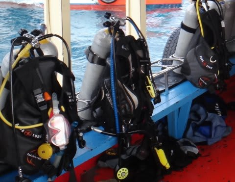

# 格安BCの悲哀？

📅 投稿日時: 2013-09-29 07:45:24

えー．

以前書いたように，

[2万9千円という，ありえない格安BCを買った](eb7b9c411e6dbfe23e183922fc3a41d9f.md)今シーズンなのだが．

今回．

タオにダイビングに行ったとき．

このダイビングショップ，レンタル器材がタダで借りれるのが売り

だったんですよね．

んで．

国際線の預け入れ荷物の重量が厳しくなったいま．

タダで借りれるなら…ってことで．

重い自分の器材を持ってこず，

レンタル器材を借りる人がすごく多かったんだけど．

…なんと．

そのレンタルBCが．

全部自分のと同じBCだよ…

(真ん中のBCは違うけど，それ以外は同じBCが並ぶと言う

不思議な船内の様子)

…

…まぁ．

レンタルに使われるくらい「安かった」

ってことではなく．

レンタル器材に選ばれるくらい「頑丈で長持ち」

だったんだ…

と．

自分を慰めた今日この頃なのであった…

＃現地では，「どれが自分のだっけ？」と混乱すること多数…
