# 2020/10/31(土)のイエティで滑ってきたよ…シーズンオープン2日目は，晴天＆混雑

📅 投稿日時: 2020-11-02 12:30:11

🏷️ カテゴリ: [2021スキー滑走日記](c2b0fc073d6357d3b786f6ca655147f7d.md)

えー．

昨日夜，死んだように寝てしまったので．

Yeti詳細レポートが書けませんでした…

だもんで，変則的な昼間更新で，

レポート公開！

まず．

昨日レポートしたように，朝9時オープン前，

8:45には並び始めたのですが．

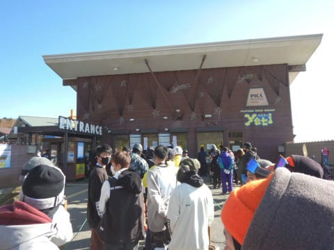

チケット売り場で15分以上の列が…（涙）

あ，ちなみに，この列に並んでいる間に，

スタッフによる検温がありましたね…

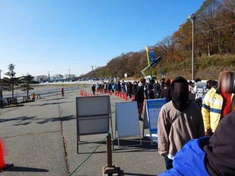

この待ち時間のおかげで．

9時オープンからちょっと遅れましたが…

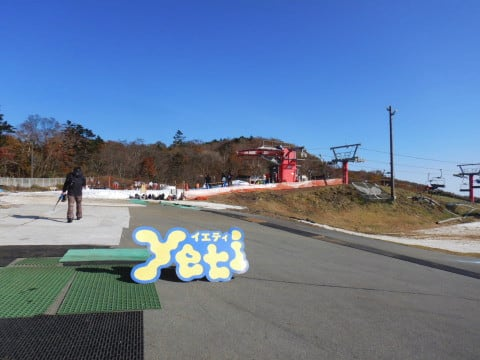

2021シーズン初の，雪です！！

ゲレンデです！

月山以来の雪ですっ！！！！

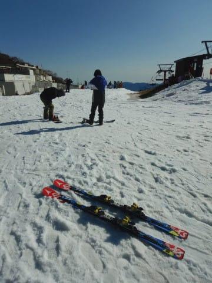

いやーーー．

来ました．

待ちに待った，この瞬間が…

実に，4か月ぶりの雪面です…！

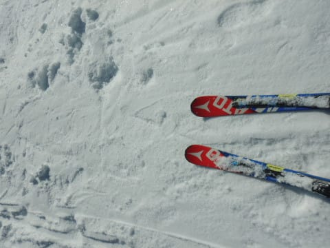

いやー．

オフシーズンが4か月を超えたのは

久しぶりだし．

6月の月山で2日滑った以前も，

コロナの緊急事態宣言で3か月近く

滑ってなかったし…

実質7か月ぶり，と言っても過言じゃないですね！

あさイチは，ガラガラ！

うはーーー！

シーズン1本目から，いい感じ！

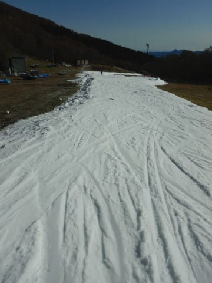

雪はアイスクラッシュの作りたて，

ちょっとモサモサした感じの雪ですが，

板はよく走る！

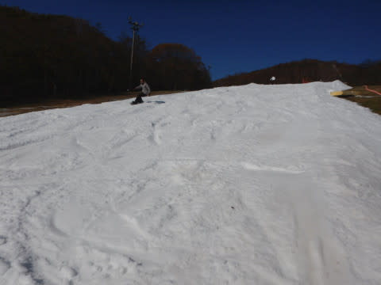

リフト乗り場・降り場も雪がちゃんと

着いてますね

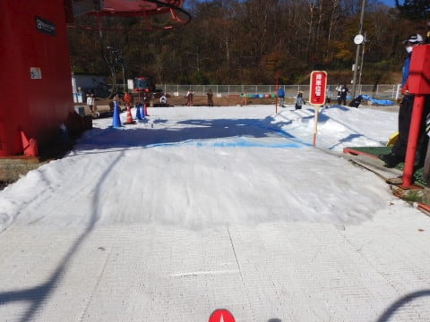

そして，

朝の1時間ほどは，人も少なめで．

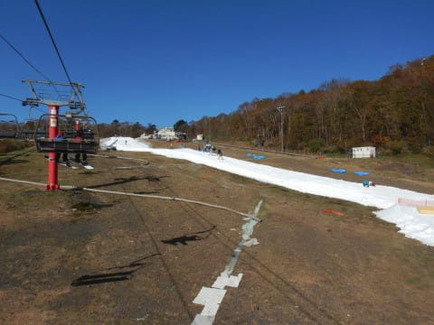

天気も良かったので，気持ちよく

滑れたけど…

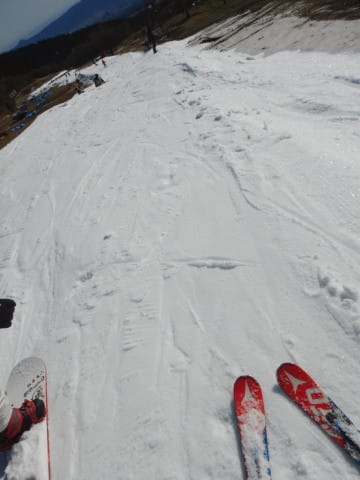

オープンから1時間，午前10時ごろには…

ちょっと人が増えてきて…

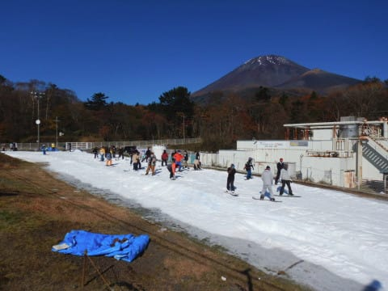

うむ？

なんだかゲレンデの人口密度があがって

来たな…

思ったら．

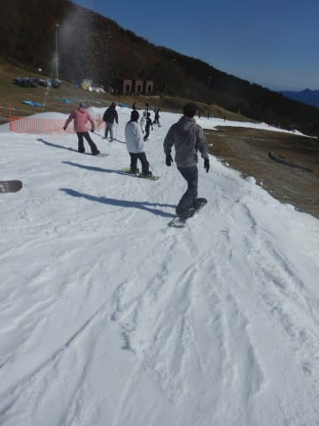

この程度だったリフト待ちが…

一気に伸びてきたんですけど…（涙）

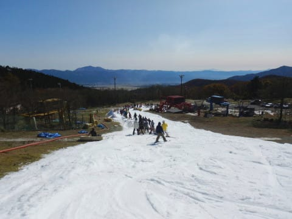

なんだか，最後の急斜面の真ん中

くらいまで列が伸びちゃって．

10分待ちを超えましたね（泣）

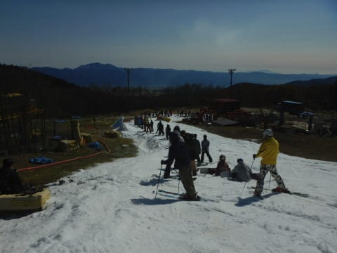

ただ，列がこれだけ伸びた午前10時過ぎに，

隣のペアリフトが動き出して，

それ以降，クワッドリフトの待ちは

大体この程度に収まりました…

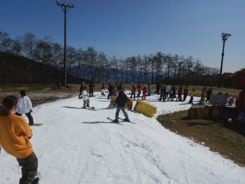

そうそう．

リフトにはこんな案内板があって．

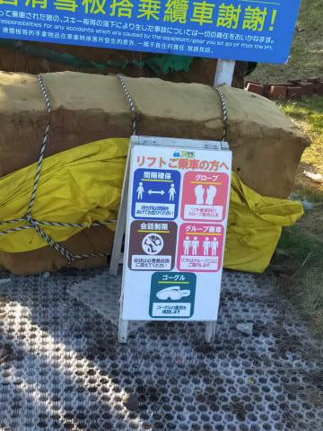

基本的にはグループでの乗車を進めて

ましたが．

混んでくると，3人程度までは乗りあって

いた感じで．

グループ以外の乗車は許さない！

という感じではなかったですが，

ぴったり4人乗車ってわけではなかったです…

で．クワッドはそこそこ混んでたけど．

板を脱いで乗らなきゃならないペアリフト．

脱ぎ履きもめんどくさいし，ゲレンデまで

ちょっとだけ歩くので，がらがら！

待ち0です．

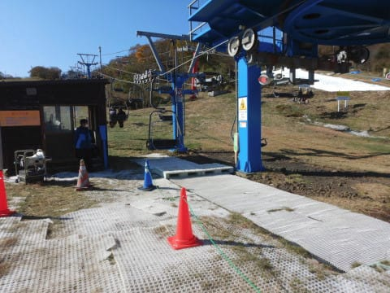

…でも．

まだオープン直後で，ゲレンデの幅がそれほど

広くなく．

ゲレンデの混雑が，ちょっとなかなか

すごい感じ…（涙）

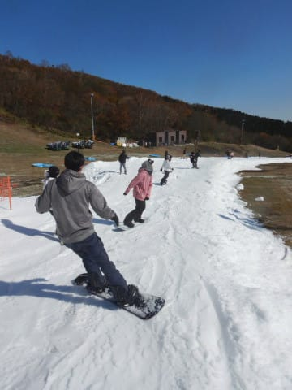

昼ごろになっても，気温がそんなに

上がらなかったので，雪はちょっとしっとり

したものの，ひどくザブザブにならず．

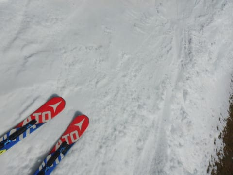

結構雪の厚みもあったので，

コース上に穴が開いたのは，最後の

急斜面の1か所だけだったので．

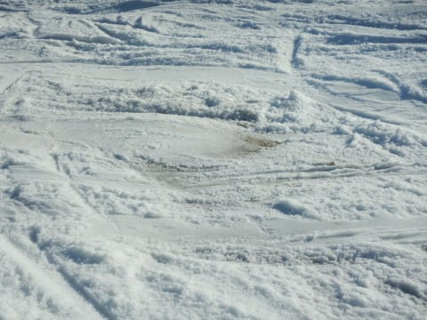

いつもの穴だらけになる10月よりは

コンディションいいかな…

と思いつつも．

コース上の人が結構多かったので…

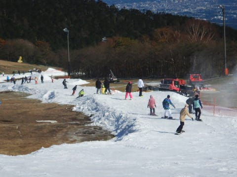

午後には，コースは結構うねりが出た

感じになってきてましたね…

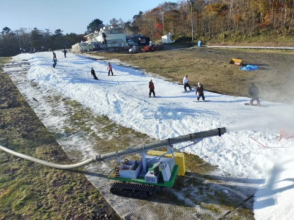

そして．

夕方に向かって人が増えていく，このスキー場．

午後2時ごろには，ペア＆クワッドの2本体制でも，

クワッド側の待ちがこれくらい．

（ペアは待ち0）

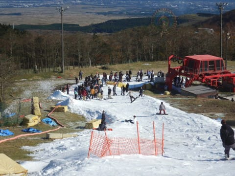

だけど．

午後3時にペアリフトが営業終了して…

えええ！

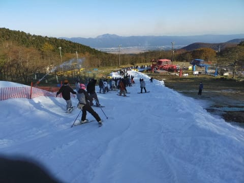

なんだか，クワッドリフト．

列がすごいことに…(泣）

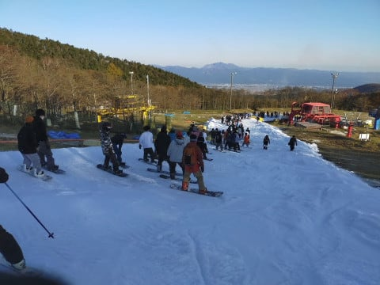

オープンの週にもかかわらず，

かなり混んでます(涙)

そして．

多くの人でコースは荒れ荒れ．

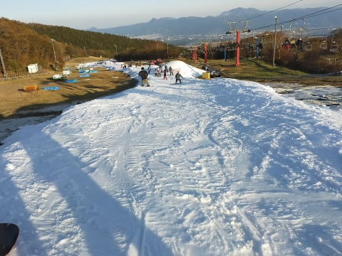

なので，午後4時から，

定番のコース整備スタート！

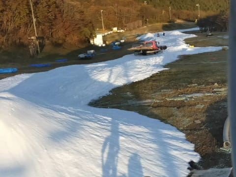

午後4時から5時まで，コース立ち入り禁止で

圧雪車が入るので．

午後5時オープンのシマシマを狙って並びます…

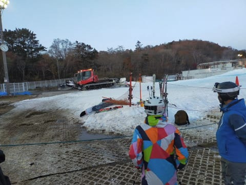

そして．

午後5時のオープンとともにコースへ飛び込む！

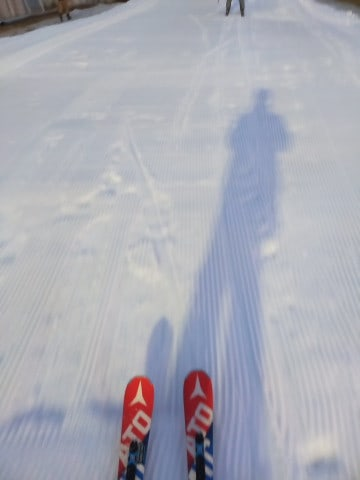

前に二人しかいない，

ほぼクリア状態です！

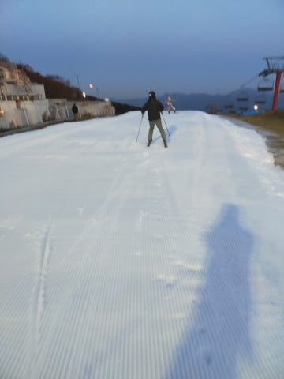

で．

コースは…

今シーズン初の，シマシマっ！

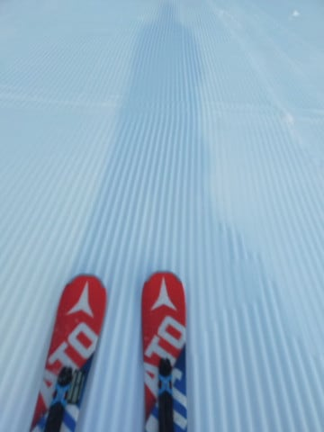

シマシマ，いただきまーす！

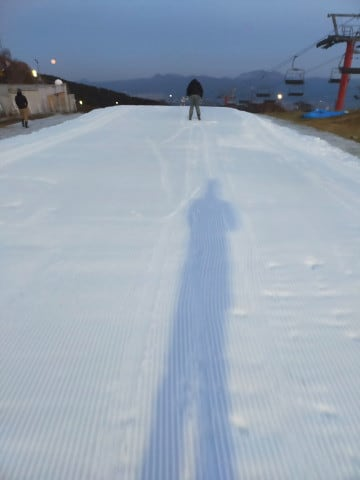

…と，1本目は，

シーズン初日と思えない気持ちいいシマシマを

堪能…

でも，2本目以降は人が増えて．

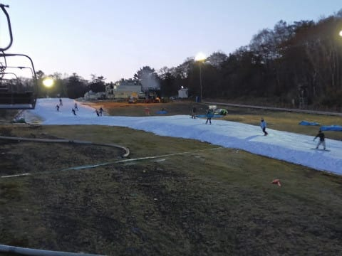

コース上の人口密度もさることながら…

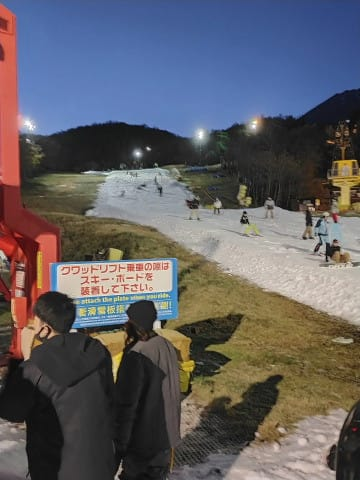

あっという間に雪も荒れてしまい．

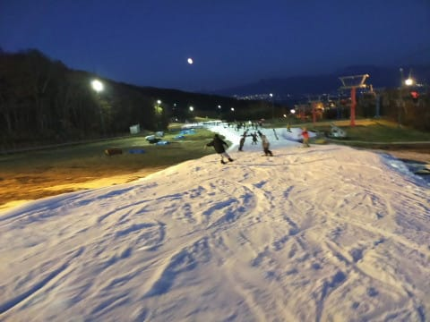

さらに，リフト待ちの列が10分待ち以上と，

すごいことになってしまったので…

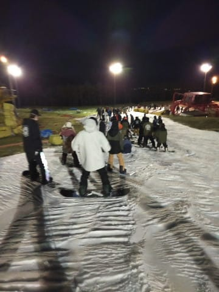

午後6時ごろに，おとなしく引き上げたのでした…

いやー．

結構混んだものの，

天気は良かったし．

シーズン初日にゆっくり滑るなら，

足ならしにちょうどいい一日

だったかな…

何にしろ，久しぶりにスキーが履けて，

雪面に立てただけで十分満足…

2021シーズン，無事に開幕です！！

## 💬 コメント一覧

### 💬 コメント by (副院長)
**タイトル**: シーズンインおめでとうございます
**投稿日**: 2020-11-02 21:29:47

昨シーズンはたった2日で硬膜下出血、母指骨折で終わってしまいました。1974年からの志賀高原歴で初めて2日で終わってしまいました。今シーズンは1月から復帰予定です。よろしくお願いします。

GO TOトラベル延長されないかなぁ

### 💬 コメント by (Skier_S)
**タイトル**: ＞副院長さま
**投稿日**: 2020-11-02 23:58:16

今シーズン，1月に復帰ですか！

待ち遠しいことかと思いますが，私も志賀でお待ちしております．

GoToトラベル，延長されそうな感じですね．

延長してほしいなぁ…

