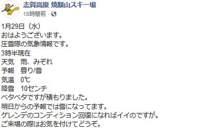
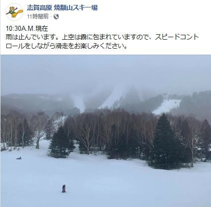
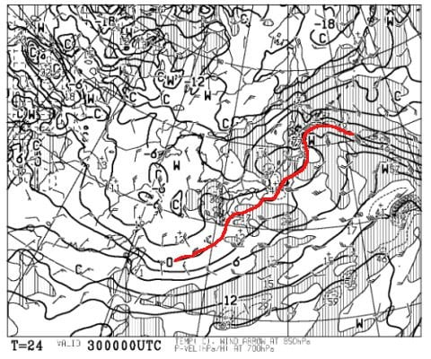
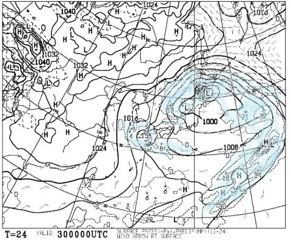
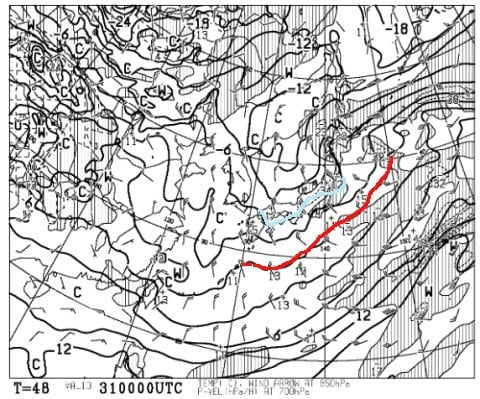
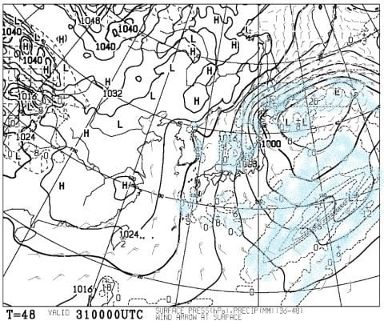
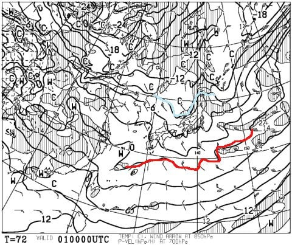
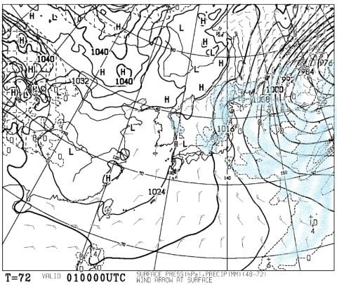
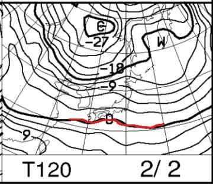
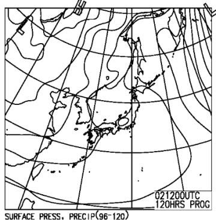

# 2月1，2日の週末の志賀高原の天気は？…1日は小雪~曇りながら，朝は新雪期待！2日は晴れそうで，どちらも冷え冷えのトップシーズン！

📅 投稿日時: 2020-01-30 00:05:10

えー．

昨日の予想で．

29日（水）：朝は標高の低いところは雨になるかも…

　焼額はギリギリ雪．でも，朝のうちはかなり湿り気味の

　重い雪．ヘタすると，午前中一瞬雨っぽくなるかも…

　積雪はそれほどなく，5~10cmほど．

　昼ごろには止むかな．

と，書きましたが．

残念ながら，焼額でも朝から雨だったようです（涙）

う――む．

午前中は一瞬雨っぽくなるかも…と書いたものの．

まさか朝から雨になるとは…（泣）

あぁ…なぜ，1月の志賀高原で雨が降るのか…

ただ，雨になる前の積雪が10cmあったようで．

朝までの積雪5~10cmというのは，

一応当たったようですね…←予想が当たったことを必死にアピール

一応，雪の積み増しがあっただけマシと，

自分を慰めるしかないですね（悲）．

ただ．

昼ごろには止むかな，と書いたように．

雨はそれほどひどくならず，10:30には

止んだようです…

（[焼額山Facebook](https://www.facebook.com/yakebitaiyama/?hc_ref=ARSqZDIGhcA7crtGlmiL95OxBu4nMSb-3iNvBwwj_CYuo5ViORWDmHlztsCskfgwvMI&fref=nf&__xts__[0]=68.ARCiCaOFuTlJ08R5eo_lqPVJxjh4FjfRgF2tFAZTxXjSrurvwgJLEgYjOwh3I9XHY3-kbw5S-bf3yQvk13s11WxmuSJ8fNJUTnmhlhIHBGrh0vPFls3I8PWjAHVdV5_Y6_9h8h3V8foFG-X65g-XD5FbWuZ2ct9bwhPHIbCS2zIIk4V7mXBvgABtuP_tuQK5Vghl7UpKWGBkh9yaLkCTqOjBtbEX1LHv3rO_fvLR-nNt1Es-Ve9ulSr17wBwpvih3lifW-i0cGow8KMXLXuN0Qq9CO-qTttLBtsuHLMGyNdCkrh8zenGxsaOoEWY8AIOwoFZ0yBzh5_Pfm7XqDNy05ZpOUZY-jtOUYg-BQ&__tn__=kC-R)より）

この雨で，雪質は完全に春の雪になっちゃった

ようですが．

10cmの積雪が雨でそれほど解けておらず，

せめて積雪量がトータルでプラスになって

くれていることを祈るばかり…

ってなことで．

昨日は週末までに雪が積もりそうか？

というところを中心にお伝えしましたが．

本日は，週末の天気の詳細まで予想

してみましょう…

えー．

まず．

30日の木曜ですが．

850hpa気温図を見ると．

昨日と同じく，赤い0℃線は

志賀より南まで下がってくれるので，

激冷えと言えないまでも，

雨の心配はなさそうな一日．

30日の地上天気図を見ると．

これもそんなに昨日の予想と変わらず．

完全な西風になりそうで，北アルプスで

雪雲がブロックされているパターン．

志賀高原は，残念ながら降雪は無く．

晴れて日も射すが，時折雪雲が飛んで

くる…という晴れたり曇ったりの天気．

次に，31日の金曜の850hpa図をみると．

昨日は-9℃線が近づく予想でしたが．

今日の予想だと，水色の-6℃線が

近づくレベルで，冷え込みは弱まりそう

ですが…

それでも，-6℃線が近づくなら，そこそこ

冷え込んでるレベル！

そして，地上天気図を見ると…

見事な縦縞っ！

久々の，冬型の天気図です！！！

降る．

31日は，降る！

朝までに，志賀高原は10～20cmは

積もる！

そして，この日は昼間も雪が降り続け．

昼間も10cmくらいの積雪の積み増しが

あると期待！！

久々の冷え冷え雪降りパフパフデー！

で．

週末の土曜，2月1日ですが…

850hpa図を見ると．

水色の-9℃線が志賀に近づいているので．

朝は-10℃を下回る冷え冷えデーです！

地上天気図を見ると，この日も見事な

冬型で，降水域が日本海側に

かかっているので．

志賀高原も積もりそうですね…！！

ただ．

太ももパフとかいうレベルではなく．

せいぜい朝はブーツパフ程度かな…

そして．日曜2日の850hpa図を見ると．

この日も，1日ほどではないとはいえ．

-3℃線が志賀より南にあるので，

まぁまぁの冷え込みで．

そして，地上天気図を見ると．

冬型が緩むので，

晴れてくれるのではないかな～．

ということで．

まとめると．

30日（木）：朝の気温は-2～3℃と，比較的

　気温が高めの朝．

　あさイチは，前日の雨で冷えた雪が固まった，

　ガリガリバーン．コース全面アイスバーン気味（涙）．

　晴れ間の合間に雲が飛んでくる，

　晴れたり曇ったりの天気．

　午後遅く，リフト営業終了のころになると，

　気温が冷えていき，雪雲が飛んできて

　雪が降り始めそう

31日（金）：朝は-8℃程度と冷え冷え！

　昨晩から雪が降り始め，朝は

　10～20cmほどの新雪！

　昨日の硬いバーンが隠れてくれる，

　恵みの雪！

　この日は終日気温は-10℃クラスで，

　一日雪が降り続ける，真冬の一日．

　寒いよ！！

　昼間もゲレンデにモサモサ雪が

　積もり続け，終日柔らか雪を

　滑り続けられそう…

1日（土）：朝は-10℃を下回る激冷え！

　昨晩からの積雪は10cmほどかな？

　あさイチはブーツパフ！

　朝は雪降り．雪の降りはだんだん弱まり，

　夕方には止むかな？

　久しぶりにトップシーズンの志賀らしい，

　柔らかい雪が滑れる一日！

　でも，午後は柔らかい雪が蹴散らされて，

　かなり荒れた凸凹ゲレンデになりそう…

　急斜面はコブの溝に硬い下地が

　顔を出すところも．

2日（日）：朝は-5℃前後か？前日からの積雪は無し．

　あさイチは，柔らかい雪が圧雪された，

　志賀のトップシーズンらしい，板が

　潜っていくような柔らかシマシマ

　圧雪バーン！

　朝のうちは曇ってるかもしれないけど，

　この日は晴れそう！

　昼間もそれほど気温が上がらないので，

　晴れた日差しのもと，トップシーズンの

　柔らか冷え冷え雪を滑れる，絶好の

　スキー日和！

　でも，雪が柔らかいから，午後はやっぱり

　ゲレンデ全面，凸凹になっていくかな…

ということで．

それほど大量に積もるわけではないとはいえ．

30日の夜から1日の朝まで，ある程度の

積雪の積み増しがありそうで．

かつ，土日とも冷えるので．

久しぶりに真冬らしい志賀高原で

滑れそうな週末です！！！

いや．

雨が見事に週末を避けてくれて．

さらに雨でゲレンデはやられたものの，

週末までに雪が降って，週末には

見事にゲレンデ状況が回復しそうってのは．

これはやっぱり，私が祈り続けたおかげ…っ！（ビシィ）←天誅が下された音

## 💬 コメント一覧

### 💬 コメント by (ゆーき)
**タイトル**: Unknown
**投稿日**: 2020-01-30 07:58:59

私の祈りのおかげのはず。

でも今週末は八方尾根な予定なんだよなぁ、、、

### 💬 コメント by (かず)
**タイトル**: Unknown
**投稿日**: 2020-01-30 20:23:54

宿じゃないので本日から来てます 今日は予想どうり硬かったです  あの影響で昨年までの平日感 

上は結構降ってるみたいですけど気温が高いような…

### 💬 コメント by (Skier_S)
**タイトル**: 明日までに，10cmは積もってほしい…
**投稿日**: 2020-01-31 02:08:37

＞ゆーきさま

今週末，八方も積もると思いますよ～！

土曜はいい感じの新雪だと思います！

＞かずさま

うーむ．

どうも，深夜2時の現時点では，思ったほど積もって無いように

見えます…

明日の朝までに，どっさり積もってくれていることを期待！！

### 💬 コメント by (真美子)
**タイトル**: Unknown
**投稿日**: 2020-01-31 22:06:23

数年前に焼額山へ。その時にスキー場について調べていたら、スキヤー様のblogに行き当たりました。その時以来ファンとなり、毎週楽しみにしています。

2019年は3月3日にお会いできるとたのしみにしていたら、奥志賀に行かれており、会えず終いでした。

今期は2月1日2日といますので、憧れのスキーヤー様にお会いできそうです。

ゴンドラでご一緒出来ることを期待しております。

会えたならば、私の還暦祝いとして握手をしていただけると嬉しいです。どうぞよろしくお願いいたします。

### 💬 コメント by (Skier_S)
**タイトル**: ＞真美子さま
**投稿日**: 2020-01-31 23:47:51

コメントありがとうございます～！

ファンになっていただけたとのコメント，記事を書く

励みになります…

ありがとうございます！！

今週末，焼額にお越しくださればお会いできると思います．

朝イチの焼額ゴンドラにはほぼ確実にいます．

お会いできるのを楽しみにしています～！！

