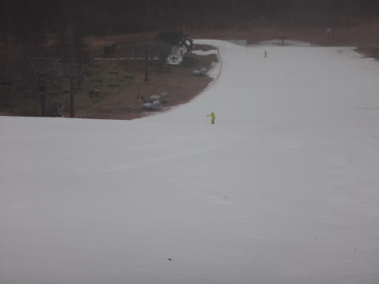

# 11月29日，アサマ2000の詳細レポートっ！朝は雨だったけど…午後は晴れ！！

📅 投稿日時: 2014-11-30 19:07:51

レポートの前に．

来週の天気ですが…

いやーーーーー．

これはやっぱり．

冷えますね．

1日の夜中から，7日過ぎまで，ひたすら冷え込みが

続きそうです．

1日の昼間までは雨ですが…

1日の夜から．

たぶん，日本海側はかなーーーり積もりそう．

東北より北は2，3日は吹雪でしょう．

…信州は，冷えるけど雪がそれほど降らない

感じなので，ちょっと心配…

でも．

今週末まで，ひたすら冷え込みは続くし．

人工降雪機もガンガン動くし，

コンディションいいはずなのだ！！！！

ってことで．

明日，明後日の営業をあきらめたらしく．

ちょっと悲惨な感じが漂う，今週のアサマ2000でしたが．

昨日速報した，アサマ2000レポートの詳細をば…

で．

朝，アサマ2000に向かう道の途中から…

どしゃ降りです（涙）．

雨が車のフロントガラスを叩きます（泣）．

この時点で，やる気280%ダウンです．

で．

アサマ2000に到着しても…

駐車場もガラガラ．

そして．

ゲレンデが，雨でかすんでいるんですけど（悲）．

…

…帰ろうかな…

という考えが一瞬頭をよぎりますが．

ここまで運転してきた時間と交通費を考えると．

さすがにそんなわけにいかず．

（雨で滑る気なくすくらいなら，今日来るなよ，という

ツッコミを全員から受けてしまう気が…）

んで．

ゲレンデに出てみると…

かなり本降りの雨ですから．

やっぱり誰も出てきてませんね…

ガラガラですね…

（あたりまえだ）

コースの脇に，ちょっと土が出てきているところがありましたが．

…でも．

この程度なら，予想よりずっとましだな．

もっといっぱい土が出てるかと思った…

リフト降り場近辺は，ちょっとマズそうでしたが．

でも，コースはそれほどひどくなくて，ひと安心．

意外と，まだコース幅もオープン時のままキープしてて

んで．

なんだか．

朝イチ．

人も少なくて．

下半分はきれいに整地されていて．

いつものようにカチカチアイスバーンじゃないのもあり．

あれ？

意外と滑りよいかも？？

ありゃ？

意外と楽しいかも？？

人がすごく少なくて，ライン取りたい放題で．

雪も柔らかくて．

これ，楽しいかも…

と，ずぶぬれになりながらも滑っていたら．

ふむむ？？

11時過ぎに，雨が止んできましたね～

それどころか．

11時半過ぎには．

日も射してきましたよっ！！

これは．

あれだ．

たぶん．

こんな天気の日にまで滑りに来た（アホな）スキーヤーのために，

スキーの神様がご褒美をくれたに違いないっ！＜だから，違いありすぎだっての

昼ごろは，ひとも全くいないのに，

日が射すゲレンデという，最高の状態に！！

ええ？

いいの？

いいんですか？

こんなコンディション良くて，いいんですか！？

楽しい～っ！！

神様，ありがとう～っ！！！

ゲレンデ，この雨にも十分耐えて．

石ころがゴロゴロ出てきたり，雪が茶色く

なっちゃうこともなく．

いいコンディションだよっ！

…と，思っていたら．

ありゃ？

ちょっと人が増えてきたなぁ…

そして．

午後1時頃には．

あれれ…

雨を止むのを待っていた人が，

出てきたのか．

人口密度が上がっちゃった…

リフト待ちが全くなかったのが救いですが．

でも．

雨で柔らかくなった雪で，人がいっぱい滑ると

どうなるかというと…

そうです．

凸凹様のお出ましです．

午後2時ごろには，かなり荒れてしまいました…

でも．

まぁ．

いつものアサマ2000の午後の，

アイスバーン小回り道よりはまだましかな…

で．このくらいのタイミングで．

「明日は雪不足のため，コース整備を行わずに

　営業します」

とのアナウンスがかかってました…

ふーむ．

明日の朝は，このコンディションのままスタートなのね…

…でも．

土がひどく出ているわけでないだけ，ましか…

ってことで．

午前中はどしゃ降りだったけど．

11時過ぎから晴れて，人が出てくる1時ごろまでは

日が射す整地を気持ちよく滑れて．

予想以上に楽しめた，アサマ2000でした！

いやーーー．

土曜に行っておいて正解だったなぁ！！

＃と，自分の行動を正当化するSkier_Sなのであった

## 💬 コメント一覧

### 💬 コメント by (Sora)
**タイトル**: やはり、フツーでない
**投稿日**: 2014-12-01 22:24:36

予想どおりの行動でしたね～（笑）。天まで味方にして。

この日は11時ごろからレポされているように、あのあたり晴れてきましたからね。多分・・と、私も小海リエックスで思ってましたよ。

さあ、今週末はどこに行かれるのでしょうか。

### 💬 コメント by (Skier_S)
**タイトル**: Soraさま
**投稿日**: 2014-12-02 00:22:41

予想を裏切らない男なので（笑）．

あまりにも予想通り過ぎるかと…

今週末は，我がホームゲレンデの焼額が

オープンしますので，何も考えることなく

志賀高原に行ってきます～っ！！！

しかし，この雪のない中，小海リエックスで

一体何をされてたんでしょう？？

### 💬 コメント by (Sora)
**タイトル**: 天を見上げて
**投稿日**: 2014-12-02 11:44:51

雪請いをしてました（笑）。

### 💬 コメント by (Skier_S)
**タイトル**: Re:天を見上げて
**投稿日**: 2014-12-02 12:58:01

その雪乞いがきいたんでしょうか？

雪がふりはじめましたが‥

でも、長野は降ってません(T.T)

