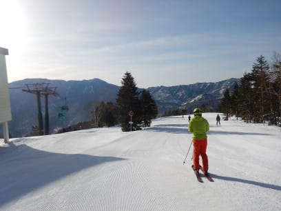

# 2019/4/29(月)GW3日目の志賀高原スキー場は…晴れのち曇り．早朝のみ硬かったけど，朝から雪は緩み，午前中にもう滑りの悪い雪に…（涙）

📅 投稿日時: 2019-04-30 00:11:19

えー．

このGWの，これからの天気ですが．

ざっくりいうと．

今晩から明日の午前中は，雨です（泣）

歌っても踊っても，降ってくるのは液体です．

朝7時頃がピークで，結構ザーザー

降りそうです…(涙)

午前中には降りは弱まりますが．

夕方までパラパラと降ったりやんだりの

天気が続きそう…

まぁ，板が滑る雪になるので，

雨も良いかも(開き直り)

そして．

令和初日となる5月1日は．

午前中は降らなさそうな気がしますが．

午後になると…降ってくるかも．

降れば当然液体です．

朝から気温は高く，まぁこの時期の

平均的なざぶざぶ雪です．

5月2日は…

この日も朝から気温が高く．

午前中は曇ってますが．

午後は晴れていきそうな感じ…

3，4，5日は．

気温は平年より低めだけど．

天気は晴れの日が続きそうで．

朝イチば多少硬めになるけど，

昼間はすごい緩んでいくという．

まぁ，GWでは平均的な天気かな．

ってなことで．

後半はそこそこ冷え込むものの．

雪が降るほどの冷え込みはなさそうと

感じているSkier_Sです．

ってなわけで．

本題へ行くわけですが．

朝は車のガラス窓が凍り付く程度には

冷えてくれた，本日朝．

すっきり快晴の，晴天ピカピカの

天気で始まったわけですが．

…これだけ天気がいいと．

強い日差しで早く雪が緩むこと

必定なので．

今日は早朝勝負だ！！！

と，早朝に並ぶわけですが．

待ってる人の列は，今日も駐車場近くまで伸びていて．

早朝営業の人気度合いがわかりますね…

ゴンドラで山頂に向かうと…

山頂の気温は-2度と．

何とかぎりぎり氷点下に冷え込んでますね！

そして，山頂のゲレンデは…

そうです！

晴天のシマシマ！

一応マイナスまで冷え込んでいるので．

朝イチはガリガリした感じの，

かなり締まったバーンコンディション！

朝の1本目は，結構スピードが出る

ハイスピードシマシマバーンです！

でも…

今日は天気がいいからか．

GW3日目という，人が増えるピークの

時期だからか．

あさイチから，GSコースは結構混んでます…

結構いい感じで締まった，かっ飛ばしバーン

ですが．

タイミングによっては，人が多めで，

トップスピードを出しにくい感じ…

そして．

2本目以降は，早くも表面の雪が緩み始め．

エッジが利きやすい雪になってきました．

そして．早朝開始から1時間も経つと．

ピカピカ晴天の日差しに照らされて．

コースの一部は，もう緩んで荒れ始めて

来ます…(涙）

まだ8時前なんだけど…

緩むのが早いよ…

早朝終了のころは．

GSコースはもう全体的に

雪がしっとりし始めてきたので…

そうです．

通常営業開始と同時に，

オープンされるパノラマコースへ，

Go！

誰も滑ってないパノラマコースは…

まだシマシマっ！

数本はいい感じのフラットバーンを

飛ばせましたが…

朝10時近くになってくると．

完全にゲレンデの雪は緩んで

しまって．

コースも荒れ始めて来ます…（涙）

まぁ．

とはいえ．

すっきり晴天で．

だのに，リフトもガラガラで．

ゴンドラも待ち時間が

全くないし．

リフト下の笹薮もまだ完全に

隠れているくらいのたっぷり

積雪だし．

…まぁ．

雪が多少荒れていて，滑りが

悪いくらいは許そう…←いつもの上から目線

…しかし．

この強い日差しのせいで．

クローズになったオリンピックコース．

かなり土が出てきましたね…

で．

午後になると．

雲がモクモクと湧き上がり始め…

（写真に写っている寺子屋スキー場も，

かなり土が出てきているみたいに見えますね)

午後は，太陽が完全に隠れた

曇り空になってしまいました…

強い日差しが隠れたから．

融けかけて板に張り付く雪は，

滑りが良くなったかというと

さにあらず．

通常営業開始時にはプラスに

ふれていた気温．

昼過ぎには，プラス4度とそれほど

高くなかったとはいえ．

プラス気温だったので…

雪はゆるんだままで．

午後もずっと張り付く感じの

雪のままでした…（涙）

ゴンドラ．リフト待ちは全くなかったですが．

GWということもあり．

こんな雪の午後にもかかわらず．

滑っている人がそこそこいるのには驚き…

まぁ，混んでいるというレベルでは

全くなかったので．

好き勝手滑れますが…

うーむ．

もう少し雪が滑ってくれると

いいんだけどな…

ってな感じで．

午後はちょいと滑りが悪い雪になっちゃいましたが．

それでも，まだまだ雪がいっぱいある焼額．

いつも通りお約束の，ラストゴンドラまで

滑り倒したのでした…

しかし．

まだ，今日は．

午前中に晴れてくれただけ良かったのだ．

残念なお知らせですが．

深夜0時現在の志賀高原．

雨が降り始めてきています（涙）

…明日は朝から．

空から降ってきてほしくない液体が降ってそう…

うーん．

早朝は滑らないでおこうかな…←通常営業からは雨の中でも滑るということか？

## 💬 コメント一覧

### 💬 コメント by (こじろう)
**タイトル**: Unknown
**投稿日**: 2019-04-30 09:15:14

S様、麓の湯田中は雨が上がり薄日が差してきていますご山の上はいかがでしょうか？

### 💬 コメント by (かず)
**タイトル**: Unknown
**投稿日**: 2019-04-30 10:56:20

昨日でシーズン終了です　シーズン中ありがとうございました　昨日はひたすら妖怪テストしてました　奥志賀までワックスしてもらいに行きましたけど　ワックスの種類は関係なさそう　そこそこブレーキがかからなくなる方向性が分かりました　来シーズンは志賀メインでAにも行ってみようと思います

### 💬 コメント by (Skier_S)
**タイトル**: Unknown
**投稿日**: 2019-04-30 11:54:35

>　こじろうさま

志賀は曇り。

ときどきぽつぽつ程度降って来ますが…

本降りではありませんよ!

### 💬 コメント by (こじろう)
**タイトル**: Unknown
**投稿日**: 2019-04-30 12:23:58

S様、ありがとうございます😊

### 💬 コメント by (ほっぽ)
**タイトル**: お疲れ様でした
**投稿日**: 2019-04-30 23:53:21

Ｓさん

今日は残念な天気でしたが、２高＆唐松で何本かご一緒させて頂き、

ありがとうございました。

そしてかもしかには私の方が先に入っていたということで、

今シーズン最後のランチも楽しめました。

今日の滑走日記をアップしておきました。

午後は１時間ほど高天ヶ原を滑って終了しました。

それと、リフト上で話題に上がったスバル純正オイルフィルターですが、

やはりリリーフ圧の設定が市販品と違うようで、

スバル曰く「水平対向に最適なリリーフ圧」

になっいるようです。

関連サイトをリンクしておきます。

http://clover-auto.com/2016/06/14/%E3%82%AA%E3%82%A4%E3%83%AB%E3%83%95%E3%82%A3%E3%83%AB%E3%82%BF%E3%83%BC/

### 💬 コメント by (Skier_S)
**タイトル**: 雨…
**投稿日**: 2019-05-01 04:37:41

>かずさま

今シーズン終了ですか！

今シーズンもお世話になりました．

来シーズンもまた志賀高原でお会いしましょう～！

＞ほっぽさま

今日はかなり残念な感じでしたね…（涙）

オイルフィルター情報もありがとうございました．

しかし，これでシーズン終了ですね．

また来シーズンも志賀高原でお会いしましょう…

というより，Yetiでお会いしましょう～！

### 💬 コメント by (ほっぽ)
**タイトル**: １０月のイエティ
**投稿日**: 2019-05-01 07:33:39

Ｓさん

五カ月半後にイエティでよろしくお願いします。(^^;

私もＢＧ、ＢＨ、ＢＰとレガシィ３台乗っていますが、

オイルフィルターは純正を使ったことがありません。

純正がベストだと思いますが、非純正だからエンジンが壊れる、

ということも無いと思います。

スバルの水平対向がそこまで神経質なエンジンとも思えませんし。

ポルシェならまだしも。(^^;

### 💬 コメント by (Skier_S)
**タイトル**: >ほっぽさま
**投稿日**: 2019-05-01 22:23:52

純正を全く使ったことが無いってのもすごいですね(笑)．

BRレガシィも，一回だけ社外品を入れましたが特に

問題なしでした．

では，イエティでお会いしましょう～！

