# コドモとコモド！子連れダイブクルーズ3　初日はバリ観光

📅 投稿日時: 2011-07-06 00:49:40

🏷️ カテゴリ: [ダイビング日記](ce3a7a8d424d112fce83ee85c81a0e344.md)

さて．

日が明けて2日目…

今日は一日，ドライバー，ガイドつきの車を1台チャーターしての

バリ観光です．

まぁ．なんてゼイタクなんでしょう．

日本でこんなことしたら幾らかかることやら…

朝起きて，まずは7時から朝食．

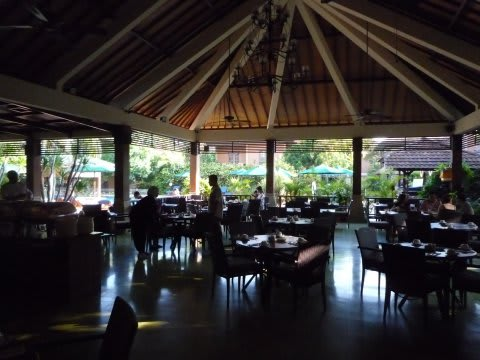

レストランは，プールを望めるオープンテラスのような場所です．

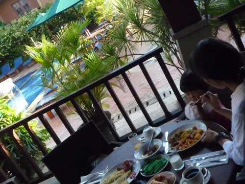

…

…我が家にとって．

これは．

危険かも．

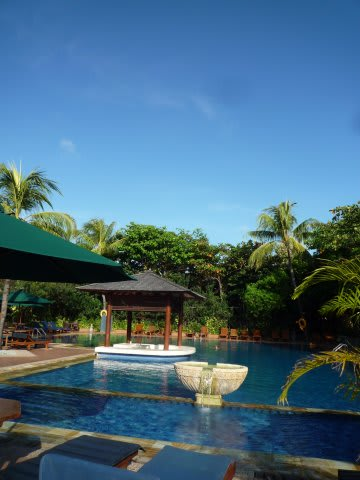

案の定，プールを見た娘は，

「プールで泳ぐ，およぐ，おーよーぐーっ！！」

プールに向かって走って行き食事をしたがらない

娘を強引に押さえ込み，我々の食事を終え，

帰り道もプールに全力で向かう娘を強引に

プールから引き離します．

ホントにプールが好きなんだから…

で．

8時半に，チャーター車のガイドがホテルにやってきます．

6時間+1時間サービスの7時間，リクエスト次第でどこにでも

連れて行ってくれるという…

われわれ家族3人だけのために，ドライバーとガイドの2人を

貸切のゼイタクな一日です．

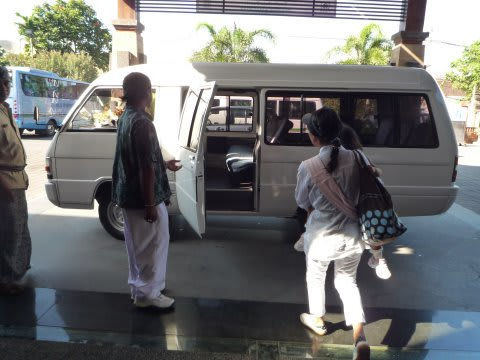

で，今日はウブド方面を観光することに．

まず向かったのは，ゴア・ガジャとかいう寺院．

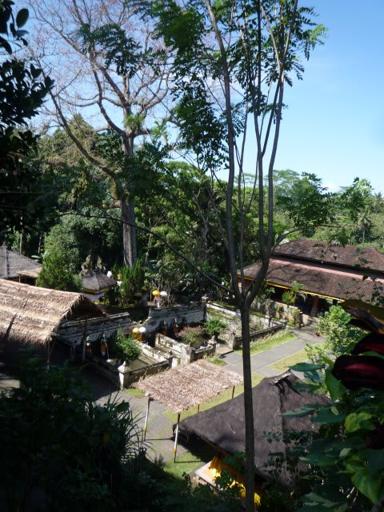

ホテルからは1時間半ほどのところです．

洞窟内に神体が祭られているという，珍しい形式の

ヒンズー教の寺院です．

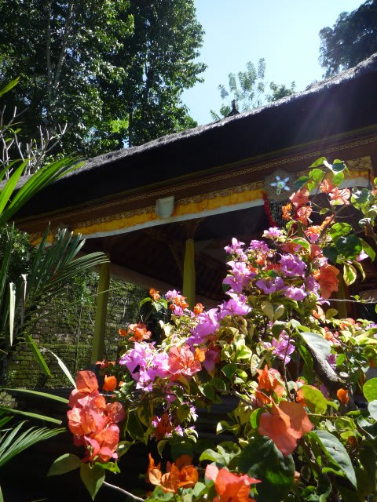

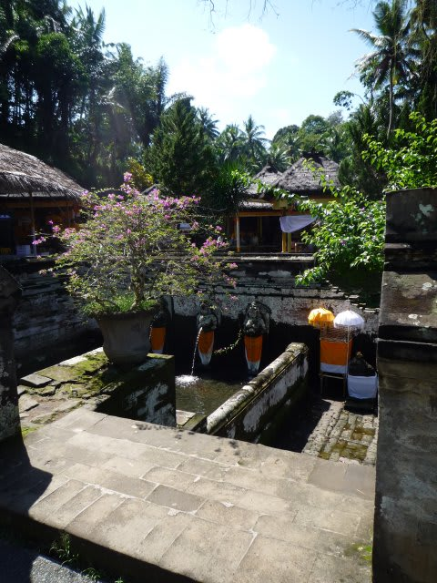

こんな沐浴場があります

お祭り時期らしく，いろいろ準備しています．

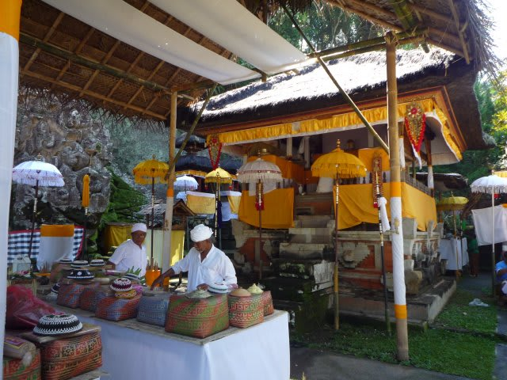

うーーん．

洞窟も10mも入ったあと，左右に数mあるだけだし，

寺院の規模もそれほど大きくなく．

まぁ，こんなもんですかね．

次に向かったのは，ゴア・ガジャからすぐの

モンキーフォレスト．

これも，ヒンズー教の寺院みたいですが，

敷地内にサルがいっぱい棲息してます．

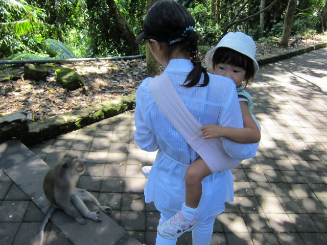

このサル，観光客を恐れません．

動物好きの娘にはいいかな，と選んだ場所．

娘は早速お猿さんと接近．コミュニケーションをとろうとしますが…

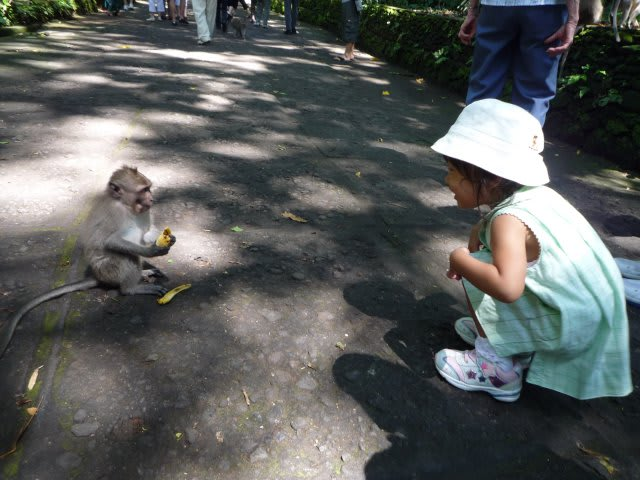

なんか，ちょっと友好性が足りないお猿さんだったのか．

お猿さんに襲われてました．

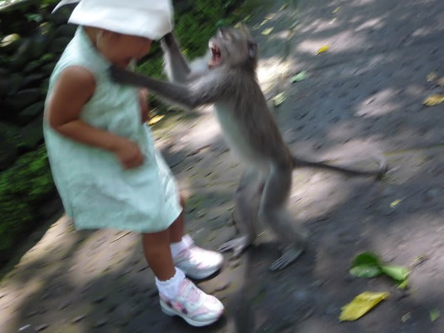

ちょ，ちょっと．そんな風なコミュニケーションをとろうと

したわけじゃなかっただろうに…

その後，また懲りずにお猿さん見て喜んでいた娘．

…お前には学習能力が無いのか！

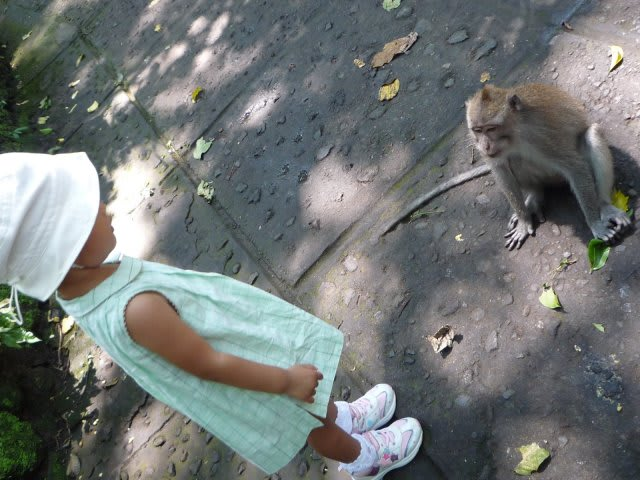

真性の動物好きみたいですね．

いろいろうろついて，お猿さんを堪能した後は，

ウブドのマーケットへ．

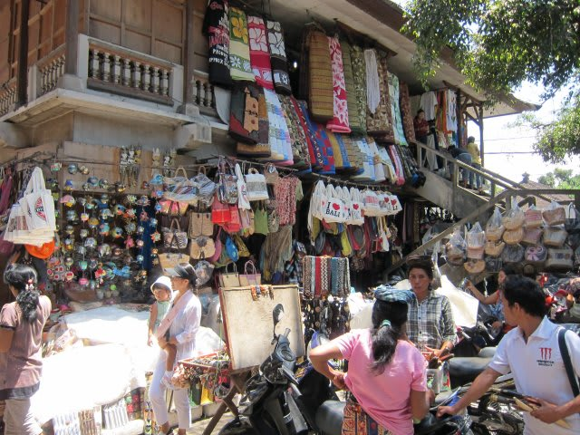

…なんか，ローカル向けのマーケットじゃなく，

観光客向けのお土産市ですな～

こういう場所にはあまり興味が無いので，

即座にお昼ご飯の場所へ移動します．

これも車で5分ほど．

前回のクルーズ終了後に寄った，

「Bebek Bengil」という，クリスピーダックが

おいしいお店へ．

残念ながら雰囲気最高の座敷ではなかったのですが，

お店の中はなかなかいい感じ．

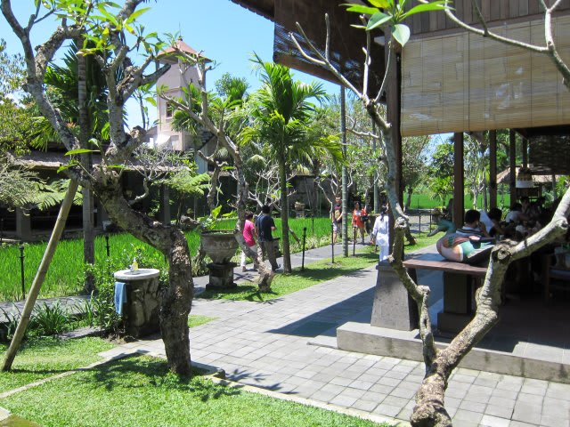

ガムランの生演奏があったり，なかなかGoodな感じです．

娘は食事より，広い敷地を駆け回り…

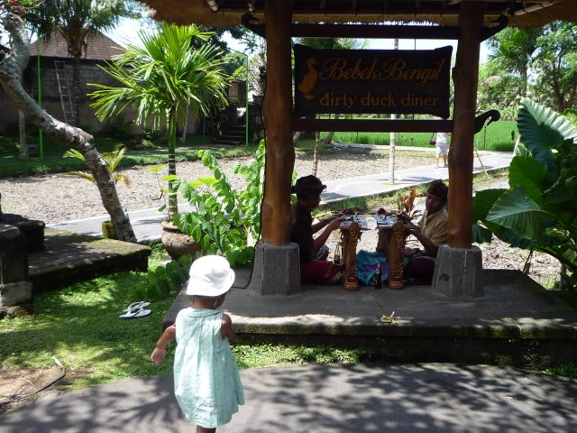

ガムランに合わせて踊り…

ガムラン奏者のおじさんにちょっかいを出し…

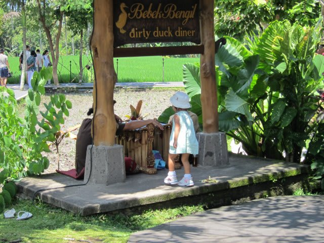

食事以外のことを堪能したようでした．

（ご飯食えよ～！）

食事の席に座らせようとすると泣いて暴れるので，

（飛行機のときのあのおとなしさはどこに行ったのだ？）

父親は走り回る娘の後ろを追っかけまわして

落ち着いて食事できず．

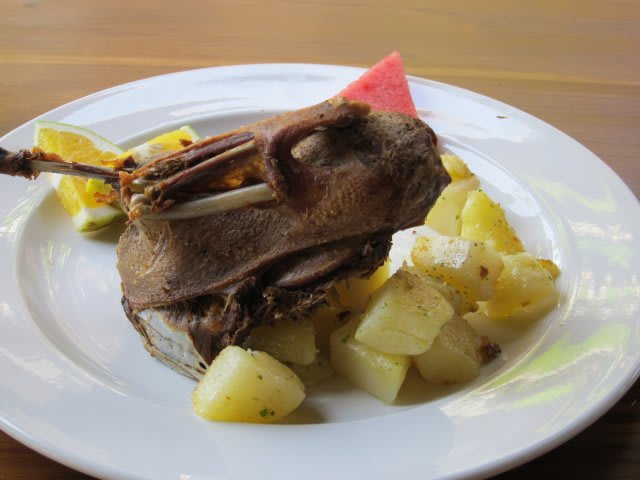

名物のクリスピーダックとか，ココナッツパイとか，

相変わらずおいしかったんですけどね～ 

とりあえず，お昼ご飯は終わったので，

午後の観光へ，Go!

（続く…このペースだと，本題のダイビング部分に達するのはいつの日か？？）
