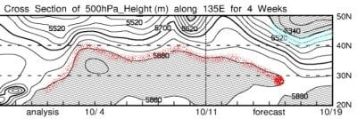
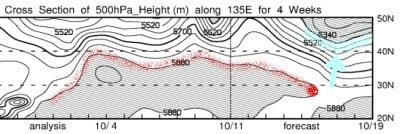
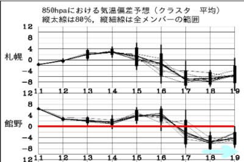
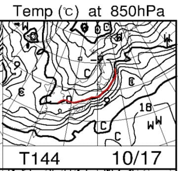
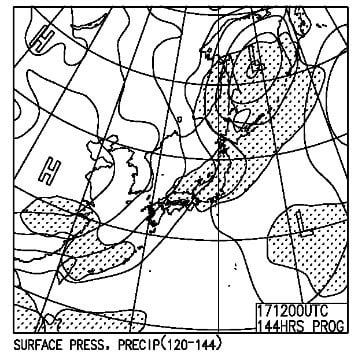
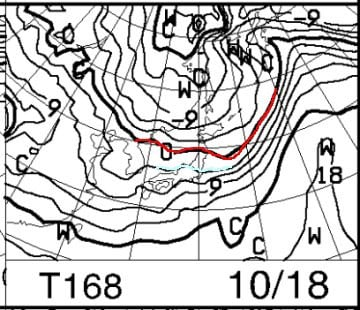

# 志賀高原の横手山，10月17日夜から18日にかけて初雪が降りそう…っ！！！

📅 投稿日時: 2021-10-13 01:02:42

多分．

志賀高原の横手山方面．

10月17日夜～18日朝にかけて，初雪が降ります！！

なんてったって…

[FXXN519](https://www.hbc.co.jp/tecweather/FXXN519.pdf)の一番下，500hpa高度線の位置を

見てみると…

赤く書いた5880mの線は，夏の空気を

示してるんですが．

こいつが日本にかかる…すなわち，

北緯35度（30Nと40Nの間）より上くらいに

なってくると夏で．

北緯40度（40N）の線に達すると，異常に

暑い夏なんですが．

10月3～4日ごろと，10月10日ごろ．

赤い5880m線，40度近くに北上してますね…

これは…8月か？？？という位置です．

分かる人が見れば

「え？10月にサブハイがこの位置？？何じゃこりゃ！！」

とひっくり返るレベルです．

まぁ，10月上旬，暑かったわけですね…

天気図が8月レベルだったんですから…

それに対抗して，右側の方の，

水色の5400m線．

こいつが真冬の空気なんですが．

こいつが10月17日になると，日本に

近づいてきます！！

…北緯40度以下まで下がると

冬の寒さ到来なんですが．

そこまで行かないまでも，

結構南に下がってきてますね…

そのおかげで．17日以降の

850hpa気温は，平年比-6℃くらい

まで下がりそうですし．

そして，久々の850hpa気温図を

見てみると…

ををををを！！！！

すごい！！！

17日は，赤く印した-0℃線が

志賀高原に結構近づいてますよっ！

冬に近い天気図ですよ！！

…ただ．

0℃線は志賀に近づくだけ．

志賀高原より南までは行ってなくて，

志賀には+3℃線がかかる程度…

うーん．

標高2000m超えでギリギリ雪に

なるか…ってところかな．

でも．

17日夜9時の地上天気図は，

冬型だし．

志賀高原は網掛けの降水域が

かかってるから…

17日夜の志賀高原．

降り始めは雨だけど…

標高が高いところは，夜から

雪になりそうです～！！

東北北部から北海道は，標高が

低くても雪になりそうですね…！

そして，18日も赤い0℃線は

東北付近まで南下してるし．

志賀高原にはギリギリ水色の

+3℃線がかかるので…

18日の午前中～昼過ぎくらいまでは

2000m以上では，雪が続くかも？

ただ．

湿度が低い方が元気が出る人工降雪機．

0度をちょいと下回る程度で．

かつ湿った雪が降る，湿度が高いこの

天気だと…実力を発揮できなさそう．

とりあえず，現時点では．

10月17，18日に横手山の人工降雪機が

動かせるかはギリギリの天気ですね…

…って．

そもそもまだオープンまで20日近く

ある10月18日の段階で，横手山では

人工降雪機を動かすつもりは全く

ないかもしれませんが…

ということで．

ようやく，夏が終わり．

志賀高原にも「雪」というものが

降りそうな季節になってきた…

ということに．

ついつい興奮して，

天気図だけのこんな記事，誰が読むんだ

という記事を書いてしまった，

Skier_Sだったのでした…

…ホントに誰が読むんだ？こんな記事…

## 💬 コメント一覧

### 💬 コメント by (ozuriski)
**タイトル**: 少なくとも私は読んでますw
**投稿日**: 2021-10-13 18:19:17

一週間で気温10度の低下は急激に下がりすぎですが…。これも気候変動の影響でしょうか。倶知安（ニセコ）では月曜の最低気温は0度の予報ですね。

横手山は確か去年の初雪はくしくも10/17だったような。例年10月下旬から氷点下に冷え込むから11/5プレオープンできると判断しての宣言ということで、10月上旬は異常でしたが、中旬から平年並みになってくれて一安心です。

これでイエティも10/22オープンでしょうか？

### 💬 コメント by (ひーちゃん)
**タイトル**: Unknown
**投稿日**: 2021-10-13 21:23:23

読んでますよ。先週志賀高原草津ルート、バイクで感動し、リベンジ考え中で雪とは、困った。Sさまも、山登りまだ、やる気満々ですよね^_^

### 💬 コメント by (Skier_S)
**タイトル**: 2名は読者がいることが分かりました…
**投稿日**: 2021-10-14 02:48:47

＞ozuriskiさま

いや～．一気に気温が下がりましたね．

横手山，昨年もこのくらいに雪が降りましたよね．

ってか，そのせいで昨年10月18日は雪の中登山する羽目になったんですが(笑)．

で．イエティの10月22日オープンは無いと踏んでいます．

18，19日も太平洋側はそこまで冷え込まないし…

もしイエティオープンが22日なら，遅くとも明日14日中(1週間前)にはオープン予告されるはず…

明日，オープンの予告がされなければほぼ確実に軽井沢オープン前を狙っての

29日オープンだと思います．

＞ひーちゃんさま

今週末，志賀草津ルートは，残念ながら土曜昼ごろから雨だと思います…

日曜まで降り続けそうです．

行くなら金曜までに行くことをおススメします！

あるいは，来週火曜以降か…

ちなみに私は，イエティが30日の週末オープンなので，

残る山登りチャンスは今週と来週のみです(笑)．

