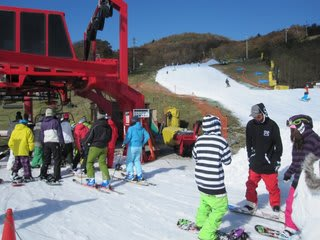

# 11月6日 Yeti

📅 投稿日時: 2010-11-07 02:00:05

ということで．

予告どおり行ってきました．

3回連続のイエティへ．

気温：10度前後

天気：晴れ時々うす曇

雪質：アイスクラッシュなので…

積雪：40cm程度？石ころを踏んづける心配はほとんど無し

リフト：待ち2-3分．

路面：ドライ

今日は天気もよく，日差しがあったかかったですね～．

日が射すと暑いくらい．

しかし，日がかげると，ちょいと肌寒い感じ．

さて．本日．

いつもはリフト開始に並ぶことを信念としている私が，

ちょっといろいろ事情があり，8時のリフト開始後1時間半の

9時半からスタートです．

で，ゲレンデに出てみると…

う．混んでる．さすがに．

人口密度高いよっ…

ボードをつけるリフト降り場近辺はすごいですなぁ．

でも，造雪機をフル稼働したんでしょうね～．

先週よりずっとゲレンデ状況は良くなってます．

先週はスキーを脱いで乗り降りしたクワッドリフトでしたが，

今日はスキーを履いたまま利用出来るようになってるし…

あと，ゲレンデの幅も，先週比1.5倍くらいに広がっている気が

します．

…まぁ，それでも廊下状態に変わりは無いですが，先週より

滑りよくなっている気がします…

雪の厚さは十分．

最後の落ち込み部分，多少薄くなっている部分もところどころ

ありますが，全体から見ればわずかな部分なので，

十分避けられるレベル．

どっちにしろ下はブラシですし，石ころ踏んづける心配は無いです．

…しかし．

日差しが強かったからか．

雪質自体は，ちょっと溶けかけの緩めの雪．

やわらかいからか，滑り出し付近の数箇所がウェーブ状に

凸凹してました．

でも，春先みたいにどぼどぼで板が潜ってしまうほど，って

訳ではないので，4月の春スキーよりはずっと滑りいいですが．

気になる混雑具合ですが．

リフト待ちは，朝9時半ごろではほとんど無し．

10時ごろに最大5分程度まで伸びたものの，

混雑緩和のためにペアリフトが動き出してからは，

平均2-3分，最大でも5分は超えませんでした．

平均的にこんな感じでしたね～．

かなり混むことを覚悟してきたのに，リフト待ちは

予想より少ないです．

ペアリフトは完全に待ち時間0です．

リフト待ち10分を超える軽井沢に比べると，

同じ時間でよりたくさん滑れた感が強いなぁ…

とりあえず．

11月上旬のこの時期．

比較的斜度は緩いですが，シーズンインの基礎練習には

十分な斜面だし．

リフト待ちも無く，がんがん滑れるので，

結構いいですねぇ．このスキー場．

でも，来週は丸沼がオープン．

となると，やっぱり丸沼に行かねば…
