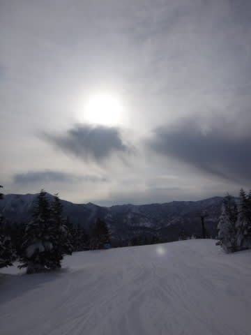
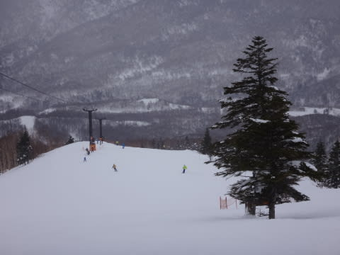
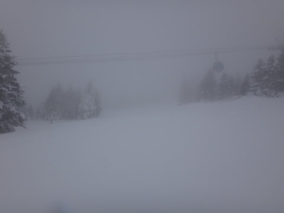

# 2月8日の志賀高原，速報モード…朝イチは晴れたものの…

📅 投稿日時: 2015-02-08 23:51:48

えー．

本日も，帰宅が夜遅かったので，

速報モードで…

で．

今日の志賀高原ですが．

朝イチは，予想通り太陽が出ていて…

ゴンドラ営業開始から数本は，昨日に引き続き，

超シアワセな最高シマシマバーンを美味しく

味わうことができたんですが…

予想よりちょっと早く，10時前には太陽が隠れてしまい，

そしてゲレンデの人もかなり増えてきちゃいました…

さらにさらに．

なんだか，昼過ぎには視界も悪くなってきて，

午後はかなり濃い霧が…

幸い，吹雪になることはなく，ガスは山頂付近だけ

だったのが救いだったかな～．

ってことで．

朝イチは楽しめたものの，土曜ほどの終日最高デーに

ならなかったのがちょっと残念．

詳細レポートは，また明日…！
