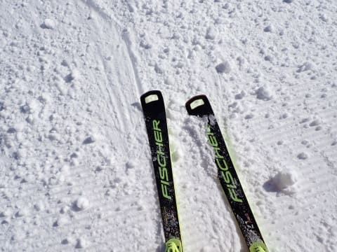
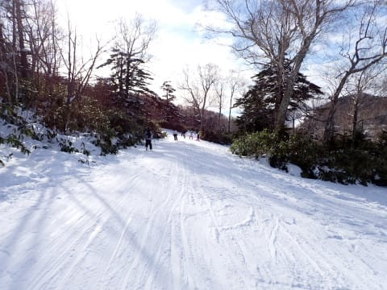

# 2023/12/30(土)の志賀高原スキー場は…晴天高温．雪不足で滑れるエリアは限られて混んでるし，悲しい感じ(涙)

📅 投稿日時: 2023-12-30 22:25:35

🏷️ カテゴリ: [2024スキー滑走日記](c453f687e8a0f05679e95831d0a02cd0c.md)

ってなわけで．

志賀高原滞在も2日目の本日ですが．

今日も全く雪は積もってません(涙)

それどころか，今日は終日晴天で

気温も高く，雪がだんだん融けて，

雪が減っていってます…(激涙)

とりあえず．

今日も朝はすっきり晴天でスタート．

いや．

晴れなくていいから，ドカドカ雪が

降ってくれ…（心からの願い）

あさイチのゴンドラは眼下に雲海が

見えてきれいだったけど…

あさイチの1ゴン山頂の気温はー3℃と，

この時期としてはかなり残念な高温（涙）

普通なら，この時期に晴れれば放射冷却で

-10℃を下回るのが普通なのに…

晴天で，朝イチから-3℃となると…

昼間の気温はプラスになるな…こりゃ（泣）

でも…

朝の1本目のバーンはシマシマ！

昨日，土が出てきてたところにも雪を

入れたようで…

1本目だけは，気持ちいいシマシマバーンを

楽しめました…！

ただ．

雲海に突っ込んでいくような，気持ちいい

シマシマも1本目だけ．

2本目からは，早くもコース上にコロコロが

出始める残念な感じになり…

人工雪バーンは下地の硬いのが出てきて．

さらに，昨日雪が薄かったところも，

コース整備で必死に雪を入れたんだろうけど．

昨晩からの積雪が全くないので，

じきにやばい感じになっていきました（涙）

今日も焼額のスタッフは雪入れ作業を

必死にやっていて，いろんなところから

雪をかき集めて何とかしようと努力していたけど…

周りにも雪が少なく，コース脇のわずかな

雪をかき集めて，かなり苦労している感じ．

そして．

さすがに年末休みの2日目で，

天気も良いこともあり…

コース上の人は確実に増えていき．

9時半ごろには，コース上はちょっと

快適といい難い人口密度に…（涙）

そして，10時過ぎには第2高速もちょっと

列が長くなり．

第2ゴンドラは5分待ちを超えたみたいです（涙）

あ，第4ロマンスと第1ゴンドラは，終日

待ちがなかったので．

こっちを使えば待たずに済みました～！

でも．

昼頃には，日差しで気温はプラスにまで上がり．

雪がやわらかくなった上に，滑る人も

かなり多かったので…

焼額山は，昼過ぎにはコース全面かなり

ボコボコになっちゃいました（涙）

だもんで．

今日から1ゴン山頂からの志賀へ行き来

できるようになったので．

今日は珍しく，焼額の呪いが解けて

奥志賀へ脱出しました…！

奥志賀はさすがに北斜面．

昼を過ぎているというのに，日差しで雪が

緩んだ焼額よりはいい雪質…！

第3高速ペア沿いは，この雪質のフラット

バーンでかなりいい感じ…！

…なんだけど．

コースがかなり短いので，ここばっかり

グルグルすると，ちょっと飽きてきます…

だもんで．

エキスパートコースを降りてみますが．

エキスパートコース，ここ数日圧雪してない

ので．めっちゃコブコブです…（涙）

それも単にコブコブってだけならいいけど．

コブ溝はかなり地面がコンニチハしてる感じで…

かなり深いコブ＆コブ溝に土の，

とても楽しいと思えないデンジャラス

バーン（涙）

さすがにエキスパートコースは1本だけで，

もう2度と滑らないでおこうと

思いました…

だもんで．

奥志賀滞在も短時間で切り上げて．

今度は一ノ瀬方面へ！←焼額に戻るんじゃないんかい

一ノ瀬は，ペアリフトはすごい混んでたけど．

今日は第3クワッドも動いていたこともあり．

ファミリークワッドと第3クワッドは，

そこまで混んでませんでした…

ただ．

クワッドリフトが空いていたのも

わけがあって．

山頂からの正面バーン．

人工降雪のかなりつるつるな下地に

コブが乗っている，かなり難易度の

高いバーン（涙）

私の板はエッジがかなり立っているので

何とかなるけど…

これ，エッジの手入れしてない板だと

ツルツルとずり落ちて，その先にコブが

待ち構えるという，かなり怖い斜面

だよね！？？

…クワッドに乗って，このコースを

滑ろうという人が少ないのも納得…

ってなことで．

一ノ瀬ファミリーも厳しい条件だったので

見切りをつけて．

今度はタンネの森を突っ切って，

高天ヶ原方面へ移動します…

ちなみに，タンネの森はリフトも動いて

おらず，滑走不可ですが．

一ノ瀬⇔高天ヶ原の移動コースはオープン

しているので，両者をスキーで行ったり

来たりできます．

ってな感じでやってきた高天ヶ原は．

リフトはガラガラです！！

ただ，高天ヶ原も滑れるのはNHKバーン

のみで．

ここもかなりエキサイティングな感じの

つるつるバーン！！

正月休み前に，エッジを立てておいて

よかったけど．

ここもガラガラだった理由がよくわかる…

そして．

人工雪でつるつるバーンの高天ヶ原を

脱出し，

今度は一ノ瀬ダイヤモンドにやってきますが…

こっちは雪がつるつるじゃない代わりに，

日差しで雪が緩んで，結構ボコボコ

してます…

でも，一ノ瀬エリアでつるつるじゃない，

滑りやすい数少ないバーンなので．

人が集中して，リフト待ち5分越え（泣）

…ってなことで．

やっぱりわがホームゲレンデの焼額が，

この悪条件の中でもまだいい感じだよね…

と，結局焼額に戻ってきました～！！

ただ…

焼額も，唐松コースは全面かなり凸凹に

なり．

パノラマコースも，落ち込み部分はかなりの

コブ＆ブッシュで．

コブで立ち止まる人がたまって，人口密度は

高めでしたが…（涙）

第4ロマンス沿いのサウスコースは，

ラストの16時までそこまでひどい

コブにならず．

そのせいで人口密度も低めで．

ちょっと雪が硬めのところもあったものの，

ガチガチアイスバーンってわけでもなく．

コブ，アイスバーン，ブッシュ，

混雑で悩まされた本日．

一番まともなバーンだったのかも…？

と．

最後の癒し（？）として，夕方で人が

少なくなったサウスコースを

かっ飛ばして．

今日も営業終了まで滑り倒したの

でした…

うーん…

雪が足りない…

滑れるエリアがかなり限られているうえに，

滑れるコースも微妙なコンディション（泣）

明日，31日夜から1日朝にかけての雪に

期待だけど．

31日は，昼間に降ったら確実に雨（涙）

おそらく，午前中にぽつぽつ来たとしても．

本格的な降り始めは午後だと思いたい…

そして．

降り始めとともに冷え込んで，

雨なのは一瞬ですぐに雪になってほしい…

私の読みでは，おそらくそこまでひどい

本格的な雨にならず，降り始めは山頂付近で

みぞれ，ふもとは雨だったのが，すぐに

雪に変わっていく…

と思いたい．

信じたい．

願いたい…

ただ．

夜から1日の朝にかけて雪になってくれるものの．

雪も短時間でやんでしまい．

1日の朝，遅くとも午前中には降りやみ

そうで…

全然積雪量が足りなさそう（泣）

あぁ…

このままだと，せっかくの6日間の正月休み．

かなり残念な6連休になりそう…

とりあえず．

31日夜から1日朝までに，1mは積もるよう，

みんなで祈り続けるのだ！！！

## 💬 コメント一覧

### 💬 コメント by (たぉ)
**タイトル**: Unknown
**投稿日**: 2023-12-31 07:22:54

私は昨日半日サウスでした！どこも雪少ないですね。今日の雨の影響が怖いですねー。今日は麓で買い物かな（笑）

### 💬 コメント by (新米パパ)
**タイトル**: Unknown
**投稿日**: 2023-12-31 18:02:05

今日はスキーは諦め、蕎麦食べてのんびり中野インターを降りると土砂降り、、絶望しつつ登ってくると、途中から雪に！！

明日朝まで50センチ、期待しておりますよー。

### 💬 コメント by (Skier_S)
**タイトル**: 今年もお世話になりました～！
**投稿日**: 2023-12-31 23:16:41

＞たぉさま

雪が少ないです…（涙）

でも，今日は雨の影響がほとんどなく良かったです！

明日の雪に期待…

＞新米パパさま

今日は滑らなくて正解だと思います．

楽しかったのは朝イチだけでした（涙）

明日，新年をいい雪で迎えられることを祈ります…

